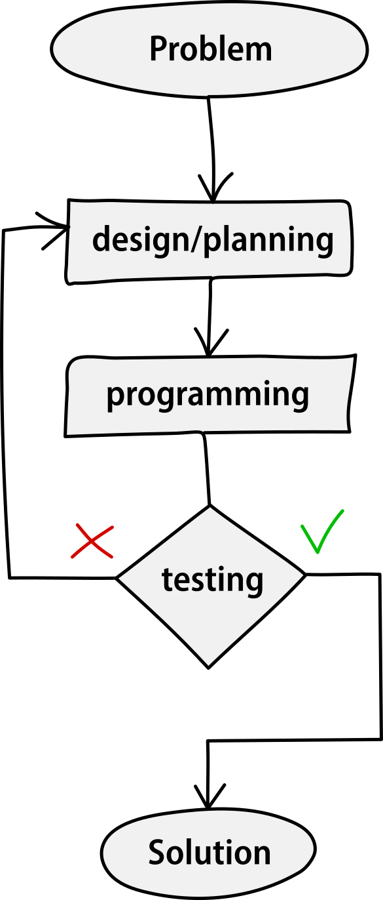

A program is made with a sequence of certain phases, and the process through which it is created can vary a lot, but generally it looks like this:
1. Analysis of the problem
2. Design/planning
3. Programming
4. Testing
5. Validation

<figcaption>Fig.1. A diagram describing the general process to solve a problem.</figcaption>

This sequence of steps leads the developer to create a functional program that can automate a task or solve a problem. 

In the testing phase the developer checks if what has been done is working as expected, and if not, it starts again by thinking and designing a new potential solution by adopting different strategies.

:::note

These notes do not cover how to make things like GUI or graphical applications. The main purpose is to teach the *logic* behind the algorithms and the *syntax* used to make a program work. Therefore we will be always sticking to console programs.

:::

## Definitions

An *algorithm* is a sequence of multiple consecutive instructions written in a determined language to solve a problem and obtain a certain output. For instance, when you are following a cooking recipe or an instruction booklet you are executing an algorithm.

A *program* is a set of data and algorithms to manipulate that data.

A *programming language* is a language with which we can communicate with a computer and provide it with instructions to execute. Computers understand only one language, the **machine code** or **binary code**, which is considered a *low-level programming language* because it's closer to how the machine works.

A programmer, instead, in his/her everyday life will probably use a *high-level programming language* like C, C++, Python, Java, JavaScript and many others because they are easier to understand, more abstract and closer to human thinking and language.

## Effectiveness 🆚 Efficiency

When creating a program, an output can often be obtained in a lot of different ways. Although (if done well) all programs return the same output, each one has a different way of approaching the problem and working out the solution.

In this situation, every program is *effective* because the desired output is obtained. The efficiency, though, is different because the amount of resources used to execute and obtain the output varies from program to program.

Of course, the fewer resources we use the better, so that we can say that our program is *efficient*, in addition to being effective.

## General recommendations

While programming (or coding) in general, it's important to keep in mind some relevant advice, principles and best practices:

- Be very fussy and meticulous
- Use meaningful names for variables
- Code as if another person will have to read it tomorrow, without being in your mind
- Don't learn pieces of code by heart: train your logic to be able to (re)write them later whenever you need them
- Keep the code well commented
- Don't use [magic numbers](https://en.wikipedia.org/wiki/Magic_number_(programming)) (hard-coded values that are difficult to update and to reason about)
- Complicated is different from complex, and it's better to avoid the first one: *Keep It Simple*
- Give the right importance to indentation and readability
- Think in advance about the reusability of the code you are writing now.

Following these steps, along with practice and a strong (strong!) motivation, will transform you in a good and proud programmer.