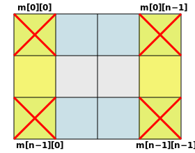

import CodeBlock from '@theme/CodeBlock';
import Tabs from '@theme/Tabs';
import TabItem from '@theme/TabItem';
import Spoiler from '@site/src/components/Spoiler';

:::info

For exercises on topics before pointers, refer to C++ exercises [Part 1](/docs/cpp/exercises_1) and [Part 2](/docs/cpp/exercises_2) (the solutions will be pretty similar to the relative C implementation).

:::

:::note C 🆚 C++ at a glance

If you come from C++, this table will help you quickly check the main differences and similarities between the two languages:

<table>
    <thead>
        <tr>
            <th>Aspect</th>
            <th>C</th>
            <th>C++</th>
        </tr>
    </thead>
    <tbody>
        <tr>
            <td>Input/Output</td>
            <td>
                <code>printf</code>, <code>scanf</code>, <code>puts</code>, <code>gets</code>
            </td>
            <td>
                <code>std::cout</code>, <code>std::cin</code>, <code>std::getline</code>, <code>std::endl</code>
            </td>
        </tr>
        <tr>
            <td>Type casting</td>
            <td>
                <code>(int)x</code>
            </td>
            <td>
                <code>static_cast&lt;int&gt;(x)</code>, etc.
            </td>
        </tr>
        <tr>
            <td>struct and typedef</td>
            <td>
                <code>typedef struct &#123;...&#125; Name;</code><br/>
                <code>struct Name var</code>
            </td>
            <td>
                <code>struct Name &#123; ... &#125;;</code><br/>
                <code>Name var</code>
            </td>
        </tr>
        <tr>
            <td>Standard Libraries</td>
            <td>
                <code>&lt;stdio.h&gt;</code>, <code>&lt;stdlib.h&gt;</code>, <code>&lt;string.h&gt;</code>
            </td>
            <td>
                <code>&lt;iostream&gt;</code>, <code>&lt;vector&gt;</code>, <code>&lt;string&gt;</code>, <code>&lt;algorithm&gt;</code>
            </td>
        </tr>
        <tr>
            <td>Dynamic allocation</td>
            <td>
                <code>malloc</code>, <code>calloc</code>, <code>realloc</code>, <code>free</code>
            </td>
            <td>
                <code>new</code>, <code>delete</code>
            </td>
        </tr>
        <tr>
            <td>Namespaces</td>
            <td>
                Not supported
            </td>
            <td>
                <code>using namespace std</code>
            </td>
        </tr>
        <tr>
            <td>Error handling</td>
            <td>
                <code>Errno</code>, <code>return -1</code>, <code>perror()</code>
            </td>
            <td>
                Try-catch
            </td>
        </tr>
    </tbody>
</table>

:::

Now that you know about pointers and memory allocation, let's practice with some exercises!

In this section, you'll find exercises ranging from basic pointer usage to more complex memory allocation scenarios. For each exercise, one or multiple solutions are provided, but try to solve them yourself first.

A difficulty is assigned to each exercise using a 3-star rating. Keep in mind that this is a subjective rating and might not accurately reflect your personal experience.

## Basic pointer (arrays & strings) exercises

> **Note:**  
> The following exercises are designed for the use of automatically allocated arrays and strings, **without** using dynamic allocation with `malloc`. Therefore, assume that all pointers used already refer to valid memory areas of appropriate size.

### Finding the maximum value (★☆☆)

Implement a function to find the maximum value in an integer array using the following prototype:

```c
void find_max(int *rmax, int *values, unsigned size);
```

Where:

- `values` is a pointer to the array
- `size` is the size of the array
- `rmax` is a pointer to the element in the array that represents the maximum value

You can assume that the array pointer is valid, the size is greater than 0, and is consistent with the actual values in the array.

<Spoiler>
Remember that `rmax` is a pointer - you need to store the actual maximum value at the memory location it points to using the dereference operator (*).
</Spoiler>

<details>
<summary>Show solution</summary>

<Tabs>
<TabItem value="solution1" label="Solution 1">

```c
#include <stdio.h>
#include <stdlib.h>
#define SIZE 100  // Array test size

void find_max(int *rmax, int *values, unsigned size) {
    for (unsigned int i = 0; i < size; i++) {
        if (*rmax < *(values + i)) {
            *rmax = *(values + i);
        }
    }
}

int main() {
    int a[SIZE];
    for (int i = 0; i < SIZE; i++) {
        a[i] = i;
    }
    int max_a = a[0];  // max_a contains the value of the 1st element

    find_max(&max_a, a, SIZE);  // Pass address, array and size
    printf("Max: %d\nAddress: %p\n", max_a, &max_a);

    return 0;
}
```

This solution uses pointer arithmetic and assumes `*rmax` is pre-initialized and uses pointer arithmetic (`*(values + i)`).

</TabItem>

<TabItem value="solution2" label="Solution 2">

```c
#include <stdio.h>
#include <stdlib.h>
#define SIZE 100  // Array test size

void find_max(int *rmax, int *values, unsigned size) {
    *rmax = values[0];  // Initialize rmax to point to the first element
    
    // Iterate through the array to find the maximum
    for (unsigned i = 1; i < size; i++) {
        if (values[i] > *rmax) {
            *rmax = values[i];
        }
    }
}

int main() {
    int a[SIZE];
    for (int i = 0; i < SIZE; i++) {
        a[i] = i;
    }
    int max_a;  // No initialization

    find_max(&max_a, a, SIZE);  // Pass address, array and size
    printf("Max: %d\nAddress: %p\n", max_a, &max_a);

    return 0;
}
```

In this solution, we initialize `*rmax` (`rmax` pointer dereference, meaning it accesses the memory location that `rmax` points to) with the first element's value (`values[0]`).

The line `*rmax = values[0];` assigns the value of `values[0]` to the memory location pointed to by `rmax`.

This solution explicitly initializes `*rmax` with the first element and uses array indexing (`values[i]`) without relying on an external initialization.

</TabItem>
</Tabs>

:::note Note
##### Why use a constant size with `SIZE`?

We use a constant size defined by the macro `SIZE` because array declarations in C require a compile-time constant size. Without this, the compiler would throw an error like "*expression must have a constant value*".

##### Why pass `&max_a` and `a` to `find_max()`?

In the `find_max()` function:

- We pass `&max_a` (address of `max_a`) because we want the function to modify the original variable in the calling function.
- For the array `a`, we pass it directly because arrays in C automatically decay to **pointers to their first element when passed to functions**, so `a` is equivalent to `&a[0]`.

###### What happens if you pass `&a` instead of the array `a`?  

If you pass `&a` instead of `a`, the function would receive a pointer to the entire array (`int (*)[SIZE]`), not a pointer to its first element (`int *`). This wouldn't match the function's parameter type, as the function expects a pointer to an `int`, not a pointer to an array.

##### Why populate the array with index values?

We populate the array with index values for simplicity. This approach ensures the array is predictable and easy to test, but the solutions will work with any array values.
:::

</details>

### Finding minimum and maximum values (★☆☆)

Implement a function similar to the previous one, but finding both the minimum and maximum values. The function should follow this prototype:

```c
void find_minmax(int *rmin, int *rmax, int *values, unsigned size);
```

Where:

- `values` is a pointer to the array
- `size` is the size of the array
- `rmin` is a pointer to the element representing the minimum value
- `rmax` is a pointer to the element representing the maximum value

<details>
<summary>Show solution</summary>

```c
void find_minmax(int *rmin, int *rmax, int *values, unsigned size) {
    // Initialize rmin and rmax to the first element
    *rmin = values[0];  // With array indexing OR
    *rmax = *values;    // With pointer arithmetic
    
    // Iterate through the array to find min and max
    for (unsigned i = 1; i < size; i++) {
        if (values[i] < *rmin) {
            *rmin = values[i];     // With array indexing OR
        }
        if (*(values + i) > *rmax) {
            *rmax = *(values + i); // With pointer arithmetic
        }
    }
}
```

Array indexing (`values[i]`) and pointer arithmetic (`*(values + i)`) are interchangeable in C, as both access the same memory location (the first element plus an offset).

</details>

### Computing mean and variance (★☆☆)

Implement a function to calculate the arithmetic mean and variance of a set of values, using the following prototype:

```c
void compute_mean_variance(float *rmean, float *rvariance, float *values, unsigned size);
```

Where:

- `values` is a pointer to the array
- `size` is the size of the array
- `rmean` is a pointer to store the mean value
- `rvariance` is a pointer to store the variance value

Remember that the variance is calculated as:  

$$
\sigma^2 = \frac{1}{n}\sum_{i=1}^{n}(x_i - \mu)^2
$$
  
where $\mu$ is the mean and $n$ is the number of values.

<Spoiler>
For computing variance efficiently, you should first calculate the mean, then in a second pass calculate the sum of squared differences from that mean.
</Spoiler>

<details>
<summary>Show solution</summary>

<Tabs>
<TabItem value="solution1" label="Solution 1">

```c
#include <math.h>
#include <stdio.h>
#include <stdlib.h>

void compute_mean_variance(float *rmean, float *rvariance, float *values, unsigned size) {
    // Calculate mean (make sure it's already initialized at 0)
    for (int i = 0; i < size; i++) {
        *rmean += values[i];
    }
    *rmean /= (float)size;

    // Calculate variance
    for (int i = 1; i <= size; i++) { // Or start at 0 and < size
        *rvariance += pow(values[i - 1] - *rmean, 2);
    }
    *rvariance /= (float)size;
}

int main() {
    float a[100];
    for (unsigned i = 0; i < 100; i++) {
        a[i] = i;
    }
    float mean = .0f, variance = .0f;

    // Pass 'a' directly (equivalent to &a[0]) because arrays decay to pointers when used in an expression
    compute_mean_variance(&mean, &variance, a, 100);
    printf("Mean: %f\nVariance: %f", mean, variance);

    return 0;
}
```

</TabItem>

<TabItem value="solution2" label="Solution 2">

```c
#include <stdio.h>
#include <stdlib.h>

void compute_mean_variance(float *rmean, float *rvariance, float *values, unsigned size) {
    // Calculate mean
    for (unsigned i = 0; i < size; i++) {
        *rmean += values[i];
    }
    *rmean /= size;

    // Calculate variance
    for (unsigned i = 0; i < size; i++) {
        *rvariance += (values[i] - *rmean) * (values[i] - *rmean); // No need to use math.h library
    }
    *rvariance /= size;
}

int main() {
    float a[100];
    for (unsigned i = 0; i < 100; i++) {
        a[i] = i;
    }
    float mean = 0.0f, variance = 0.0f;

    compute_mean_variance(&mean, &variance, a, 100);
    printf("Mean: %f\nVariance: %f\n", mean, variance);

    return 0;
}
```

</TabItem>
</Tabs>

In `.0f`, using 'f' explicitly tells the compiler the numerical literal should be taken as a float number, instead of as a double (which is what C default to when dealing with decimal numbers).

If we don't initialize mean and variance at 0 before passing them, we must do it inside `compute_mean_variance`, since we are summing values to them.

In the second loop for calculating variance, the first solution starts at 1 and ends at n (including extremes) to reflect the mathematical formula, but it can also start one step ahead and adjust the index accordingly (remembering that indexes represent offsets, therefore they start from 0, not 1).

</details>

### Swapping values (★☆☆)

Implement a function to swap the values of two integers using pointers. The function should have the following prototype:

```c
void swap(int *a, int *b);
```

<details>
<summary>Show solution</summary>

```c
void swap(int *a, int *b) {
    int temp = *a;
    *a = *b;
    *b = temp;
}
```

</details>

### Pointer arithmetic with arrays (★☆☆)

Write a function that takes an integer array and its size as parameters, then prints all elements using only pointer arithmetic (without using array indexing notation `[]`). The function should have the following prototype:

```c
void print_array(int *arr, unsigned size);
```

<details>
<summary>Show solution</summary>

```c
void print_array(int *arr, unsigned size) {
    int *end = arr + size; // Points just past the last element
    
    for (int *p = arr; p < end; p++) {
        printf("%d ", *p);
    }
    printf("\n");
}
```

</details>

### Reverse an array (★★☆)

Write a function that reverses the elements of an array in place (without using a second array), using only pointers. The function should have the following prototype:

```c
void reverse_array(int *arr, unsigned size);
```

<Spoiler>
Consider using two pointers - one starting from the beginning and one from the end of the array. Swap their values and move them toward each other until they meet in the middle.
</Spoiler>

<details>
<summary>Show solution</summary>

```c
void reverse_array(int *arr, unsigned size) {
    int *start = arr;
    int *end = arr + size - 1;
    
    while (start < end) {
        // Swap values at start and end pointers
        int temp = *start;
        *start = *end;
        *end = temp;
        
        // Move pointers toward the middle
        start++;
        end--;
    }
}
```

</details>

### Reversing an array to a new location (★☆☆)

Write a function that reverses an array of integers into another array (without modifying the original array), using the following prototype:

```c
void reversei(int *r, const int *values, unsigned size);
```

Where:

- `r` is a pointer to the **destination** array where the reversed values will be stored
- `values` is a pointer to the **source** array
- `size` is the size of both arrays

<details>
<summary>Show solution</summary>

```c
void reversei(int *r, const int *values, unsigned size) {
    for (unsigned i = 0; i < size; i++) {
        r[i] = values[size - 1 - i];
    }
}

// Example usage:
int main() {
    int original[] = {1, 2, 3, 4, 5};
    int reversed[5];
    unsigned size = 5;
    
    reversei(reversed, original, size);
    
    printf("Original array: ");
    for (unsigned i = 0; i < size; i++) {
        printf("%d ", original[i]);
    }
    
    printf("\nReversed array: ");
    for (unsigned i = 0; i < size; i++) {
        printf("%d ", reversed[i]);
    }
    
    return 0;
}
```

</details>

### Reversing a string (★☆☆)

Write a function that reverses a C string into another string, using the following prototype:

```c
void reverses(char *r, const char *s);
```

Where:

- `r` is a pointer to the destination string where the reversed string will be stored
- `s` is a pointer to the source string

Try both with and without using the `string.h` library.

<Spoiler>
Remember that strings in C are null-terminated, so you need to find the length of the string first, then copy the characters in reverse order, and finally add the null terminator.
</Spoiler>

<details>
<summary>Show solution</summary>

<Tabs>
<TabItem value="solution1" label="Solution 1">

```c
#include <stdio.h>
#include <stdlib.h>
#include <string.h>

void reverses(char *r, const char *s) {
    // This will error
    // int length = sizeof(s) / sizeof(s[0]); // ❌ Do not do this here
    int length = strlen(s); // Calculate the length of the string

    // Reverse the string
    for (int i = length; i > 0; i--) {
        r[length - i] = s[i - 1];
    }
    // ↕️ or
    // for (int i = 0; i < length; i++) {
    //     r[i] = s[length - 1 - i];
    // }

    r[length] = '\0'; // Null-terminate the reversed string
}

int main() {
    char s[] = "Hello, World!";
    int length = strlen(s); // Calculate the length of the string

    printf("Original: %s\n", s);

    // Allocate memory for the reversed string
    char *r = (char *)malloc((length + 1) * sizeof(char)); // Include space for null terminator
    if (r == NULL) {
        fprintf(stderr, "Memory allocation failed\n");
        return 1;
    }
    
    reverses(r, s);
    printf("Reversed: %s\n", r); // Print the reversed string

    free(r); // Free allocated memory
    
    return 0;
}
```

Using `string.h` library.

:::info Note
When an array is passed to a function in C, it "decays" into a pointer to its first element. This means operations like `sizeof(array)` inside the function will only return the size of the pointer itself (typically 4 or 8 bytes), not the size of the entire array.

This is why we can't calculate the array length inside the function using the `sizeof(array)/sizeof(array[0])` approach that works in the calling context. Instead, we need to pass the array length as a separate parameter to the function or use `strlen` for strings.

#### Why does this happen?

The issue lies in how the two methods calculate the length of the array or string, and it depends on the type of `s`.

##### 1. **Using `sizeof(s) / sizeof(s[0])`**

This method works only if `s` is a **statically allocated array** (e.g., `char s[100]`). The `sizeof` operator calculates the total size of the array in bytes (`sizeof(s)`) and divides it by the size of one element (`sizeof(s[0])`). This gives the number of elements in the array.

However, if `s` is a **pointer** (e.g., `char *s`), `sizeof(s)` will return the size of the pointer itself, not the size of the memory it points to. This makes the calculation incorrect.

##### 2. **Using `strlen(s)`**

The `strlen` function works for **null-terminated strings**. It calculates the length of the string by iterating through the characters in `s` until it finds the null terminator (`'\0'`). This works regardless of whether `s` is a statically allocated array or a dynamically allocated pointer, as long as it points to a valid null-terminated string.

See this example:

```c
#include <stdio.h>
#include <string.h>

int main() {
    char s1[] = "Hello";  // Statically allocated array
    char *s2 = "World";   // Pointer to a string literal

    printf("Using sizeof on s1: %zu\n", sizeof(s1)); // Works, gives 6 (5 chars + '\0')
    printf("Using sizeof on s2: %zu\n", sizeof(s2)); // Gives size of pointer, not the string

    printf("Using strlen on s1: %zu\n", strlen(s1)); // Works, gives 5
    printf("Using strlen on s2: %zu\n", strlen(s2)); // Works, gives 5

    return 0;
}
```

:::

</TabItem>

<TabItem value="solution2" label="Solution 2">

```c
void reverses(char *r, const char *s) {
    // Find the length of the string
    unsigned len = 0;
    while (s[len] != '\0') {
        len++;
    }
    
    // Reverse the string
    for (unsigned i = 0; i < len; i++) {
        r[i] = s[len - 1 - i];
    }
    
    // Add null terminator
    r[len] = '\0';
}

// Example usage:
int main() {
    const char *original = "Hello, World!";
    char reversed[20];  // Make sure it's big enough
    
    reverses(reversed, original);
    printf("Original: %s\nReversed: %s\n", original, reversed);
    
    return 0;
}
```

</TabItem>
</Tabs>

</details>

### ROT13 cipher (★★☆)

Write a function that implements the ROT13 cipher, which shifts each letter in a string by 13 positions in the alphabet (wrapping around if necessary). Non-alphabetic characters should remain unchanged. Use the following prototype:

```c
void rot13(char *r, const char *s);
```

Where:

- `r` is a pointer to the destination string where the encrypted string will be stored
- `s` is a pointer to the source string

It can be helpful to refer to the ASCII table for `char` operations:


<figcaption>Table of ASCII values - By <a href="//commons.wikimedia.org/wiki/File:ASCII-Table.svg" title="File:ASCII-Table.svg">ASCII-Table.svg</a>: ZZT32derivative work: Usha - <a href="//commons.wikimedia.org/wiki/File:ASCII-Table.svg" title="File:ASCII-Table.svg">ASCII-Table.svg</a>, Public Domain, <a href="https://commons.wikimedia.org/w/index.php?curid=10388973">Link</a></figcaption>

<Spoiler>
The ROT13 cipher is its own inverse - applying it twice returns the original text. You'll need to handle both uppercase and lowercase letters separately.
</Spoiler>

<details>
<summary>Show solution</summary>

<Tabs>
<TabItem value="solution1" label="Solution 1">

```c
#include <stdio.h>
#include <string.h>
#include <ctype.h>

void rot13(char *r, const char *s) {
    for (int i = 0; s[i] != '\0'; i++) {
        if (isalpha(s[i])) {
            // Handle both uppercase and lowercase letters
            if (islower(s[i])) {
                // For lowercase: subtract 'a', add 13, take modulo 26, add 'a' back
                r[i] = (char)((s[i] - 'a' + 13) % 26 + 'a');
            } else if (isupper(s[i])) {
                // For uppercase: subtract 'A', add 13, take modulo 26, add 'A' back
                r[i] = (char)((s[i] - 'A' + 13) % 26 + 'A');
            }
        } else {
            // Copy non-alphabetic characters as is
            r[i] = s[i];
        }
    }
    
    // Add null terminator at the end
    r[strlen(s)] = '\0';
}

int main() {
    char s[] = "example String 1!";
    printf("Original: %s\n", s);

    // Dynamically allocate memory for the result
    char *r = (char *)malloc((strlen(s) + 1) * sizeof(char));
    if (r == NULL) {
        fprintf(stderr, "Memory allocation failed\n");
        return 1;
    }

    rot13(r, s);
    printf("Encrypted: %s\n", r);
    
    // Free allocated memory
    free(r);

    return 0;
}
```

</TabItem>

<TabItem value="solution2" label="Solution 2">

```c
void rot13(char *r, const char *s) {
    int i = 0;
    while (s[i] != '\0') {
        char c = s[i];
        if ('a' <= c && c <= 'z') {
            r[i] = 'a' + ((c - 'a' + 13) % 26);
        } else if ('A' <= c && c <= 'Z') {
            r[i] = 'A' + ((c - 'A' + 13) % 26);
        } else {
            r[i] = c; // Not a letter, copy as is
        }
        i++;
    }
    r[i] = '\0'; // Add null terminator
}

// Example usage:
int main() {
    const char *original = "Hello, World!";
    char encrypted[20];
    char decrypted[20];
    
    rot13(encrypted, original);
    rot13(decrypted, encrypted);  // Applying ROT13 twice gets the original text
    
    printf("Original: %s\nEncrypted: %s\nDecrypted: %s\n", 
           original, encrypted, decrypted);
    
    return 0;
}
```

</TabItem>
</Tabs>

</details>

### Finding a value in an array (★☆☆)

Write a function that finds the position of a specific value in an integer array, using the following prototype:

```c
long findi(int t, const int *values, unsigned size);
```

Where:

- `t` is the value to search for
- `values` is a pointer to the array
- `size` is the size of the array
- The function should return the index of the first occurrence of the value, or -1 if not found

<details>
<summary>Show solution</summary>

```c
long findi(int t, const int *values, unsigned size) {
    for (unsigned i = 0; i < size; i++) {
        if (values[i] == t) {
            return i;
        }
    }
    return -1; // Not found
}

// Example usage:
int main() {
    int array[] = {10, 20, 30, 40, 50, 30, 60};
    unsigned size = 7;
    
    printf("Position of 30: %ld\n", findi(30, array, size));  // Should print 2
    printf("Position of 35: %ld\n", findi(35, array, size));  // Should print -1
    
    return 0;
}
```

</details>

### Capitalizing words in a string (★★☆)

Write a function that converts a string so that the first letter of each word is capitalized and all other letters are lowercase. Use the following prototype:

```c
void capitalize(char *r, const char *s);
```

Where:

- `r` is a pointer to the destination string where the capitalized string will be stored
- `s` is a pointer to the source string

<Spoiler>
A good approach is to use the C standard library functions toupper, tolower, and isspace from ctype.h library. Track whether the current character is at the start of a word (either the first character or following a space), and convert it to uppercase; otherwise, convert it to lowercase.<br/>
Another possible solution: iterate through the input string while keeping track of when a new word begins. Use toupper() for the first alphabetic character following a space (or at the start) and tolower() for all subsequent characters. Don’t forget to add a null terminator at the end.
</Spoiler>

<details>
<summary>Show solution</summary>
<Tabs>
<TabItem value="solution1" label="Solution 1">

```c
#include <ctype.h>  // For toupper, tolower, isspace, isalpha
#include <stdio.h>
#include <string.h> // For strlen

// r: output string
// s: input string (const, not modified)
void capitalize(char *r, const char *s) {
    // Capitalizes the first letter of each word, lowercases the rest
    for (int i = 0; i < strlen(s); i++) {
        if ((i == 0 || isspace(s[i - 1])) && isalpha(s[i])) {
            r[i] = toupper(s[i]);
        } else {
            r[i] = tolower(s[i]);
        }
    }
    // Null-terminate string (no need for -1, strlen doesn't count \0 already)
    r[strlen(s)] = '\0';
}

// Example usage:
int main() {
    char original[] = "aD #  fAA";
    printf("Original: %s\n", original);
    char newString[sizeof(original)];
    capitalize(newString, original);
    printf("Capitalized: %s\n", newString);
    return 0;
}
```

This solution uses standard library functions (`toupper`, `tolower`, `isspace`, `isalpha`) to check for word boundaries and convert characters as needed. It capitalizes the first letter of each word and lowercases the rest by examining each character and its context.

</TabItem>

<TabItem value="solution2" label="Solution 2">

```c
void capitalize(char *r, const char *s) {
    int i = 0;
    int capitalize_next = 1; // Start with capitalizing the first letter
    
    while (s[i] != '\0') {
        if (s[i] == ' ') {
            r[i] = ' ';
            capitalize_next = 1;
        } else if (capitalize_next && 'a' <= s[i] && s[i] <= 'z') {
            // Convert lowercase to uppercase if it comes after a space
            r[i] = s[i] - 'a' + 'A'; // 'a' has a code of 97, 'A' is 65
            capitalize_next = 0;
        } else if (!capitalize_next && 'A' <= s[i] && s[i] <= 'Z') {
            // Convert uppercase to lowercase otherwise
            r[i] = s[i] - 'A' + 'a';
            capitalize_next = 0;
        } else {
            // Keep as is for non-alphabetic characters
            r[i] = s[i];
            capitalize_next = 0;
        }
        i++;
    }
    r[i] = '\0'; // Add null terminator
}

// Example usage:
int main() {
    const char *original = "hello WORLD how ARE you";
    char capitalized[50];
    
    capitalize(capitalized, original);
    printf("Original:    %s\nCapitalized: %s\n", original, capitalized);
    
    return 0;
}
```

This solution uses a flag (`capitalize_next`) to track when a new word begins. If the current character is a space, the flag is set so the next letter will be capitalized. When the flag is set and a lowercase letter is found, it is converted to uppercase using ASCII arithmetic (`r[i] = s[i] - 'a' + 'A'`). For example, if `s[i] = 'c'` (99), then `r[i] = 'c' - 'a' + 'A' = 99 - 97 + 65 = 67 = 'C'`.

Similarly, if the flag is not set and an uppercase letter is found, it is converted to lowercase (`r[i] = s[i] - 'A' + 'a'`). Non-alphabetic characters are copied as-is.

This approach avoids using standard library functions and demonstrates how ASCII values can be manipulated directly for case conversion.

</TabItem>
</Tabs>

</details>

### Counting letter frequencies (★★☆)

Write a function that counts the frequency of each letter (case-insensitive) in a string and stores the results in an array. Use the following prototype:

```c
void freqs(unsigned *r, const char *s);
```

Where:

- `r` is a pointer to an array of size 26, where each element will store the count of a letter (`r[0]` for `'a'/'A'`, `r[1]` for `'b'/'B'`, etc.)
- `s` is a pointer to the source string

<Spoiler>
A good approach is to convert each character to lowercase (or uppercase) using tolower() or toupper() from ctype.h, then check if it's an alphabetic character with isalpha(). If it is, increment the corresponding index in the result array by subtracting 'a' from the character value (e.g., r[s[i] - 'a']++). Make sure to initialize the frequency array to zero before counting.
</Spoiler>

<details>
<summary>Show solution</summary>

<Tabs>
<TabItem value="solution1" label="Solution 1">

```c
#include <ctype.h>   // for tolower, isalpha
#include <stdio.h>
#define SIZE 10

void freqs(unsigned *r, const char *s) {
    // ASCII value of 'a' for reference
    printf("\na = %d in ASCII", (int)'a');  // a = 97

    char s_low[SIZE];
    // Convert input string to lowercase in a new array
    for (int i = 0; i < SIZE; i++) {
        s_low[i] = tolower(s[i]);
    }

    // Count frequencies of alphabetic characters
    for (int i = 0; i < SIZE; i++) { 
        if (isalpha(s_low[i])) {
            // Subtract 'a' to get index (0 for 'a', 1 for 'b', ...)
            r[(int)s_low[i] - 'a']++;
        }
    }
}

int main() {
    char s[SIZE] = "abbct#tou";
    unsigned r[26] = {0};  // Initialize all elements to 0

    printf("String s: %s\n", s);

    printf("Array r:  ");
    for (int i = 0; i < 26; i++) {
        printf("%d", r[i]);
    }

    freqs(r, s);

    printf("\nr freqs:  ");
    for (int i = 0; i < 26; i++) {
        printf("%d", r[i]);
    }

    return 0;
}
```

This solution first converts the input string to lowercase using `tolower()` so that letter counting is case-insensitive. It then checks each character with `isalpha()` and increments the corresponding frequency in the result array by subtracting `'a'` from the character's ASCII value.

</TabItem>

<TabItem value="solution2" label="Solution 2">

```c {2-7}
void freqs(unsigned *r, const char *s) {
    for (int i = 0; i < SIZE; i++) {
        char c = tolower(s[i]);
        if (c >= 'a' && c <= 'z') {
            r[c - 'a']++;
        }
    }
    // OR
    // int i = 0;
    // while (s[i] != '\0') {
    //     if ('a' <= s[i] && s[i] <= 'z') {
    //         r[s[i] - 'a']++;
    //     } else if ('A' <= s[i] && s[i] <= 'Z') {
    //         r[s[i] - 'A']++;
    //     }
    //     i++;
    // }
}

// Example usage:
int main() {
    const char *text = "Hello, World!";
    unsigned frequencies[26] = {0};
    
    freqs(frequencies, text);
    
    printf("Letter frequencies in '%s':\n", text);
    for (int i = 0; i < 26; i++) {
        if (frequencies[i] > 0) {
            printf("%c: %u\n", 'a' + i, frequencies[i]);
        }
    }
    
    return 0;
}
```

</TabItem>
</Tabs>

</details>

### Merging sorted arrays (★★☆)

Write a function that merges two already sorted integer arrays into a single sorted array. Use the following prototype:

```c
void merge(int *r, const int *a1, unsigned s1, const int *a2, unsigned s2);
```

Where:

- `r` is a pointer to the destination array where the merged result will be stored
- `a1` is a pointer to the first sorted array
- `s1` is the size of the first array
- `a2` is a pointer to the second sorted array
- `s2` is the size of the second array

<Spoiler>
Use three indices (one for each input array and one for the result). At each step, compare the current elements of both arrays and copy the smaller one to the result, incrementing the index of the array from which that element was taken. Continue until one array is exhausted, then copy any remaining elements from the other array (since they can be of different sizes, so one might terminate before the other). This approach ensures the merged array remains sorted and is efficient (O(s1 + s2) time).
</Spoiler>

<details>
<summary>Show solution</summary>

<Tabs>
<TabItem value="solution1" label="Solution 1">

```c
#include <stdio.h>
#define SIZE1 10
#define SIZE2 5

// Merges two sorted arrays a1 and a2 into result array r.
// s1: size of a1, s2: size of a2
void merge(int *r, const int *a1, unsigned s1, const int *a2, unsigned s2) {
    int i = 0, j = 0, k = 0;
    // Merge both arrays until one is exhausted
    while (i < s1 && j < s2) {
        if (a1[i] <= a2[j]) {
            r[k] = a1[i];
            i++;
            k++; // or r[k++] = a1[i++];
        } else {
            r[k] = a2[j];
            j++;
            k++;
        }
    }
    // Copy any remaining elements from a1
    while (i < s1) {
        r[k] = a1[i];
        i++;
        k++;
    }
    // Copy any remaining elements from a2
    while (j < s2) {
        r[k] = a2[j];
        j++;
        k++;
    }
}

int main() {
    int a1[SIZE1] = {1, 2, 4, 5, 5, 6, 7, 9, 10, 20};
    int a2[SIZE2] = {0, 4, 5, 6, 6};
    int result[SIZE1 + SIZE2] = {0};

    merge(result, a1, SIZE1, a2, SIZE2);
    for (int i = 0; i < SIZE1 + SIZE2; i++) {
        printf("%d ", result[i]);
    }
    printf("\n");

    return 0;
}
```

</TabItem>

<TabItem value="solution2" label="Solution 2">

```c
void merge(int *r, const int *a1, unsigned s1, const int *a2, unsigned s2) {
    unsigned i = 0, j = 0, k = 0;
    
    // Merge arrays
    while (i < s1 && j < s2) {
        if (a1[i] <= a2[j]) {
            r[k++] = a1[i++];
        } else {
            r[k++] = a2[j++];
        }
    }
    
    // Copy remaining elements of a1
    while (i < s1) {
        r[k++] = a1[i++];
    }
    
    // Copy remaining elements of a2
    while (j < s2) {
        r[k++] = a2[j++];
    }
}

// Example usage:
int main() {
    int array1[] = {1, 3, 5, 7, 9};
    int array2[] = {2, 4, 6, 8, 10};
    unsigned size1 = 5, size2 = 5;
    int merged[10];
    
    merge(merged, array1, size1, array2, size2);
    
    printf("Merged array: ");
    for (unsigned i = 0; i < size1 + size2; i++) {
        printf("%d ", merged[i]);
    }
    
    return 0;
}
```

</TabItem>
</Tabs>

</details>

### Generating Fibonacci sequence (★☆☆)

Write a function that generates the first n numbers in the Fibonacci sequence. Use the following prototype:

```c
void fibonacci(unsigned *r, unsigned n);
```

Where:

- `r` is a pointer to the destination array where the sequence will be stored
- `n` is the number of elements to generate

Remember that the Fibonacci sequence starts with 0, 1, and each subsequent number is the sum of the two preceding ones.:

$$
F_n = 
\begin{cases}
0 & \text{if } n = 0 \\
1 & \text{if } n = 1 \\
\boxed{F_{n-1} + F_{n-2}} & \text{if } n \geq 2
\end{cases}
$$

where $F_n$ is the $n$-th Fibonacci number.

<details>
<summary>Show solution</summary>

<Tabs>
<TabItem value="solution1" label="Solution 1">

```c
#include <stdio.h>
#define N 10

// Fills the array r with the first n Fibonacci numbers.
// Assumes r[0] and r[1] are already initialized to 0 and 1.
void fibonacci(unsigned *r, unsigned n) {
    // Start from the third element and compute each Fibonacci number
    for (int i = 2; i < n; i++) {
        r[i] = r[i-1] + r[i-2];
    }
}

int main() {
    // Initialize the first two terms of the Fibonacci sequence
    int a[N] = {0, 1}; // Remaining elements are set to 0 by default

    fibonacci(a, N);

    printf("First %u Fibonacci numbers: ", N);
    for (int i = 0; i < N; i++) {
        printf("%u ", a[i]);
    }
    printf("\n");

    return 0;
}
```

This solution assumes the first two elements of the array are initialized to 0 and 1, and then fills the rest using the Fibonacci recurrence relation.

</TabItem>
<TabItem value="solution2" label="Solution 2">

```c
void fibonacci(unsigned *r, unsigned n) {
    if (n >= 1) {
        r[0] = 0;
    }
    if (n >= 2) {
        r[1] = 1;
    }
    
    for (unsigned i = 2; i < n; i++) {
        r[i] = r[i-1] + r[i-2];
    }
}

// Example usage:
int main() {
    unsigned fib[10];
    unsigned n = 10;
    
    fibonacci(fib, n);
    
    printf("First %u Fibonacci numbers: ", n);
    for (unsigned i = 0; i < n; i++) {
        printf("%u ", fib[i]);
    }
    
    return 0;
}
```

This solution initializes the first two Fibonacci numbers inside the function, making it safer and more self-contained. It checks if the array is large enough before assigning the initial values, then fills the rest using the standard recurrence relation.

</TabItem>
</Tabs>

</details>

## String Manipulation with Pointers

### String length (★☆☆)

Implement your own version of the `strlen` function that calculates the length of a string using pointers. Your function should have this prototype:

```c
unsigned my_strlen(const char *str);
```

<Spoiler>
`\0` is the character that terminates strings.
</Spoiler>

<details>
<summary>Show solution</summary>

```c
unsigned my_strlen(const char *str) {
    const char *p = str;
    
    // Move pointer until null terminator is found
    while (*p != '\0') {
        p++;
    }
    
    // Calculate the distance between the pointers
    return (unsigned)(p - str);
}
```

</details>

### String copy (★★☆)

Implement your own version of the `strcpy` function that copies a string to another location using pointers. Your function should have this prototype:

```c
char *my_strcpy(char *dest, const char *src);
```

<Spoiler>
Remember to save the original destination pointer before modifying it, as you need to return this pointer at the end of the function.
</Spoiler>

<details>
<summary>Show solution</summary>

```c
char *my_strcpy(char *dest, const char *src) {
    char *original_dest = dest;
    
    // Copy each character until null terminator
    while (*src != '\0') {
        *dest = *src;
        dest++;
        src++;
    }
    
    // Add null terminator
    *dest = '\0';
    
    // Return pointer to the start of destination
    return original_dest;
}
```

Another solution using post-increment:

```c
char *my_strcpy(char *dest, const char *src) {
    char *original_dest = dest;
    
    while ((*dest++ = *src++) != '\0')
        ;
    
    return original_dest;
}
```

</details>

### String concatenation (★★☆)

Implement your own version of the `strcat` function that concatenates two strings using pointers. Your function should have this prototype:

```c
char *my_strcat(char *dest, const char *src);
```

<details>
<summary>Show solution</summary>

```c
char *my_strcat(char *dest, const char *src) {
    char *original_dest = dest;
    
    // Move to the end of dest
    while (*dest != '\0') {
        dest++;
    }
    
    // Copy src to the end of dest
    while (*src != '\0') {
        *dest = *src;
        dest++;
        src++;
    }
    
    // Add null terminator
    *dest = '\0';
    
    return original_dest;
}
```

</details>

## Memory Allocation Exercises

Let's revisit some of our previous exercises with a different approach - **now we'll dynamically allocate memory** for the results inside the functions instead of using pre-allocated arrays.

### Dynamic Array Reversal (★★☆)

Implement a function that reverses an array of integers but dynamically allocates memory for the result. The function should have this prototype:

```c
int* reversei(const int *values, unsigned size);
```

Where:

- `values` is a pointer to the input array
- `size` is the size of the array
- The function returns a pointer to the dynamically allocated reversed array (or NULL if allocation fails)

<Spoiler>
Remember to handle memory allocation failures by returning NULL, and the caller will be responsible for freeing the memory.
</Spoiler>

<details>
<summary>Show solution</summary>

```c
#include <stdio.h>
#include <stdlib.h>

int* reversei(const int *values, unsigned size) {
    // Allocate memory for reversed array
    int *result = (int *)malloc(size * sizeof(int));
    if (result == NULL) {
        return NULL; // Memory allocation failed
    }
    
    // Reverse the array
    for (unsigned i = 0; i < size; i++) {
        result[i] = values[size - 1 - i];
    }
    
    return result;
}

// Example usage:
int main() {
    int original[] = {1, 2, 3, 4, 5};
    unsigned size = 5;
    
    int *reversed = reversei(original, size);
    if (reversed == NULL) {
        printf("Memory allocation failed!\n");
        return 1;
    }
    
    printf("Original array: ");
    for (unsigned i = 0; i < size; i++) {
        printf("%d ", original[i]);
    }
    
    printf("\nReversed array: ");
    for (unsigned i = 0; i < size; i++) {
        printf("%d ", reversed[i]);
    }
    printf("\n");
    
    // Don't forget to free the dynamically allocated memory
    free(reversed);
    
    return 0;
}
```

**Why isn't there a `free()` inside `reversei`?**

When a function like `reversei` allocates memory with `malloc` and returns a pointer to that memory, it is essential that the memory remains valid after the function returns. If you were to call `free()` on the allocated memory (e.g., `free(result)`) before returning, the pointer you return would point to memory that has already been freed. Using such a pointer results in undefined behavior, as it refers to invalid (dangling) memory.

Therefore, `reversei` should not call `free()` on the memory it allocates. Instead, it returns the pointer to the caller, transferring ownership of the memory. It is then the caller's responsibility to call `free()` when the memory is no longer needed. This is a common and important pattern in C: functions that allocate memory with `malloc` and return a pointer expect the caller to manage (and eventually free) that memory.

In the example, `free(reversed);` is called in `main` after the reversed array is used, ensuring proper memory management.

</details>

### Dynamic String Reversal (★★☆)

Implement a function that reverses a C string and dynamically allocates memory for the result. The function should use a double pointer to return the result. Use this prototype:

```c
void reverses(char **r, const char *s);
```

Where:

- `r` is a pointer to a pointer where the reversed string will be stored (set to NULL in case of allocation failure)
- `s` is a pointer to the input string

<Spoiler>
First calculate the length of the input string to allocate the correct amount of memory. Make sure to set `*r = NULL` if allocation fails.
</Spoiler>

<details>
<summary>Show solution</summary>

```c
#include <stdio.h>
#include <stdlib.h>
#include <string.h>

void reverses(char **r, const char *s) {
    if (s == NULL || r == NULL) {
        if (r != NULL) {
            *r = NULL; // Set to NULL in case of invalid input
        }
        return;
    }
    
    // Find the length of the string
    size_t len = strlen(s);
    
    // Allocate memory for reversed string (including null terminator)
    *r = (char *)malloc((len + 1) * sizeof(char));
    if (*r == NULL) {
        return; // Memory allocation failed
    }
    
    // Reverse the string
    for (size_t i = 0; i < len; i++) {
        (*r)[i] = s[len - 1 - i];
    }
    
    // Add null terminator
    (*r)[len] = '\0';
}

// Example usage:
int main() {
    const char *original = "Hello, World!";
    char *reversed = NULL;
    
    reverses(&reversed, original);
    if (reversed == NULL) {
        printf("Memory allocation failed or invalid input!\n");
        return 1;
    }
    
    printf("Original: %s\n", original);
    printf("Reversed: %s\n", reversed);
    
    // Free dynamically allocated memory
    free(reversed);
    
    return 0;
}
```

**Why `size_t`?**

- `size_t` is the standard unsigned integer type for sizes and counts in C: it’s what `sizeof` returns and what memory/​I/O APIs (e.g. `malloc`, `strlen`, `memcpy`, `fread`, `fwrite`) expect.
- It's in `<stddef.h>` (and also available via `<stdio.h>`), and its width matches the target architecture (32 or 64‑bit), ensuring the code is portable.
- In this exercise, both the string length and the loop index are always non-negative and could potentially reach the maximum size supported by the system. The `size_t` type is specifically intended for such cases, as it is guaranteed to be large enough to represent the size of any object in memory and is the standard type for array indices and sizes in C.

</details>

### Dynamic Array Merging (★★★)

Implement a function that merges two sorted integer arrays into a single dynamically allocated sorted array. The function should handle duplicates and use a double pointer to return the result. Use this prototype:

```c
void merge(int **r, const int *a1, unsigned s1, const int *a2, unsigned s2);
```

Where:

- `r` is a pointer to a pointer where the merged array will be stored (set to NULL in case of allocation failure)
- `a1` is a pointer to the first sorted array
- `s1` is the size of the first array
- `a2` is a pointer to the second sorted array
- `s2` is the size of the second array

<Spoiler>
Since the arrays may contain duplicates, the result may have up to `s1 + s2` elements. Start by allocating memory of this size, then perform the merge operation as in the earlier exercise.
</Spoiler>

<details>
<summary>Show solution</summary>

```c
#include <stdio.h>
#include <stdlib.h>

void merge(int **r, const int *a1, unsigned s1, const int *a2, unsigned s2) {
    // Check input validity
    if (r == NULL) {
        return;
    }
    
    // Handle empty input cases
    if (a1 == NULL && a2 == NULL) {
        *r = NULL;
        return;
    }
    
    // Allocate memory for merged array (maximum possible size)
    *r = (int *)malloc((s1 + s2) * sizeof(int));
    if (*r == NULL) {
        return; // Memory allocation failed
    }
    
    unsigned i = 0, j = 0, k = 0;
    
    // Merge arrays
    while (i < s1 && j < s2) {
        if (a1[i] <= a2[j]) {
            (*r)[k++] = a1[i++];
        } else {
            (*r)[k++] = a2[j++];
        }
    }
    
    // Copy remaining elements of a1
    while (i < s1) {
        (*r)[k++] = a1[i++];
    }
    
    // Copy remaining elements of a2
    while (j < s2) {
        (*r)[k++] = a2[j++];
    }
    
    // Note: k now contains the actual size of the merged array
    // We could resize the array to save memory if needed:
    // *r = realloc(*r, k * sizeof(int));
    // But this is optional and might fail, so we're keeping it simple.
}

// Example usage:
int main() {
    int array1[] = {1, 3, 5, 7, 9};
    int array2[] = {2, 4, 6, 8, 10};
    unsigned size1 = 5, size2 = 5;
    int *merged = NULL;
    
    merge(&merged, array1, size1, array2, size2);
    if (merged == NULL) {
        printf("Memory allocation failed or invalid input!\n");
        return 1;
    }
    
    printf("First array: ");
    for (unsigned i = 0; i < size1; i++) {
        printf("%d ", array1[i]);
    }
    
    printf("\nSecond array: ");
    for (unsigned i = 0; i < size2; i++) {
        printf("%d ", array2[i]);
    }
    
    printf("\nMerged array: ");
    for (unsigned i = 0; i < size1 + size2; i++) {
        printf("%d ", merged[i]);
    }
    printf("\n");
    
    // Free dynamically allocated memory
    free(merged);
    
    return 0;
}
```

</details>

### Dynamic String Concatenation (★★☆)

Write a function that concatenates two strings and returns the result in dynamically allocated memory. Use this prototype:

```c
char* concat_strings(const char *s1, const char *s2);
```

Where:

- `s1` and `s2` are the input strings to concatenate
- The function returns a pointer to the dynamically allocated concatenated string, or NULL if allocation fails

<Spoiler>
Calculate the total length needed (length of s1 + length of s2 + 1 for null terminator), then allocate memory and copy both strings in sequence.
</Spoiler>

<details>
<summary>Show solution</summary>

```c
#include <stdio.h>
#include <stdlib.h>
#include <string.h>

char* concat_strings(const char *s1, const char *s2) {
    // Handle NULL inputs
    if (s1 == NULL) s1 = "";
    if (s2 == NULL) s2 = "";
    
    // Calculate required length
    size_t len1 = strlen(s1);
    size_t len2 = strlen(s2);
    
    // Allocate memory for concatenated string (including null terminator)
    char *result = (char *)malloc((len1 + len2 + 1) * sizeof(char));
    if (result == NULL) {
        return NULL; // Memory allocation failed
    }
    
    // Copy first string
    strcpy(result, s1);
    
    // Append second string
    strcat(result, s2);
    
    return result;
}

// Example usage:
int main() {
    const char *str1 = "Hello, ";
    const char *str2 = "World!";
    
    char *concatenated = concat_strings(str1, str2);
    if (concatenated == NULL) {
        printf("Memory allocation failed!\n");
        return 1;
    }
    
    printf("String 1: \"%s\"\n", str1);
    printf("String 2: \"%s\"\n", str2);
    printf("Concatenated: \"%s\"\n", concatenated);
    
    // Free dynamically allocated memory
    free(concatenated);
    
    return 0;
}
```

</details>

### Dynamic array (★★☆)

Write a program that:

1. Asks the user for the size of an array
2. Dynamically allocates an array of integers of that size
3. Fills the array with values entered by the user
4. Calculates and prints the sum of all elements
5. Properly frees the memory before exiting

<details>
<summary>Show solution</summary>

```c
#include <stdio.h>
#include <stdlib.h>

int main() {
    int size;
    int *array;
    int sum = 0;
    
    // Get the size from the user
    printf("Enter the size of the array: ");
    scanf("%d", &size);
    
    // Allocate memory
    array = (int *)malloc(size * sizeof(int));
    if (array == NULL) {
        printf("Memory allocation failed!\n");
        return 1;
    }
    
    // Get values from the user
    printf("Enter %d integers:\n", size);
    for (int i = 0; i < size; i++) {
        scanf("%d", &array[i]);
        sum += array[i];
    }
    
    // Print the sum
    printf("Sum of all elements: %d\n", sum);
    
    // Free the memory
    free(array);
    
    return 0;
}
```

</details>

### Dynamic 2D array (★★★)

Write a function that creates a dynamic 2D array (matrix) with the specified number of rows and columns. Then write another function to free this matrix. Use these prototypes:

```c
int **create_matrix(int rows, int cols);
void free_matrix(int **matrix, int rows);
```

<Spoiler>
For a 2D array, you need to allocate memory twice: first for the array of row pointers, then for each individual row. Make sure to handle memory allocation failures properly.
</Spoiler>

<details>
<summary>Show solution</summary>

```c
#include <stdio.h>
#include <stdlib.h>

int **create_matrix(int rows, int cols) {
    // Allocate array of pointers (rows)
    int **matrix = (int **)malloc(rows * sizeof(int *));
    if (matrix == NULL) {
        return NULL;
    }
    
    // Allocate each row
    for (int i = 0; i < rows; i++) {
        matrix[i] = (int *)malloc(cols * sizeof(int));
        if (matrix[i] == NULL) {
            // Free previously allocated rows
            for (int j = 0; j < i; j++) {
                free(matrix[j]);
            }
            free(matrix);
            return NULL;
        }
    }
    
    return matrix;
}

void free_matrix(int **matrix, int rows) {
    // Free each row
    for (int i = 0; i < rows; i++) {
        free(matrix[i]);
    }
    // Free the array of pointers
    free(matrix);
}

// Example usage:
int main() {
    int rows = 3, cols = 4;
    
    // Create matrix
    int **matrix = create_matrix(rows, cols);
    if (matrix == NULL) {
        printf("Memory allocation failed!\n");
        return 1;
    }
    
    // Initialize matrix with values
    for (int i = 0; i < rows; i++) {
        for (int j = 0; j < cols; j++) {
            matrix[i][j] = i * cols + j;
        }
    }
    
    // Print matrix
    for (int i = 0; i < rows; i++) {
        for (int j = 0; j < cols; j++) {
            printf("%2d ", matrix[i][j]);
        }
        printf("\n");
    }
    
    // Free memory
    free_matrix(matrix, rows);
    
    return 0;
}
```

</details>

### Resizing arrays with realloc (★★★)

Write a program that:

1. Allocates memory for an array of 5 integers
2. Fills the array with values
3. Uses `realloc()` to expand the array to hold 10 integers
4. Fills the additional elements
5. Prints all elements
6. Frees the memory

<Spoiler>
When using `realloc()`, remember that it might return a new pointer. Always assign the result to a temporary variable first to avoid losing the original pointer if allocation fails.
</Spoiler>

<details>
<summary>Show solution</summary>

```c
#include <stdio.h>
#include <stdlib.h>

int main() {
    int *array;
    int original_size = 5;
    int new_size = 10;
    
    // Allocate memory for 5 integers
    array = (int *)malloc(original_size * sizeof(int));
    if (array == NULL) {
        printf("Initial memory allocation failed!\n");
        return 1;
    }
    
    // Fill the first 5 elements
    printf("Filling the first %d elements:\n", original_size);
    for (int i = 0; i < original_size; i++) {
        array[i] = i * 10;
        printf("array[%d] = %d\n", i, array[i]);
    }
    
    // Resize the array to hold 10 integers
    int *new_array = (int *)realloc(array, new_size * sizeof(int));
    if (new_array == NULL) {
        printf("Memory reallocation failed!\n");
        free(array);
        return 1;
    }
    array = new_array;
    
    // Fill the additional elements
    printf("\nFilling the additional %d elements:\n", new_size - original_size);
    for (int i = original_size; i < new_size; i++) {
        array[i] = i * 10;
        printf("array[%d] = %d\n", i, array[i]);
    }
    
    // Print all elements
    printf("\nAll elements after reallocation:\n");
    for (int i = 0; i < new_size; i++) {
        printf("array[%d] = %d\n", i, array[i]);
    }
    
    // Free memory
    free(array);
    
    return 0;
}
```

</details>


## Matrix and Nested Structure Exercises

These exercises focus on working with matrices (2D arrays) and nested data structures in C. They build upon your understanding of pointers, memory allocation, and arrays to work with more complex data structures.

### Matrix Edge Sum (★★☆)

Implement a function that calculates the sum of all values in the "frame" or edge of a matrix (the outer border). The function should follow this prototype:

```c
long matrix_edge(unsigned n_rows, unsigned n_cols, int **m);
```

Where:

- `m` is the input matrix with `n_rows` rows and `n_cols` columns
- The function calculates and returns the sum of all elements along the perimeter


<Spoiler>
Remember that the edge consists of the first and last rows entirely, plus the first and last columns (excluding the corners which would otherwise be counted twice).


<figcaption style={{zIndex: -10}}>
    Diagram of a matrix with its edge (border) elements highlighted and corners marked, illustrating which elements are included in the edge sum calculation.
</figcaption>

</Spoiler>

<details>
<summary>Show solution</summary>

<Tabs>
<TabItem value="solution1" label="Solution 1 (2D array approach)">

```c
#include <stdio.h>
#include <stdlib.h>
#include <time.h>

long matrix_edge(unsigned n_rows, unsigned n_cols, int **m) {
    int sumExternalRows = 0;
    int sumExternalCols = 0;

    for (unsigned i = 0; i < n_cols; i++) {
        sumExternalRows += m[0][i] + m[n_rows - 1][i];
    }
    for (unsigned i = 0; i < n_rows; i++) {
        sumExternalCols += m[i][n_cols - 1] + m[i][0];
    }

    // Subtract the corners, counted two times
    long edge = sumExternalRows + sumExternalCols 
              - m[n_rows-1][n_cols-1] - m[0][0]
              - m[0][n_cols-1] - m[n_rows-1][0];

    return edge;
}

int main() {
    int rows = 3;
    int cols = 4;

    int **matr = (int**) malloc(rows * sizeof(int*));
    for (int i=0; i<rows; i++) {
        matr[i] = (int*) malloc(cols * sizeof(int));
    }

    if (matr == NULL) {
        printf("Memory allocation failed\n");
        exit(1);
    }

    // Initialize matrix with random values and print
    srand((unsigned)time(NULL));
    for (int i = 0; i < rows; i++) {
        for (int j = 0; j < cols; j++) {
            matr[i][j] = rand() % 10; // Random between 0 and 9
            printf("%d ", matr[i][j]);
        }
        printf("\n");
    }

    printf("Edge sum: %ld\n", matrix_edge(rows, cols, matr)); 
    
    // Free memory
    for (int i = 0; i < rows; i++) {
        free(matr[i]);
    }
    free(matr);
    
    return 0;
}
```

This solution uses a dynamically allocated 2D array approach, where the matrix is represented as an array of pointers to arrays. We calculate the sum of the first and last rows, and then the first and last columns, being careful to subtract the corners which would otherwise be counted twice.

</TabItem>

<TabItem value="solution2" label="Solution 2 (1D array approach)">

```c
#include <stdio.h>
#include <stdlib.h>

long matrix_edge(unsigned n_rows, unsigned n_cols, int *m) {
    long sum = 0;
    if (n_rows == 0 || n_cols == 0) return 0;
    
    // First and last row
    for (unsigned j = 0; j < n_cols; ++j) {
        sum += m[0 * n_cols + j];
        if (n_rows > 1)
            sum += m[(n_rows - 1) * n_cols + j];
    }
    
    // First and last column (excluding the corners already counted)
    for (unsigned i = 1; i < n_rows - 1; ++i) {
        sum += m[i * n_cols + 0];
        if (n_cols > 1)
            sum += m[i * n_cols + (n_cols - 1)];
    }
    
    return sum;
}

int main() {
    int m[3][4] = {
        {1, 2, 3, 4},
        {5, 6, 7, 8},
        {9, 10, 11, 12}
    };
    
    printf("Edge sum: %ld\n", matrix_edge(3, 4, (int *)m));
    return 0;
}
```

This solution treats the 2D matrix as a flat 1D array in memory, which is how C actually stores multi-dimensional arrays. We calculate the position of each element using the formula `i * n_cols + j`. This approach avoids the need for double pointer notation and can work directly with C's built-in 2D arrays.

</TabItem>
</Tabs>

</details>

### Matrix Diagonals (★★☆)

Implement a function that extracts the main diagonal and the secondary diagonal from a square matrix. The function should follow this prototype:

```c
void diagonals(int *rpd, int *rsd, unsigned size, int **m);
```

Where:

- `m` is the input square matrix with `size` rows and columns
- `rpd` is a pointer where the main diagonal will be stored
- `rsd` is a pointer where the secondary diagonal will be stored
- You can assume that both `rpd` and `rsd` point to already properly allocated memory areas

<Spoiler>
Remember that the elements of the main diagonal have the same row and column indices (i,i), while the secondary diagonal elements have indices where the sum of row and column equals size-1 (i,size-1-i).
</Spoiler>

<details>
<summary>Show solution</summary>

<Tabs>
<TabItem value="solution1" label="Solution 1">

```c
#include <stdio.h>

void diagonals(int *rpd, int *rsd, unsigned size, int m[][]) {
    // Extract main diagonal (top-left to bottom-right)
    for (unsigned i = 0; i < size; i++) {
        rpd[i] = m[i][i];
    }
    
    // Extract secondary diagonal (top-right to bottom-left)
    for (unsigned i = 0; i < size; i++) {
        rsd[i] = m[i][size - 1 - i];
    }
}

int main() {
    // Example 4x4 matrix
    int m[4][4] = {
        {1, 2, 3, 4},
        {5, 6, 7, 8},
        {9, 10, 11, 12},
        {13, 14, 15, 16}
    };
    
    int main_diag[4];    // To store the main diagonal
    int secondary_diag[4];  // To store the secondary diagonal
    
    // Print the matrix
    printf("Matrix:\n");
    for (int i = 0; i < 4; i++) {
        for (int j = 0; j < 4; j++) {
            printf("%2d ", m[i][j]);
        }
        printf("\n");
    }
    
    // Extract diagonals
    diagonals(main_diag, secondary_diag, 4, m);
    
    // Print main diagonal
    printf("\nMain diagonal: ");
    for (int i = 0; i < 4; i++) {
        printf("%d ", main_diag[i]);
    }
    
    // Print secondary diagonal
    printf("\nSecondary diagonal: ");
    for (int i = 0; i < 4; i++) {
        printf("%d ", secondary_diag[i]);
    }
    
    return 0;
}
```

**Output:**
<div class="output">
<code class="output">
Matrix:<br/>
 1  2  3  4 <br/>
 5  6  7  8 <br/>
 9 10 11 12 <br/>
13 14 15 16 <br/>
<br/>
Main diagonal: 1 6 11 16 <br/>
Secondary diagonal: 4 7 10 13 <br/>
</code>
</div><br/>

This solution extracts both diagonals from the square matrix:

- The main diagonal elements are at positions (0,0), (1,1), (2,2), etc.
- The secondary diagonal elements are at positions (0,n-1), (1,n-2), (2,n-3), etc., where n is the size of the matrix.

For the 4×4 matrix in the example, the main diagonal contains [1, 6, 11, 16] and the secondary diagonal contains [4, 7, 10, 13].

</TabItem>

<TabItem value="solution2" label="Solution 2 (dynamic 2D array)">

```c
#include <stdio.h>
#include <stdlib.h>
#include <time.h>

void diagonals(int *rpd, int *rsd, unsigned size, int **m) {
    for (unsigned i = 0; i < size; i++) {
        rpd[i] = m[i][i];
    }

    for (unsigned i = 0; i < size; i++) {
        rsd[i] = m[i][size - 1 - i];
    }
}

int main() {
    int size = 3;

    // Dynamically allocate a size x size matrix
    int **m = (int **)malloc(size * sizeof(int *));
    for (int i = 0; i < size; i++) {
        m[i] = (int *)malloc(size * sizeof(int));
    }

    // Fill the matrix with random values between 0 and 99
    srand((unsigned)time(NULL));
    for (int i = 0; i < size; i++) {
        for (int j = 0; j < size; j++) {
            m[i][j] = rand() % 100;
        }
    }

    // Print the matrix
    printf("Matrix:\n");
    for (int i = 0; i < size; i++) {
        for (int j = 0; j < size; j++) {
            printf("%3d ", m[i][j]);
        }
        printf("\n");
    }

    // Allocate arrays for the diagonals
    int *main_diag = (int *)malloc(size * sizeof(int));
    int *sec_diag = (int *)malloc(size * sizeof(int));

    diagonals(main_diag, sec_diag, size, m);

    // Print the main diagonal
    printf("\nMain diagonal: ");
    for (int i = 0; i < size; i++)
        printf("%d ", main_diag[i]);
    printf("\n");

    // Print the secondary diagonal
    printf("Secondary diagonal: ");
    for (int i = 0; i < size; i++)
        printf("%d ", sec_diag[i]);
    printf("\n");

    // Free allocated memory
    for (int i = 0; i < size; i++) {
        free(m[i]);
    }
    free(m);
    free(main_diag);
    free(sec_diag);

    return 0;
}
```

This solution demonstrates how to extract both diagonals from a dynamically allocated square matrix (`int **m`). The main diagonal contains elements where the row and column indices are equal, while the secondary diagonal contains elements where their sum is `size - 1`.

</TabItem>
</Tabs>

</details>

### Tabula Recta (★★☆)

Implement a function that creates a [tabula recta](https://en.wikipedia.org/wiki/Tabula_recta) matrix of the English alphabet. The function should follow this prototype:

```c
void tabula_recta(char t[][26]);
```

Where:

- `t` is the matrix where the generated table will be stored

A tabula recta is a 26×26 table of characters where each row is the alphabet shifted by the row number. The first row contains the alphabet as is, the second row starts with 'B', etc.

<Spoiler>
You can use modular arithmetic to handle the wrapping of the alphabet. For each position (i,j), the character will be 'A' + ((i + j) % 26).
</Spoiler>

<details>
<summary>Show solution</summary>

```c
#include <stdio.h>

void tabula_recta(char t[][26]) {
    // Fill the matrix with the tabula recta
    for (int i = 0; i < 26; i++) {
        for (int j = 0; j < 26; j++) {
            // Each row starts with a different letter of the alphabet
            // and continues with the alphabet wrapping around
            t[i][j] = 'A' + ((i + j) % 26);
        }
    }
}

// Example usage:
int main() {
    char table[26][26];
    
    // Generate the tabula recta
    tabula_recta(table);
    
    // Print the tabula recta (with row and column headers)
    printf("    ");
    for (int i = 0; i < 26; i++) {
        printf("%c ", 'A' + i);
    }
    printf("\n");
    
    printf("   +");
    for (int i = 0; i < 26; i++) {
        printf("--");
    }
    printf("\n");
    
    for (int i = 0; i < 26; i++) {
        printf("%c | ", 'A' + i);
        for (int j = 0; j < 26; j++) {
            printf("%c ", table[i][j]);
        }
        printf("\n");
    }
    
    return 0;
}
```

**Output:**

<div class="output">
<code class="output">
&nbsp;&nbsp;&nbsp;&nbsp;A B C D E F G H I J K L M N O P Q R S T U V W X Y Z <br/>
&nbsp;&nbsp;&nbsp;&nbsp;+----------------------------------------------------<br/>
A | A B C D E F G H I J K L M N O P Q R S T U V W X Y Z <br/>
B | B C D E F G H I J K L M N O P Q R S T U V W X Y Z A <br/>
C | C D E F G H I J K L M N O P Q R S T U V W X Y Z A B <br/>
D | D E F G H I J K L M N O P Q R S T U V W X Y Z A B C <br/>
E | E F G H I J K L M N O P Q R S T U V W X Y Z A B C D <br/>
F | F G H I J K L M N O P Q R S T U V W X Y Z A B C D E <br/>
G | G H I J K L M N O P Q R S T U V W X Y Z A B C D E F <br/>
H | H I J K L M N O P Q R S T U V W X Y Z A B C D E F G <br/>
I | I J K L M N O P Q R S T U V W X Y Z A B C D E F G H <br/>
J | J K L M N O P Q R S T U V W X Y Z A B C D E F G H I <br/>
K | K L M N O P Q R S T U V W X Y Z A B C D E F G H I J <br/>
L | L M N O P Q R S T U V W X Y Z A B C D E F G H I J K <br/>
M | M N O P Q R S T U V W X Y Z A B C D E F G H I J K L <br/>
N | N O P Q R S T U V W X Y Z A B C D E F G H I J K L M <br/>
O | O P Q R S T U V W X Y Z A B C D E F G H I J K L M N <br/>
P | P Q R S T U V W X Y Z A B C D E F G H I J K L M N O <br/>
Q | Q R S T U V W X Y Z A B C D E F G H I J K L M N O P <br/>
R | R S T U V W X Y Z A B C D E F G H I J K L M N O P Q <br/>
S | S T U V W X Y Z A B C D E F G H I J K L M N O P Q R <br/>
T | T U V W X Y Z A B C D E F G H I J K L M N O P Q R S <br/>
U | U V W X Y Z A B C D E F G H I J K L M N O P Q R S T <br/>
V | V W X Y Z A B C D E F G H I J K L M N O P Q R S T U <br/>
W | W X Y Z A B C D E F G H I J K L M N O P Q R S T U V <br/>
X | X Y Z A B C D E F G H I J K L M N O P Q R S T U V W <br/>
Y | Y Z A B C D E F G H I J K L M N O P Q R S T U V W X <br/>
Z | Z A B C D E F G H I J K L M N O P Q R S T U V W X Y <br/>
</code>
</div><br/>

This solution creates a tabula recta, which is a table where:

- The first row is the regular alphabet: ABCDEFGHIJKLMNOPQRSTUVWXYZ
- The second row is the alphabet shifted by 1: BCDEFGHIJKLMNOPQRSTUVWXYZA
- The third row is the alphabet shifted by 2: CDEFGHIJKLMNOPQRSTUVWXYZAB
- And so on...

This table is historically used in encryption techniques like the Vigenère cipher. Each character at position (i,j) is calculated as 'A' + ((i + j) % 26) to handle the alphabet wrapping.

</details>

### String List Creation and Destruction (★★★)

Implement two functions useful for allocating and deallocating a list of strings. The functions should follow these prototypes:

```c
char **create_list(unsigned list_size, const unsigned *sizes);
void destroy_list(char **list_p);
```

Where:

- `create_list` allocates memory for a list of strings:
  - `list_size` is the number of strings in the list
  - `sizes` is a pointer to an array of length `list_size` containing the sizes to allocate for each string
  - The function returns a pointer to the list, or NULL in case of memory allocation error
  - Ensure the list is initialized with empty strings
- `destroy_list` deallocates the memory of the list pointed to by the input variable `list_p`

<Spoiler>
Remember to allocate memory for both the array of pointers and each individual string. Also, don't forget to initialize each string with a null character to create empty strings.
</Spoiler>

<details>
<summary>Show solution</summary>

```c
#include <stdio.h>
#include <stdlib.h>
#include <string.h>

char **create_list(unsigned list_size, const unsigned *sizes) {
    // Allocate memory for the array of pointers
    char **list = (char **)malloc(list_size * sizeof(char *));
    if (list == NULL) {
        return NULL;  // Memory allocation failed
    }
    
    // Allocate memory for each string
    for (unsigned i = 0; i < list_size; i++) {
        // +1 for the null terminator
        list[i] = (char *)malloc((sizes[i] + 1) * sizeof(char));
        if (list[i] == NULL) {
            // If allocation fails, free all previously allocated memory
            for (unsigned j = 0; j < i; j++) {
                free(list[j]);
            }
            free(list);
            return NULL;
        }
        
        // Initialize with empty string
        list[i][0] = '\0';
    }
    
    return list;
}

void destroy_list(char **list_p) {
    if (list_p == NULL) {
        return;  // Nothing to free
    }
    
    // Free each string
    unsigned i = 0;
    while (list_p[i] != NULL) {
        free(list_p[i]);
        i++;
    }
    
    // Free the array of pointers
    free(list_p);
}

// Example usage:
int main() {
    unsigned list_size = 3;
    unsigned sizes[3] = {10, 5, 20};  // Sizes for 3 strings
    
    // Create list of strings
    char **string_list = create_list(list_size, sizes);
    if (string_list == NULL) {
        printf("Memory allocation failed!\n");
        return 1;
    }
    
    // Use the strings
    strcpy(string_list[0], "Hello");
    strcpy(string_list[1], "World");
    strcpy(string_list[2], "This is a test");
    
    // Print the strings
    for (unsigned i = 0; i < list_size; i++) {
        printf("String %u: %s\n", i, string_list[i]);
    }
    
    // Destroy the list when done
    destroy_list(string_list);
    
    return 0;
}
```

This solution manages memory allocation for a list of strings with specific sizes. It handles allocation failures by properly freeing any already allocated memory. The `create_list` function allocates memory for both the array of string pointers and each individual string, while `destroy_list` frees all this memory.

Note: This implementation of `destroy_list` assumes that the list is NULL-terminated (the last element after the valid strings is NULL). If this is not the case, you would need to pass the list size as an additional parameter.

</details>

### String Splitting (★★★)

Implement a function that, given a string containing a sequence of words separated by spaces, creates a list of strings where the last element of the list is followed by a NULL value. The function should follow this prototype:

```c
char **split(const char *s);
```

Where:

- `s` is a pointer to the input C string
- The function returns a pointer to the list, or NULL in case of memory allocation error

<Spoiler>
To implement this function, you'll need to:
1. Count the number of words in the string
2. Allocate memory for an array of pointers (one more than the number of words, for the NULL terminator)
3. For each word, allocate memory, copy the word, and store the pointer
4. Set the last element to NULL
</Spoiler>

<details>
<summary>Show solution</summary>

```c
#include <stdio.h>
#include <stdlib.h>
#include <string.h>
#include <ctype.h>

char **split(const char *s) {
    if (s == NULL) {
        return NULL;
    }
    
    // Count words
    int word_count = 0;
    int in_word = 0;
    
    for (int i = 0; s[i] != '\0'; i++) {
        if (isspace(s[i])) {
            in_word = 0;
        } else if (!in_word) {
            in_word = 1;
            word_count++;
        }
    }
    
    // Allocate array of pointers (+1 for NULL terminator)
    char **result = (char **)malloc((word_count + 1) * sizeof(char *));
    if (result == NULL) {
        return NULL;
    }
    
    // Extract words
    int word_index = 0;
    in_word = 0;
    int word_start = 0;
    
    for (int i = 0; ; i++) {
        if (s[i] == '\0' || isspace(s[i])) {
            if (in_word) {
                // End of a word - allocate memory and copy it
                int word_length = i - word_start;
                result[word_index] = (char *)malloc((word_length + 1) * sizeof(char));
                
                if (result[word_index] == NULL) {
                    // Clean up if allocation fails
                    for (int j = 0; j < word_index; j++) {
                        free(result[j]);
                    }
                    free(result);
                    return NULL;
                }
                
                // Copy the word
                strncpy(result[word_index], &s[word_start], word_length);
                result[word_index][word_length] = '\0';
                word_index++;
                in_word = 0;
            }
            
            if (s[i] == '\0') {
                break;  // End of string
            }
        } else if (!in_word) {
            // Start of a new word
            word_start = i;
            in_word = 1;
        }
    }
    
    // Set NULL terminator
    result[word_count] = NULL;
    
    return result;
}

// Example usage:
int main() {
    const char *test_string = "The quick brown fox jumps over the lazy dog";
    
    char **words = split(test_string);
    if (words == NULL) {
        printf("Memory allocation failed!\n");
        return 1;
    }
    
    printf("Original string: \"%s\"\n\n", test_string);
    printf("Split into words:\n");
    
    int i = 0;
    while (words[i] != NULL) {
        printf("Word %d: \"%s\"\n", i, words[i]);
        i++;
    }
    
    // Free the allocated memory
    i = 0;
    while (words[i] != NULL) {
        free(words[i]);
        i++;
    }
    free(words);
    
    return 0;
}
```

This solution:

1. Counts the number of words in the input string
2. Allocates memory for the array of pointers (plus one for the NULL terminator)
3. Parses the string to identify each word
4. For each word, allocates memory and copies the word
5. Sets the last element of the array to NULL
6. Handles memory allocation failures by cleaning up any already allocated memory

The function returns a NULL-terminated list of strings, where each string is a separate word from the input string. This is a common pattern in C for string array functions, similar to how environment variables or command-line arguments are passed to the `main` function.

</details>

## Data Structures Exercises

These exercises focus on using structures (structs) to create more complex data types.

### Array Statistics (★★☆)

Implement a function to calculate the minimum, maximum, mean, and variance of values in an array. The function should use the following prototype:

```c
typedef struct array_info {
    int max;
    int min;
    float mean;
    float variance;
} array_info_t;

array_info_t array_stats(const int *values, unsigned size);
```

Where:

- `array_info_t` is the struct that stores the array information
- `values` is a pointer to the array
- `size` is the size of the array

<Spoiler>
Calculate all the statistics in a single pass through the array for the min, max, and mean. Then make a second pass to calculate the variance using the computed mean.
</Spoiler>

<details>
<summary>Show solution</summary>

```c
#include <stdio.h>

typedef struct array_info {
    int max;
    int min;
    float mean;
    float variance;
} array_info_t;

array_info_t array_stats(const int *values, unsigned size) {
    array_info_t result;
    
    // Initialize min and max with the first value
    result.min = values[0];
    result.max = values[0];
    
    // Calculate sum for mean
    float sum = 0;
    for (unsigned i = 0; i < size; i++) {
        // Update min and max
        if (values[i] < result.min) {
            result.min = values[i];
        }
        if (values[i] > result.max) {
            result.max = values[i];
        }
        
        // Add to sum for mean calculation
        sum += values[i];
    }
    
    // Calculate mean
    result.mean = sum / size;
    
    // Calculate variance
    float sum_squared_diff = 0;
    for (unsigned i = 0; i < size; i++) {
        float diff = values[i] - result.mean;
        sum_squared_diff += diff * diff;
    }
    result.variance = sum_squared_diff / size;
    
    return result;
}

int main() {
    int values[] = {4, 7, 2, 8, 1, 9, 5};
    unsigned size = sizeof(values) / sizeof(values[0]);
    
    array_info_t stats = array_stats(values, size);
    
    printf("Array statistics:\n");
    printf("Min: %d\n", stats.min);
    printf("Max: %d\n", stats.max);
    printf("Mean: %.2f\n", stats.mean);
    printf("Variance: %.2f\n", stats.variance);
    
    return 0;
}
```

</details>

### Array Statistics Variants (★★☆)

Implement the following variants of the array statistics function with different parameter approaches:

#### Variant 1 - Output Parameter

```c
void array_stats(array_info_t *r, const int *values, unsigned size);
```

Where:

- `r` is a pointer to the structure where the calculated values will be stored

<Tabs>
<TabItem value="solution1" label="Solution 1">

```c
void array_stats(array_info_t *r, const int *values, unsigned size) {
    // Initialize min and max with the first value
    r->min = values[0];
    r->max = values[0];
    
    // Calculate sum for mean
    float sum = 0;
    for (unsigned i = 0; i < size; i++) {
        // Update min and max
        if (values[i] < r->min) {
            r->min = values[i];
        }
        if (values[i] > r->max) {
            r->max = values[i];
        }
        
        // Add to sum for mean calculation
        sum += values[i];
    }
    
    // Calculate mean
    r->mean = sum / size;
    
    // Calculate variance
    float sum_squared_diff = 0;
    for (unsigned i = 0; i < size; i++) {
        float diff = values[i] - r->mean;
        sum_squared_diff += diff * diff;
    }
    r->variance = sum_squared_diff / size;
}

int main() {
    int values[] = {4, 7, 2, 8, 1, 9, 5};
    unsigned size = sizeof(values) / sizeof(values[0]);
    array_info_t stats; // ⚠️ Not a pointer

    array_stats(&stats, values, size); // Pass the address
    
    printf("Array statistics:\n");
    printf("Min: %d\n", stats.min);
    printf("Max: %d\n", stats.max);
    printf("Mean: %.2f\n", stats.mean);
    printf("Variance: %.2f\n", stats.variance);
    
    return 0;
}
```

</TabItem>

<TabItem value="solution2" label="Solution 2">

```c
void array_stats(array_info_t *r, const int *values, unsigned size) {
    array_info_t result;
    
    // Initialize min and max with the first value
    result.min = values[0];
    result.max = values[0];
    
    // Calculate sum for mean
    float sum = 0;
    for (unsigned i = 0; i < size; i++) {
        // Update min and max
        if (values[i] < result.min) {
            result.min = values[i];
        }
        if (values[i] > result.max) {
            result.max = values[i];
        }
        
        // Add to sum for mean calculation
        sum += values[i];
    }
    
    // Calculate mean
    result.mean = sum / size;
    
    // Calculate variance
    float sum_squared_diff = 0;
    for (unsigned i = 0; i < size; i++) {
        float diff = values[i] - result.mean;
        sum_squared_diff += diff * diff;
    }
    result.variance = sum_squared_diff / size;

    *r = result;
}

int main() {
    int values[] = {4, 7, 2, 8, 1, 9, 5};
    unsigned size = sizeof(values) / sizeof(values[0]);
    array_info_t stats;
    
    array_stats(&stats, values, size);
    
    printf("Array statistics:\n");
    printf("Min: %d\n", stats.min);
    printf("Max: %d\n", stats.max);
    printf("Mean: %.2f\n", stats.mean);
    printf("Variance: %.2f\n", stats.variance);
    
    return 0;
}
```

This solution uses a local variable `result` as in the previous exercise to accumulate the statistics, then assigns it to the output pointer at the end with `*r = result;`.

</TabItem>
</Tabs>

#### Variant 2 - Dynamic Allocation

```c
array_info_t *array_stats(const int *values, unsigned size);
```

Where:

- The function returns a pointer to a dynamically allocated structure containing the results, or NULL in case of error.

<details>
<summary>Show solution</summary>

```c
#include <stdlib.h>

array_info_t *array_stats(const int *values, unsigned size) {
    // Allocate memory for the result structure
    array_info_t *r = (array_info_t *)malloc(sizeof(array_info_t));
    if (r == NULL) {
        return NULL; // Memory allocation failed
    }
    
    // Initialize min and max with the first value
    r->min = values[0];
    r->max = values[0];
    
    // Calculate sum for mean
    float sum = 0;
    for (unsigned i = 0; i < size; i++) {
        // Update min and max
        if (values[i] < r->min) {
            r->min = values[i];
        }
        if (values[i] > r->max) {
            r->max = values[i];
        }
        
        // Add to sum for mean calculation
        sum += values[i];
    }
    
    // Calculate mean
    r->mean = sum / size;
    
    // Calculate variance
    float sum_squared_diff = 0;
    for (unsigned i = 0; i < size; i++) {
        float diff = values[i] - r->mean;
        sum_squared_diff += diff * diff;
    }
    r->variance = sum_squared_diff / size;
    
    return r;
}

// Example usage:
int main() {
    int values[] = {4, 7, 2, 8, 1, 9, 5};
    unsigned size = sizeof(values) / sizeof(values[0]);
    
    array_info_t *stats = array_stats(values, size);
    if (stats == NULL) {
        printf("Memory allocation failed!\n");
        return 1;
    }
    
    printf("Array statistics:\n");
    printf("Min: %d\n", stats->min);
    printf("Max: %d\n", stats->max);
    printf("Mean: %.2f\n", stats->mean);
    printf("Variance: %.2f\n", stats->variance);
    
    // Free allocated memory
    free(stats);
    
    return 0;
}
```

</details>

#### Variant 3 - Double Pointer

```c
void array_stats(array_info_t **r, const int *values, unsigned size);
```

Where:

- `r` is a pointer to a pointer to the structure, which will be dynamically allocated within the function. It will be set to NULL in case of error.

<details>
<summary>Show solution</summary>

```c
#include <stdlib.h>

void array_stats(array_info_t **r, const int *values, unsigned size) {
    // Allocate memory for the result structure
    *r = (array_info_t *)malloc(sizeof(array_info_t));
    if (*r == NULL) {
        return; // Memory allocation failed
    }
    
    // Initialize min and max with the first value
    (*r)->min = values[0];
    (*r)->max = values[0];
    
    // Calculate sum for mean
    float sum = 0;
    for (unsigned i = 0; i < size; i++) {
        // Update min and max
        if (values[i] < (*r)->min) {
            (*r)->min = values[i];
        }
        if (values[i] > (*r)->max) {
            (*r)->max = values[i];
        }
        
        // Add to sum for mean calculation
        sum += values[i];
    }
    
    // Calculate mean
    (*r)->mean = sum / size;
    
    // Calculate variance
    float sum_squared_diff = 0;
    for (unsigned i = 0; i < size; i++) {
        float diff = values[i] - (*r)->mean;
        sum_squared_diff += diff * diff;
    }
    (*r)->variance = sum_squared_diff / size;
}

// Example usage:
int main() {
    int values[] = {4, 7, 2, 8, 1, 9, 5};
    unsigned size = sizeof(values) / sizeof(values[0]);
    
    array_info_t *stats = NULL;
    array_stats(&stats, values, size);
    
    if (stats == NULL) {
        printf("Memory allocation failed!\n");
        return 1;
    }
    
    printf("Array statistics:\n");
    printf("Min: %d\n", stats->min);
    printf("Max: %d\n", stats->max);
    printf("Mean: %.2f\n", stats->mean);
    printf("Variance: %.2f\n", stats->variance);
    
    // Free allocated memory
    free(stats);
    
    return 0;
}
```

</details>

### Merging Sorted Arrays with Structures (★★★)

Implement a function that merges two sorted arrays of integers into a third array, where the arrays are managed using a structure. The function should have the following prototype:

```c
typedef struct int_array {
    int *p;
    unsigned size;
} int_array_t;

void merge(int_array_t **r, const int_array_t *a1, const int_array_t *a2);
```

Where:

- `int_array_t` is the structure for managing an integer array
- `r` is a pointer to the structure that will manage the resulting array
- `a1` is a pointer to the structure managing the first input array
- `a2` is a pointer to the structure managing the second input array

<Spoiler>
First allocate memory for the result structure, then allocate memory for the merged array of size a1->size + a2->size. Use a similar merging algorithm as in previous exercises but with structure members.
</Spoiler>

<details>
<summary>Show solution</summary>

```c
#include <stdio.h>
#include <stdlib.h>

typedef struct int_array {
    int *p;
    unsigned size;
} int_array_t;

void merge(int_array_t **r, const int_array_t *a1, const int_array_t *a2) {
    // Allocate memory for the result structure
    *r = (int_array_t *)malloc(sizeof(int_array_t));
    if (*r == NULL) {
        return; // Memory allocation failed
    }
    
    // Set the size of the result array
    (*r)->size = a1->size + a2->size;
    
    // Allocate memory for the merged array
    (*r)->p = (int *)malloc((*r)->size * sizeof(int));
    if ((*r)->p == NULL) {
        free(*r); // Free the structure if array allocation fails
        *r = NULL;
        return;
    }
    
    unsigned i = 0, j = 0, k = 0;
    
    // Merge arrays
    while (i < a1->size && j < a2->size) {
        if (a1->p[i] <= a2->p[j]) {
            (*r)->p[k++] = a1->p[i++];
        } else {
            (*r)->p[k++] = a2->p[j++];
        }
    }
    
    // Copy remaining elements of a1
    while (i < a1->size) {
        (*r)->p[k++] = a1->p[i++];
    }
    
    // Copy remaining elements of a2
    while (j < a2->size) {
        (*r)->p[k++] = a2->p[j++];
    }
}

int main() {
    // Create and initialize first array
    int_array_t a1;
    a1.size = 5;
    a1.p = (int *)malloc(a1.size * sizeof(int));
    for (unsigned i = 0; i < a1.size; i++) {
        a1.p[i] = i * 2; // Even numbers: 0, 2, 4, 6, 8
    }
    
    // Create and initialize second array
    int_array_t a2;
    a2.size = 5;
    a2.p = (int *)malloc(a2.size * sizeof(int));
    for (unsigned i = 0; i < a2.size; i++) {
        a2.p[i] = i * 2 + 1; // Odd numbers: 1, 3, 5, 7, 9
    }
    
    // Merge arrays
    int_array_t *result = NULL;
    merge(&result, &a1, &a2);
    
    if (result == NULL) {
        printf("Memory allocation failed!\n");
        free(a1.p);
        free(a2.p);
        return 1;
    }
    
    // Print merged array
    printf("Merged array: ");
    for (unsigned i = 0; i < result->size; i++) {
        printf("%d ", result->p[i]);
    }
    printf("\n");
    
    // Free all allocated memory
    free(a1.p);
    free(a2.p);
    free(result->p);
    free(result);
    
    return 0;
}
```

</details>

### Computing Polygon Area (★★★)

Implement a function to calculate the area of an irregular polygon given the coordinates of its vertices. Use the shoelace formula:

$$
A = \frac{1}{2} \left| \sum_{i=1}^{n} (x_i y_{i+1} - x_{i+1} y_i) \right|
$$

where $x_{n+1}$ and $y_{n+1}$ are to be understood as modulo $n$, so $x_1$ and $y_1$.

The function should have the following prototype:

```c
typedef struct point {
    float x;
    float y;
} point_t;

typedef struct polygon {
    unsigned n;
    point_t *vertices;
} polygon_t;

float compute_area(const polygon_t *p);
```

Where:

- `point_t` represents a point on the plane with $x$ and $y$ coordinates
- `polygon_t` represents a polygon with $n$ vertices
- `compute_area` calculates the area of the polygon

<Spoiler>
The shoelace formula requires you to iterate through each vertex and its next vertex (wrapping around to the first vertex after the last). For each pair, compute (x₁×y₂ - x₂×y₁) and sum these values. The absolute value of half this sum is the area.
</Spoiler>

<details>
<summary>Show solution</summary>

```c
#include <stdio.h>
#include <stdlib.h>
#include <math.h>

typedef struct point {
    float x;
    float y;
} point_t;

typedef struct polygon {
    unsigned n;
    point_t *vertices;
} polygon_t;

float compute_area(const polygon_t *p) {
    if (p == NULL || p->n < 3 || p->vertices == NULL) {
        return 0.0f; // Invalid polygon
    }
    
    float area = 0.0f;
    
    // Apply the shoelace formula
    for (unsigned i = 0; i < p->n; i++) {
        unsigned next = (i + 1) % p->n; // Next vertex, wrapping to 0 for the last one
        area += (p->vertices[i].x * p->vertices[next].y) - 
                (p->vertices[next].x * p->vertices[i].y);
    }
    
    // Take the absolute value and divide by 2
    return fabsf(area) / 2.0f;
}

int main() {
    // Create a square with vertices at (0,0), (1,0), (1,1), (0,1)
    polygon_t square;
    square.n = 4;
    square.vertices = (point_t *)malloc(square.n * sizeof(point_t));
    
    square.vertices[0].x = 0; square.vertices[0].y = 0;
    square.vertices[1].x = 1; square.vertices[1].y = 0;
    square.vertices[2].x = 1; square.vertices[2].y = 1;
    square.vertices[3].x = 0; square.vertices[3].y = 1;
    
    float area = compute_area(&square);
    printf("Area of the square: %.2f\n", area); // Should be 1.00
    
    // Create a triangle with vertices at (0,0), (1,0), (0.5,0.866)
    polygon_t triangle;
    triangle.n = 3;
    triangle.vertices = (point_t *)malloc(triangle.n * sizeof(point_t));
    
    triangle.vertices[0].x = 0; triangle.vertices[0].y = 0;
    triangle.vertices[1].x = 1; triangle.vertices[1].y = 0;
    triangle.vertices[2].x = 0.5; triangle.vertices[2].y = 0.866f;
    
    area = compute_area(&triangle);
    printf("Area of the triangle: %.2f\n", area); // Should be ~0.43
    
    // Free allocated memory
    free(square.vertices);
    free(triangle.vertices);
    
    return 0;
}
```

</details>

### String Indexing with Opaque Structure (★★★)

Implement a function that, given a C string containing a sequence of words separated by spaces, creates an index of all the words without copying them. Use an opaque structure that will be treated by users as a black box. The function should have the following prototypes:

```c
typedef struct string_index string_index_t;

string_index_t *index_string(const char *s);

void print_string(const string_index_t *st, unsigned i);

void destroy_index(string_index_t *st);
```

Where:

- `string_index_t` is an opaque structure
- `index_string` accepts the string and returns a pointer to the indexed structure
- `print_string` displays the i-th word (0-indexed)
- `destroy_index` deallocates memory used by the index structure

<Spoiler>
The opaque structure should store the original string and an array of pointers to the beginning of each word in the string. You'll need to parse the string to identify word boundaries (spaces) and store pointers to where each word begins.
</Spoiler>

<details>
<summary>Show solution</summary>

```c
#include <stdio.h>
#include <stdlib.h>
#include <string.h>
#include <ctype.h>

// Complete definition of the opaque structure
struct string_index {
    char *original_string;  // Copy of the original string
    char **word_starts;     // Array of pointers to starts of words
    unsigned word_count;    // Number of words found
};

typedef struct string_index string_index_t;

string_index_t *index_string(const char *s) {
    if (s == NULL) {
        return NULL;
    }
    
    // Allocate the structure
    string_index_t *index = (string_index_t *)malloc(sizeof(string_index_t));
    if (index == NULL) {
        return NULL;
    }
    
    // Make a copy of the original string
    index->original_string = strdup(s);
    if (index->original_string == NULL) {
        free(index);
        return NULL;
    }
    
    // First pass: count words
    index->word_count = 0;
    int in_word = 0;
    for (const char *p = s; *p != '\0'; p++) {
        if (!isspace(*p) && !in_word) {
            in_word = 1;
            index->word_count++;
        } else if (isspace(*p)) {
            in_word = 0;
        }
    }
    
    // Allocate array for word pointers
    index->word_starts = (char **)malloc(index->word_count * sizeof(char *));
    if (index->word_starts == NULL) {
        free(index->original_string);
        free(index);
        return NULL;
    }
    
    // Second pass: store word pointers
    in_word = 0;
    unsigned word_index = 0;
    char *p = index->original_string;
    
    while (*p != '\0') {
        if (!isspace(*p) && !in_word) {
            in_word = 1;
            index->word_starts[word_index++] = p;
        } else if (isspace(*p) && in_word) {
            in_word = 0;
            *p = '\0';  // Replace space with null terminator to end the word
        }
        p++;
    }
    
    return index;
}

void print_string(const string_index_t *st, unsigned i) {
    if (st == NULL || i >= st->word_count) {
        return;
    }
    
    printf("%s\n", st->word_starts[i]);
}

void destroy_index(string_index_t *st) {
    if (st == NULL) {
        return;
    }
    
    free(st->original_string);
    free(st->word_starts);
    free(st);
}

int main() {
    const char *sentence = "This is a test sentence with multiple words";
    
    string_index_t *index = index_string(sentence);
    if (index == NULL) {
        printf("Failed to create index!\n");
        return 1;
    }
    
    printf("Words in the sentence:\n");
    for (unsigned i = 0; i < 7; i++) {  // Assuming 7 words in the sentence
        printf("Word %u: ", i);
        print_string(index, i);
    }
    
    destroy_index(index);
    
    return 0;
}
```

</details>

## String Manipulation Exercises

These exercises focus on working with strings in C.

### Suffix Comparison (★★☆)

Write a function that finds a specific substring within two strings and checks if the strings are identical from that point forward. The function should have the following prototype:

```c
int suffix_compare(const char *s1, const char *s2, const char *st);
```

Where:

- `s1` and `s2` are the two input strings
- `st` is the substring to find in both strings
- The function returns 1 if the comparison succeeds, or 0 if the strings differ or if the substring is not found in one of them

<Spoiler>
First locate the substring in both strings using `strstr()`. Then compare the strings starting from those positions using `strcmp()`.
</Spoiler>

<details>
<summary>Show solution</summary>

```c
#include <stdio.h>
#include <string.h>

int suffix_compare(const char *s1, const char *s2, const char *st) {
    // Check for NULL pointers
    if (s1 == NULL || s2 == NULL || st == NULL) {
        return 0;
    }
    
    // Find the substring in both strings
    const char *pos1 = strstr(s1, st);
    const char *pos2 = strstr(s2, st);
    
    // If the substring is not found in either string, return 0
    if (pos1 == NULL || pos2 == NULL) {
        return 0;
    }
    
    // Compare the strings from the positions where the substring was found
    return strcmp(pos1, pos2) == 0 ? 1 : 0;
}

int main() {
    const char *str1 = "Hello, World!";
    const char *str2 = "Goodbye, World!";
    const char *substr = "World";
    
    if (suffix_compare(str1, str2, substr)) {
        printf("The strings are identical after \"%s\"\n", substr);
    } else {
        printf("The strings are different after \"%s\"\n", substr);
    }
    
    const char *str3 = "Testing with suffix";
    const char *str4 = "Different testing with suffix";
    const char *substr2 = "with";
    
    if (suffix_compare(str3, str4, substr2)) {
        printf("The strings are identical after \"%s\"\n", substr2);
    } else {
        printf("The strings are different after \"%s\"\n", substr2);
    }
    
    return 0;
}
```

</details>

### Substring Extraction (★★☆)

Write a function that, given a string and a character, finds the last occurrence of the character and returns a new string containing all characters after it. The function should have the following prototype:

```c
char* mysubstring(const char *s, char symbol);
```

Where:

- `s` is the input string
- `symbol` is the character to find
- The function returns a pointer to a new dynamically allocated string containing the substring, or NULL if the character is not found or if memory allocation fails

<Spoiler>
Find the last occurrence of the character using `strrchr()`. Then allocate memory for the substring and copy the characters starting from the position after the found character.
</Spoiler>

<details>
<summary>Show solution</summary>

```c
#include <stdio.h>
#include <stdlib.h>
#include <string.h>

char* mysubstring(const char *s, char symbol) {
    // Check for NULL input
    if (s == NULL) {
        return NULL;
    }
    
    // Find the last occurrence of the symbol
    const char *pos = strrchr(s, symbol);
    
    // If the symbol is not found, return NULL
    if (pos == NULL) {
        return NULL;
    }
    
    // Move to the character after the symbol
    pos++;
    
    // Allocate memory for the new string
    char *result = (char *)malloc(strlen(pos) + 1); // +1 for null terminator
    if (result == NULL) {
        return NULL; // Memory allocation failed
    }
    
    // Copy the substring
    strcpy(result, pos);
    
    return result;
}

int main() {
    const char *str = "Hello, World!";
    
    // Find substring after the last 'l'
    char *substr = mysubstring(str, 'l');
    if (substr != NULL) {
        printf("Substring after last 'l': %s\n", substr);
        free(substr);
    } else {
        printf("Character not found or memory allocation failed\n");
    }
    
    // Find substring after 'W'
    substr = mysubstring(str, 'W');
    if (substr != NULL) {
        printf("Substring after 'W': %s\n", substr);
        free(substr);
    } else {
        printf("Character not found or memory allocation failed\n");
    }
    
    // Find substring after 'Z' (not in the string)
    substr = mysubstring(str, 'Z');
    if (substr != NULL) {
        printf("Substring after 'Z': %s\n", substr);
        free(substr);
    } else {
        printf("Character not found or memory allocation failed\n");
    }
    
    return 0;
}
```

</details>

### String to Numbers Conversion (★★★)

Implement a function that converts a comma-separated list of integers in a string to an array of long integers. The function should have the following prototype:

```c
int stringsplit(long **values, const char *s);
```

Where:

- `values` is a pointer to a pointer that will be set to the dynamically allocated array of numbers
- `s` is the input string containing comma-separated numbers
- The function returns the number of values successfully converted, or a negative value in case of error

<Spoiler>
First count the number of commas in the string to determine the number of values. Then allocate an array of the appropriate size. Finally, parse the string using `strtol` to convert each number.
</Spoiler>

<details>
<summary>Show solution</summary>

```c
#include <stdio.h>
#include <stdlib.h>
#include <string.h>
#include <errno.h>

int stringsplit(long **values, const char *s) {
    // Check for NULL pointers or empty string
    if (values == NULL || s == NULL || *s == '\0') {
        if (values != NULL) {
            *values = NULL;
        }
        return 0;
    }
    
    // Count commas to determine the number of values
    int count = 1; // Start with 1 (for the last value with no comma after it)
    for (const char *p = s; *p != '\0'; p++) {
        if (*p == ',') {
            count++;
        }
    }
    
    // Allocate memory for the array
    *values = (long *)malloc(count * sizeof(long));
    if (*values == NULL) {
        return -2; // Memory allocation error
    }
    
    // Make a copy of the string to avoid modifying the original
    char *str_copy = strdup(s);
    if (str_copy == NULL) {
        free(*values);
        *values = NULL;
        return -2; // Memory allocation error
    }
    
    // Parse the string and convert numbers
    char *token = strtok(str_copy, ",");
    int index = 0;
    
    while (token != NULL) {
        // Skip leading whitespace
        while (*token == ' ') {
            token++;
        }
        
        // Check if the token is empty
        if (*token == '\0') {
            free(str_copy);
            free(*values);
            *values = NULL;
            return -1; // Conversion error
        }
        
        // Convert to long
        char *endptr;
        errno = 0;
        long val = strtol(token, &endptr, 10);
        
        // Check for conversion errors
        if (errno != 0 || *endptr != '\0') {
            free(str_copy);
            free(*values);
            *values = NULL;
            return -1; // Conversion error
        }
        
        (*values)[index++] = val;
        token = strtok(NULL, ",");
    }
    
    free(str_copy);
    return count;
}

int main() {
    const char *numstr = "5,7,-10,42,0";
    long *numbers = NULL;
    
    int count = stringsplit(&numbers, numstr);
    
    if (count > 0) {
        printf("Successfully converted %d numbers:\n", count);
        for (int i = 0; i < count; i++) {
            printf("%ld ", numbers[i]);
        }
        printf("\n");
        free(numbers);
    } else if (count == 0) {
        printf("Empty string or NULL input\n");
    } else if (count == -1) {
        printf("Conversion error\n");
    } else if (count == -2) {
        printf("Memory allocation error\n");
    }
    
    return 0;
}
```

</details>

### Matrix String Conversion (★★★)

Write a function that converts a string representation of a matrix (tab-separated columns, newline-separated rows) into a matrix of integers. The function should have the following prototype:

```c
int convert_matrix(unsigned rows_num, unsigned cols_num, int r[][cols_num], const char *s);
```

Where:

- `rows_num` and `cols_num` are the expected dimensions of the matrix
- `r` is the pre-allocated matrix where the converted values will be stored
- `s` is the input string
- The function returns 1 if the conversion succeeds, 0 otherwise

<Spoiler>
Parse the string character by character, keeping track of the current row and column. Use `strtol` to convert numbers as you encounter them. Verify that the matrix dimensions match what's expected.
</Spoiler>

<details>
<summary>Show solution</summary>

```c
#include <stdio.h>
#include <stdlib.h>
#include <string.h>

int convert_matrix(unsigned rows_num, unsigned cols_num, int r[][cols_num], const char *s) {
    if (s == NULL || r == NULL || rows_num == 0 || cols_num == 0) {
        return 0;
    }
    
    const char *p = s;
    char *endptr;
    unsigned row = 0, col = 0;
    
    while (*p != '\0') {
        // Skip whitespace
        while (*p == ' ') {
            p++;
        }
        
        // Check for end of string
        if (*p == '\0') {
            break;
        }
        
        // Convert number
        long val = strtol(p, &endptr, 10);
        
        // Check for conversion errors
        if (p == endptr) {
            // Not a number
            if (*p == '\t') {
                // Skip tab and move to next column
                col++;
                p++;
            } else if (*p == '\n') {
                // Skip newline and move to next row
                row++;
                col = 0;
                p++;
            } else {
                // Invalid character
                return 0;
            }
        } else {
            // Valid number
            if (row >= rows_num || col >= cols_num) {
                // Matrix dimensions exceeded
                return 0;
            }
            
            // Store the value
            r[row][col] = (int)val;
            
            // Move to next column
            col++;
            p = endptr;
            
            // Skip any whitespace
            while (*p == ' ') {
                p++;
            }
            
            // Check for delimiter
            if (*p == '\t') {
                p++; // Skip tab
            } else if (*p == '\n') {
                row++;
                col = 0;
                p++; // Skip newline
            }
        }
    }
    
    // Check if we processed the entire matrix
    return (row == rows_num - 1 && col == cols_num) || (row == rows_num && col == 0);
}

int main() {
    const char *matstr = "1\t2\t3\n4\t5\t6\n7\t8\t9";
    unsigned rows = 3;
    unsigned cols = 3;
    int matrix[3][3];
    
    if (convert_matrix(rows, cols, matrix, matstr)) {
        printf("Successfully converted matrix:\n");
        for (unsigned i = 0; i < rows; i++) {
            for (unsigned j = 0; j < cols; j++) {
                printf("%d\t", matrix[i][j]);
            }
            printf("\n");
        }
    } else {
        printf("Conversion failed\n");
    }
    
    return 0;
}
```

</details>

### Variable-Size Matrix Conversion (★★★)

Write a function that converts a string representation of a tabular format with varying row sizes into a structure containing arrays of integers. The function should have the following prototype:

```c
typedef struct int_list {
    unsigned size;
    unsigned *sizes;
    int **values;
} int_list_t;

long convert_var_matrix(int_list_t *r, const char *s);
```

Where:

- `r` is a pointer to the structure that will hold the converted values
- `s` is the input string
- The function returns the total number of values converted, or 0 if the string is empty

<Spoiler>
First count the number of rows (newlines) in the string, then for each row count the number of values to allocate memory appropriately. Finally, parse the string row by row, converting each number.
</Spoiler>

<details>
<summary>Show solution</summary>

```c
#include <stdio.h>
#include <stdlib.h>
#include <string.h>

typedef struct int_list {
    unsigned size;
    unsigned *sizes;
    int **values;
} int_list_t;

long convert_var_matrix(int_list_t *r, const char *s) {
    if (r == NULL || s == NULL) {
        if (r != NULL) {
            r->size = 0;
            r->sizes = NULL;
            r->values = NULL;
        }
        return 0;
    }
    
    // Count rows (newlines + 1)
    unsigned row_count = 1;
    for (const char *p = s; *p != '\0'; p++) {
        if (*p == '\n') {
            row_count++;
        }
    }
    
    // Handle empty string
    if (*s == '\0') {
        r->size = 0;
        r->sizes = NULL;
        r->values = NULL;
        return 0;
    }
    
    // Allocate memory for row sizes
    r->size = row_count;
    r->sizes = (unsigned *)malloc(row_count * sizeof(unsigned));
    if (r->sizes == NULL) {
        r->size = 0;
        r->values = NULL;
        return 0;
    }
    
    // Allocate memory for row pointers
    r->values = (int **)malloc(row_count * sizeof(int *));
    if (r->values == NULL) {
        free(r->sizes);
        r->size = 0;
        r->sizes = NULL;
        return 0;
    }
    
    // Count values in each row and allocate memory
    const char *row_start = s;
    long total_values = 0;
    
    for (unsigned row = 0; row < row_count; row++) {
        // Find end of row
        const char *row_end = strchr(row_start, '\n');
        if (row_end == NULL) {
            // Last row
            row_end = s + strlen(s);
        }
        
        // Count tabs + 1 to get number of values in this row
        unsigned col_count = 1;
        for (const char *p = row_start; p < row_end; p++) {
            if (*p == '\t') {
                col_count++;
            }
        }
        
        // Store row size
        r->sizes[row] = col_count;
        total_values += col_count;
        
        // Allocate memory for this row
        r->values[row] = (int *)malloc(col_count * sizeof(int));
        if (r->values[row] == NULL) {
            // Clean up on failure
            for (unsigned i = 0; i < row; i++) {
                free(r->values[i]);
            }
            free(r->values);
            free(r->sizes);
            r->size = 0;
            r->sizes = NULL;
            r->values = NULL;
            return 0;
        }
        
        // Parse values in this row
        const char *p = row_start;
        char *endptr;
        
        for (unsigned col = 0; col < col_count; col++) {
            // Convert number
            long val = strtol(p, &endptr, 10);
            r->values[row][col] = (int)val;
            
            // Move to next value
            p = endptr;
            while (*p == ' ') {
                p++;
            }
            if (*p == '\t') {
                p++; // Skip tab
            }
        }
        
        // Move to next row
        row_start = row_end + 1;
    }
    
    return total_values;
}

int main() {
    const char *matstr = "1\t2\t3\n4\t5\n6\t7\t8\t9";
    int_list_t matrix;
    
    long total = convert_var_matrix(&matrix, matstr);
    
    if (total > 0) {
        printf("Successfully converted %ld values in %u rows:\n", total, matrix.size);
        
        for (unsigned i = 0; i < matrix.size; i++) {
            printf("Row %u (%u values): ", i, matrix.sizes[i]);
            for (unsigned j = 0; j < matrix.sizes[i]; j++) {
                printf("%d ", matrix.values[i][j]);
            }
            printf("\n");
        }
        
        // Clean up
        for (unsigned i = 0; i < matrix.size; i++) {
            free(matrix.values[i]);
        }
        free(matrix.values);
        free(matrix.sizes);
    } else {
        printf("Empty string or conversion failed\n");
    }
    
    return 0;
}
```

</details>
