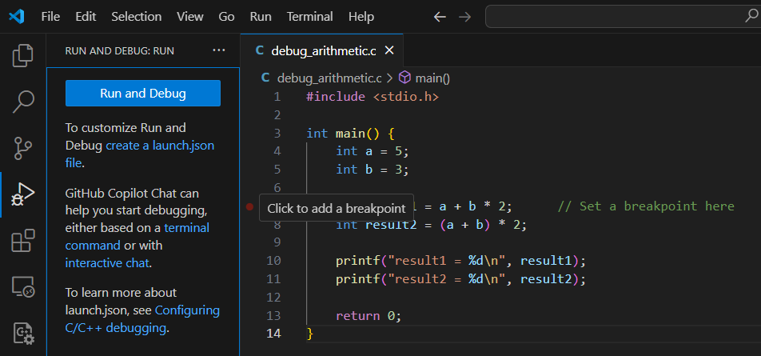
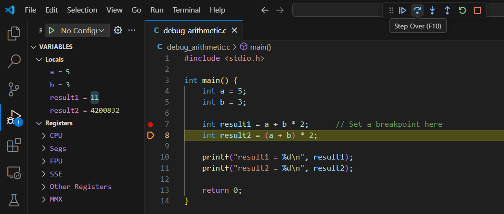

Let's now explore some practical examples to better understand the concepts we've covered in the last chapter. Open VS Code or go to [C/C++ Shell](https://cpp.sh/) in your browser to execute the following programs. To debug, see [below](/docs/c/examples-debugging#debugging-expressions-in-c).

<!-- import CodeBlock from '@theme/CodeBlock';
import Tabs from '@theme/Tabs';
import TabItem from '@theme/TabItem'; -->

### Arithmetic Operators

```c {title="arithmetic_operators.c"}
#include <stdio.h>

int main() {
    // Examples of arithmetic operators
    float a = 10 + 1;
    float b = 20 - 3;
    float c = 3 * 2;
    float d = 10 / 3;     // Integer division
    float e = 10 / 3.0;   // Floating-point division
    float f = 10 % 3;     // Remainder of integer division
    float g = 10 / (float)3;  // Floating-point division (with cast)
    
    printf("a = %.1f\n", a);
    printf("b = %.1f\n", b);
    printf("c = %.1f\n", c);
    printf("d = %.1f\n", d);
    printf("e = %.2f\n", e);
    printf("f = %.1f\n", f);
    printf("g = %.2f\n", g);
    return 0;
}
```

<div class="output">
    <code class="output">
    a = 11.0<br/>
    b = 17.0<br/>
    c = 6.0<br/>
    d = 3.0<br/>
    e = 3.33<br/>
    f = 1.0<br/>
    g = 3.33<br/>
    </code>
</div>

### Relational and Logical Operators

```c {title="relational_logical_operators.c"}
#include <stdio.h>

int main() {
    // Examples of relational operators
    int a = 3 < 4;      // Reads as a = (3 < 4)
    int b = 3 >= 4;
    int c = 2 == 1;
    int d = 1 == 1;
    
    // Examples of logical operators
    int e = !(2 > 3);
    int f = (1 != 2) && (3 == 4);
    int g = (1 != 2) || (3 == 4);
    
    printf("3 >= 4: %d\n", b);
    printf("2 == 1: %d\n", c);
    printf("1 == 1: %d\n", d);
    printf("!(2 > 3): %d\n", e);
    printf("(1 != 2) && (3 == 4): %d\n", f);
    printf("(1 != 2) || (3 == 4): %d\n", g);
    return 0;
}
```

<div class="output">
    <code class="output">
    3 >= 4: 0<br/>
    2 == 1: 0<br/>
    1 == 1: 1<br/>
    !(2 > 3): 1<br/>
    (1 != 2) && (3 == 4): 0<br/>
    (1 != 2) || (3 == 4): 1<br/>
    </code>
</div>

### Operator Precedence

```c {title="operator_precedence.c"}
#include <stdio.h>

int main() {
    // Try to interpret these expressions and verify your expectations
    float a = 3 * 2 - 1;
    float b = 7 / 2 * 2;
    float c = 7 / 2.0 * 2;
    float d = 7 / 2 * 2.0;
    float e = 13 % 2 == 1;
    float f = 1 <= 3 && 2 <= 4;
    
    // Some examples to avoid
    float g = 2 <= 3 <= 4;    // Confusing chain of comparisons
    float h = (2 != 3) * 4;   // Mixing comparison and multiplication
    float i = 1 < 3 == 2 < 4; // Confusing chain of comparisons
    
    printf("a = %.1f\n", a);
    printf("b = %.1f\n", b);
    printf("c = %.1f\n", c);
    printf("d = %.1f\n", d);
    printf("e = %.1f\n", e);
    printf("f = %.1f\n", f);
    printf("g = %.1f\n", g);
    printf("h = %.1f\n", h);
    printf("i = %.1f\n", i);
    return 0;
}
```

<div class="output">
    <code class="output">
    a = 5.0<br/>
    b = 6.0<br/>
    c = 7.0<br/>
    d = 2.0<br/>
    e = 1.0<br/>
    f = 1.0<br/>
    g = 1.0<br/>
    h = 4.0<br/>
    i = 1.0<br/>
    </code>
</div>

### Assignment and Increment/Decrement

```c {title="assignment_increments.c"}
#include <stdio.h>

int main() {
    // The assignment operator writes a value to a variable
    int a = 10;
    a = a + 2;
    printf("a = %d\n", a);  // Output: 12
    
    // Increment and decrement have two notations
    int b = a++;  // Postfix notation (denotes the value before increment)
    printf("b = %d, a = %d\n", b, a);  // Output: b = 12, a = 13
    int c = ++a;  // Prefix notation (denotes the value after increment)
    printf("c = %d, a = %d\n", c, a);  // Output: c = 14, a = 14
    
    // Some operators have a compact notation when combined with assignment
    a += 2;  // Equivalent to: a = a + 2
    printf("a += 2: %d\n", a);  // Output: 16
    a -= 2;  // Equivalent to: a = a - 2
    printf("a -= 2: %d\n", a);  // Output: 14
    
    // The assignment operator is itself an expression
    int d = (a = 2 * a);
    printf("d = (a = 2 * a): d = %d, a = %d\n", d, a);  // Output: d = 28, a = 28
    int e = a /= 2; 
    printf("e = a /= 2: e = %d, a = %d\n", e, a);  // Output: e = 14, a = 14
    
    return 0;
}
```

<div class="output">
    <code class="output">
    a = 12<br/>
    b = 12, a = 13<br/>
    c = 14, a = 14<br/>
    a += 2: 16<br/>
    a -= 2: 14<br/>
    d = (a = 2 * a): d = 28, a = 28<br/>
    e = a /= 2: e = 14, a = 14<br/>
    </code>
</div>

### Integer Types and Representation

```c {title="integer_types.c"}
#include <stdio.h>

int main() {
    // Variable assignment (integer types)
    int a = 10;
    short int b = 2;
    long int c = 1000;
    long long int d = 1234;
    
    // Different representation capacities (value ranges)
    short e = 32767;  // Maximum value for short
    int f = 2147483647;  // Maximum value for int (32-bit)
    long g = 2147483647L;  // Long literal with 'L' suffix
    long long h = 9223372036854775807LL;  // Long long literal with 'LL' suffix
    
    printf("int: %d\n", a);
    printf("short int: %hd\n", b);
    printf("long int: %ld\n", c);
    printf("long long int: %lld\n", d);
    printf("max short: %hd\n", e);
    printf("max int: %d\n", f);
    printf("long value: %ld\n", g);
    printf("long long value: %lld\n", h);
    
    return 0;
}
```

<div class="output">
    <code class="output">
    int: 10<br/>
    short int: 2<br/>
    long int: 1000<br/>
    long long int: 1234<br/>
    max short: 32767<br/>
    max int: 2147483647<br/>
    long value: 2147483647<br/>
    long long value: 9223372036854775807<br/>
    </code>
</div>

## Debugging Expressions in C

Debugging is a crucial skill when working with expressions. Visual Studio Code makes it easy to observe how variables change as your program executes. You can read the detailed guide to debugging in VS Code on [Debug code with Visual Studio Code](https://code.visualstudio.com/docs/editor/debugging), while here you'll find a short explanation on how to do it.

We'll use the following program, to also understand operator precedence:

```c {title="debug_arithmetic.c"}
#include <stdio.h>

int main() {
    int a = 5;
    int b = 3;
    
    int result1 = a + b * 2;      // Set a breakpoint here
    int result2 = (a + b) * 2;
    
    printf("result1 = %d\n", result1);
    printf("result2 = %d\n", result2);
    
    return 0;
}
```

### Setting up breakpoints

1. Open your C file in Visual Studio Code
2. Click in the margin to the left of a line number to set a breakpoint (a red dot will appear)
3. Start debugging by pressing F5 or clicking the "Run and Debug" button


<figcaption>Screenshot of Visual Studio Code with a C program open. To add a breakpoint, click in the margin to the left of the line number where you want to pause execution. A red dot will appear, indicating the breakpoint.</figcaption>

### Watching variables change

1. Once the program pauses at your breakpoint, observe the current values in the "Variables" panel
2. Use the "Step Over" button (F10) to execute the next line
3. Watch how variable values change after each operation


<figcaption>Screenshot of Visual Studio Code with a C program open. The debugger is active, showing variable values in the "Variables" panel. To step through the code, use the "Step Over" button (press F10).</figcaption>

This technique allows you to visualize how expressions are evaluated step-by-step and helps identify any issues in your code, a very important job of software development.
