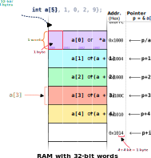

An **array** in C is a collection of elements of the same type, stored in contiguous memory locations. Arrays allow you to group related data together and access each element using an index.

### Basic array declaration and usage

To declare an array, specify the data type of its elements followed by the array name and its size in square brackets:

```c
int numbers[5];  // Declares an array of 5 integers
```

This creates space for 5 integers in memory, indexed from `0` to `4`. You can access and modify individual elements using their index:

```c
numbers[0] = 10;  // Assign 10 to the first element
numbers[1] = 20;  // Assign 20 to the second element
int x = numbers[2];  // Retrieve value of third element
```

## Array initialization

There are several ways to initialize arrays in C:

```c
// Method 1: Initialize with values at declaration
int values[5] = {10, 20, 30, 40, 50};

// Method 2: Partial initialization (remaining elements are set to 0)
int partial[5] = {10, 20};  // Equivalent to {10, 20, 0, 0, 0}

// Method 3: Initialize all elements to zero
int zeros[100] = {0};

// Method 4: Let the compiler determine the size based on initializers
int auto_sized[] = {1, 2, 3, 4};  // Creates an array of size 4
```

:::note Zero initialization
Using `{0}` initializes all elements to zero. This is a common technique for clearing arrays:

```c
int arr[10] = {0};         // All 10 elements set to zero
int matrix[50][50] = {0};  // All 2500 elements set to zero
```

This works because C automatically sets any unspecified initializers to zero when you provide at least one initializer value.
:::

## Array input and output

### Reading array elements from input

You can read array elements using `scanf`:

```c
int arr[5];
printf("Enter 5 integers: ");
for (int i = 0; i < 5; i++) {
    scanf("%d", &arr[i]);  // Note the & operator
}
```

Note that when you call `scanf`, it requires the **address** of the variable where the input will be stored, not the value itself.

By using `&arr[i]`, you pass the pointer to the i‑th element of `arr`. This ensures that each entered integer is written directly into the correct position in the array.

:::tip
If you frequently need to print arrays, you can define a macro to simplify the process and avoid writing repetitive loops each time as follows:

```c
#define PRINT_ARRAY(arr, size)       \
    for (int i = 0; i < (size); i++) \
        printf("%d ", (arr)[i]);

// Usage
PRINT_ARRAY(a, SIZE);
```

Also, wrapping the macro body in a `do { … } while (0)` makes it behave like a single statement, preventing issues when used inside conditionals:

```c
#define PRINT_ARRAY(arr, size)             \
    do {                                   \
        for (int i = 0; i < (size); i++)   \
            printf("%d ", (arr)[i]);       \
    } while (0)

// Safe in an if/else without braces
if (condition)
    PRINT_ARRAY(a, SIZE);
else
    printf("No array to print\n");
```
:::

#### Reading array input with basic error handling

When reading input into an array, it's good practice to check if the input is valid. Here is a way to do that:

```c
#define SIZE 5
// and in main()...
int a[SIZE];

for (int i = 0; i < SIZE; i++) {
    printf("Enter value %d: ", i);
    // scanf needs the address of the variable to store the input
    // The condition checks if scanf successfully read an integer
    if (scanf("%d", &a[i]) != 1) {
        printf("Invalid input\n");
        break;
    }
}
```

If the user enters something that is not an integer, the program prints an error message and stops reading further input. This helps prevent undefined behavior from invalid or unexpected input.

:::note
Notice that the `scanf` function is called directly inside the `if` condition:

```c
if (scanf("%d", &a[i]) != 1) {
    printf("Invalid input\n");
    break;
}
```

This means `scanf` is executed once, and its return value is immediately checked. There is no need to call `scanf` again in an `else` block, because the input has already been read (or attempted to be read) at this point.
:::

## Multidimensional arrays

C supports multidimensional arrays, which are essentially arrays of arrays:

```c
// 2D array (3 rows, 4 columns)
int matrix[3][4] = {
    {11, 12, 13, 14},  // Row 0
    {21, 22, 23, 24},  // Row 1
    {31, 32, 33, 34}   // Row 2
};

// Access element at row 1, column 2
int value = matrix[1][2];  // Gets 23
```


<div style={{ display: 'flex', justifyContent: 'center', margin: '1em 0' }}>
    <table style={{ borderCollapse: 'collapse', fontFamily: 'Consolas, monospace' }}>
<tbody>
    <tr style={{ borderTop: "none" }}>
        <th style={{ background: "transparent", color: "#fff", borderRight: "1px solid #bbb", borderBottom: "1px solid #bbb", borderTop: "none", borderLeft: "none", width: "90px", height: "90px" }}></th>
        <th style={{ background: "#1377CFFF", color: "#fff", border: "1px solid #bbb", width: "90px", height: "90px" }}>Col 0</th>
        <th style={{ background: "#1377CFFF", color: "#fff", border: "1px solid #bbb", width: "90px", height: "90px" }}>Col 1</th>
        <th style={{ background: "#1377CFFF", color: "#fff", border: "1px solid #bbb", width: "90px", height: "90px" }}>Col 2</th>
        <th style={{ background: "#1377CFFF", color: "#fff", border: "1px solid #bbb", width: "90px", height: "90px" }}>Col 3</th>
    </tr>
    <tr>
        <th style={{ background: "#DB443CFF", color: "#fff", border: "1px solid #bbb", width: "90px", height: "90px" }}>Row 0</th>
        <td style={{ background: "rgba(0, 116, 217, 0.04)", border: "1px solid #bbb", textAlign: "center", width: "90px", height: "90px" }}>11</td>
        <td style={{ background: "rgba(0, 116, 217, 0.04)", border: "1px solid #bbb", textAlign: "center", width: "90px", height: "90px" }}>12</td>
        <td style={{ background: "rgba(0, 116, 217, 0.04)", border: "1px solid #bbb", textAlign: "center", width: "90px", height: "90px" }}>13</td>
        <td style={{ background: "rgba(0, 116, 217, 0.04)", border: "1px solid #bbb", textAlign: "center", width: "90px", height: "90px" }}>14</td>
    </tr>
    <tr>
        <th style={{ background: "#DB443CFF", color: "#fff", border: "1px solid #bbb", width: "90px", height: "90px" }}>Row 1</th>
        <td style={{ background: "rgba(255, 65, 54, 0.04)", border: "1px solid #bbb", textAlign: "center", width: "90px", height: "90px" }}>21</td>
        <td style={{ background: "rgba(255, 65, 54, 0.04)", border: "1px solid #bbb", textAlign: "center", width: "90px", height: "90px" }}>22</td>
        <td style={{ background: "rgba(255, 65, 54, 0.04)", border: "1px solid #bbb", textAlign: "center", width: "90px", height: "90px" }}>23</td>
        <td style={{ background: "rgba(255, 65, 54, 0.04)", border: "1px solid #bbb", textAlign: "center", width: "90px", height: "90px" }}>24</td>
    </tr>
    <tr>
        <th style={{ background: "#DB443CFF", color: "#fff", border: "1px solid #bbb", width: "90px", height: "90px" }}>Row 2</th>
        <td style={{ background: "rgba(46, 204, 64, 0.04)", border: "1px solid #bbb", textAlign: "center", width: "90px", height: "90px" }}>31</td>
        <td style={{ background: "rgba(46, 204, 64, 0.04)", border: "1px solid #bbb", textAlign: "center", width: "90px", height: "90px" }}>32</td>
        <td style={{ background: "rgba(46, 204, 64, 0.04)", border: "1px solid #bbb", textAlign: "center", width: "90px", height: "90px" }}>33</td>
        <td style={{ background: "rgba(46, 204, 64, 0.04)", border: "1px solid #bbb", textAlign: "center", width: "90px", height: "90px" }}>34</td>
    </tr>
</tbody>
</table>
</div>


You can create arrays with any number of dimensions:

```c
// 3D array (2 matrices of 3×3)
int cube[2][3][3];

// Accessing elements
cube[0][1][2] = 99;  // First matrix, second row, third column
```

To print them, use nested loops. For example, printing a 2D array is done  like this:

```c
#include <stdio.h>

int main() {
    int matrix[3][4] = {
        {11, 12, 13, 14},
        {21, 22, 23, 24},
        {31, 32, 33, 34}
    };

    for (int i = 0; i < 3; i++) {
        for (int j = 0; j < 4; j++) {
            printf("%d ", matrix[i][j]);
        }
        printf("\n");
    }
    return 0;
}
```

<div class="output">
<code class="output">
11 12 13 14 <br/>
21 22 23 24 <br/>
31 32 33 34 <br/>
</code>
</div>

You can extend this approach for higher-dimensional arrays by adding more nested loops.

## Arrays and memory

Arrays in C have a fixed size that must be known at compile time (for static arrays). The array name itself represents the memory address of the first element.

```c
int nums[5] = {10, 20, 30, 40, 50};
printf("Address of first element: %p\n", nums);  // Same as &nums[0]
```

The relationship between arrays and pointers is why array names can often be used interchangeably with pointers to their first element:

```c
int *ptr = nums;  // ptr points to nums[0]
printf("First element: %d\n", *ptr);  // Prints 10
printf("Second element: %d\n", *(ptr + 1));  // Prints 20
```

This memory diagram might be helpful:


<figcaption>
Fig. 1. This diagram illustrates how arrays and pointers are represented in memory. The array name (e.g., <code>a</code>) acts as a pointer to the first element (<code>p</code> is the same as <code>a</code> here, they both point to the same location). Pointer arithmetic (such as <code>p + 1</code>) moves to subsequent elements, just like incrementing the array index.
</figcaption>

Remember that each data type has a specific size; for example, an `int` typically occupies 32 bits (4 bytes) in most C implementations.

## Dynamic arrays

Static arrays have a fixed size determined at compile time. For variable-sized arrays allocated at runtime, C provides dynamic memory allocation:

```c
```c
#include <stdio.h>
#include <stdlib.h>

int main() {
    // Allocate an array of n integers
    int size;
    printf("Enter array size: ");
    scanf("%d", &size);

    int *dynamic_array = (int *)malloc(size * sizeof(int));

    // Check if allocation was successful
    if (dynamic_array == NULL) {
        printf("Memory allocation failed\n");
        return 1;
    }

    // Use the array
    for (int i = 0; i < size; i++) {
        dynamic_array[i] = i * 10;
    }

    // Print the array
    printf("Array contents: ");
    for (int i = 0; i < size; i++) {
        printf("%d ", dynamic_array[i]);
    }
    printf("\n");

    // Important: Free the memory when done
    free(dynamic_array);

    return 0;
}
```

<div class="output">
<code class="output">
Enter array size: 5<br/>
Array contents: 0 10 20 30 40 
</code>
</div>

:::caution Variable-length arrays (VLAs)
C99 introduced Variable-Length Arrays, which allow array sizes to be determined at runtime:

```c
void process_data(int size) {
    int variable_array[size];  // Size determined at runtime
    // Use the array...
}
```

However, VLAs have limitations:
- They cannot be initialized at declaration
- They exist only until the end of their scope
- They can cause stack overflow with large sizes
- They're optional in C11 and later standards

For larger or longer-lived dynamic arrays, `malloc()` is generally preferred.
:::

## Common pitfalls with arrays

1. **Bounds checking**: C does not automatically check if an array index is valid. Accessing an element beyond the array bounds leads to undefined behavior.

```c
int arr[3] = {1, 2, 3};
printf("%d\n", arr[5]);  // Out-of-bounds access: undefined behavior
```

2. **Array size**: Unlike some languages, C arrays do not track their own size. You must manage this information separately.

```c
int arr[10];
// sizeof(arr) gives the total size in bytes
int size = sizeof(arr) / sizeof(arr[0]);  // Calculates number of elements
printf("Array size: %d\n", size);
```

:::note

The `strlen()` function is commonly used to determine the length of a string (a character array terminated by a null character `'\0'`).  
It **cannot** be used to find the size of a general array of numbers or other types.  
For example:

```c
char str[] = "hello";
printf("%zu\n", strlen(str));  // Prints 5 (number of characters before '\0')
```

But for non-string arrays (like `int arr[10]`), `strlen()` does not apply. Always use `sizeof(arr) / sizeof(arr[0])` for such cases.

:::

3. **Uninitialized arrays**: elements of an array declared without initialization contain garbage values unless explicitly initialized.

```c
int arr[5];  // Uninitialized array
for (int i = 0; i < 5; i++) {
    printf("%d ", arr[i]);  // Unpredictable output (garbage values)
}
```

4. **Array assignment**: you cannot assign one array to another with the `=` operator. Instead, you must copy elements individually or use functions like `memcpy()`.

```c
int a[5] = {1, 2, 3, 4, 5};
int b[5];
// b = a; // Wrong! This does not work in C

// Correct way to copy:
for (int i = 0; i < 5; i++) {
    b[i] = a[i];
}
```

Arrays are fundamental to C programming and serve as the foundation for many more complex data structures like strings, matrices, and tables.

## 📝 Exercise: Analyze weekly temperatures

Let's try coding a C program that:

- Stores the temperatures for 7 days in an array.
- Calculates the average temperature.
- Prints the days (1-indexed) where the temperature was above average.
- Displays the average temperature and the number of days above average.

Solve this on your own before checking the solution!

<details>
<summary>Show solution</summary>

```c
#include <stdio.h>

int main() {
    // Declare and initialize an array
    int temperatures[7] = {24, 22, 25, 23, 26, 25, 24};
    
    // Calculate average temperature
    int sum = 0;
    for (int i = 0; i < 7; i++) {
        sum += temperatures[i];
    }
    float average = (float)sum / 7;
    
    // Find days above average
    int above_average_count = 0;
    printf("Days with above average temperature: ");
    for (int i = 0; i < 7; i++) {
        if (temperatures[i] > average) {
            printf("%d ", i + 1);  // Day number (1-indexed)
            above_average_count++;
        }
    }
    printf("\n");
    
    printf("Average temperature: %.2f°C\n", average);
    printf("Number of days above average: %d\n", above_average_count);
    
    return 0;
}
```

<div class="output">
<code class="output">
Days with above average temperature: 3 5 6 <br/>
Average temperature: 24.14°C<br/>
Number of days above average: 3<br/>
</code>
</div>

</details>