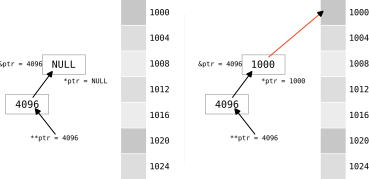
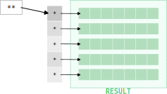

We've seen that a pointer is a variable that stores a memory address. as such, a pointer has itself an address in memory.

A double pointer is a **pointer that stores the address of another pointer**. It's also commonly called a "pointer to pointer".

This concept extends the indirection principle we've already seen with regular pointers, adding another layer of reference.

## Declaration

To declare a double pointer, use two asterisks before the variable name, and similar to regular pointers, a double pointer needs to be initialized before use:

```c
int x = 10;     // An integer variable
int *p = &x;    // A pointer to x
int **pp = &p;  // A double pointer to p
```

- `x` contains the value `10`
- `p` contains the address of `x` (`&x`)
- `pp` contains the address of `p` (`&p`)

## Visualizing double pointers

The relationship between variables, pointers, and double pointers can be visualized like this:


<figcaption>Fig.1. Relationship between a variable, a pointer, and a double pointer. Image courtesy of GeekforGeeks</figcaption>

:::info Memory addresses vs. memory contents (at any pointer level)

Alternative diagram with text:

``` showLineNumbers
  &p=0xCAFEBABE        p=0xFEEDBEEF         *p=0xDEADBEEF      <-- memory address
┌──────────────┐    ┌───────────────┐    ┌────────────────┐
│ p=0xFEEDBEEF │ -> │ *p=0xDEADBEEF │ -> │ **p=0x01234567 │    <-- memory content
└──────────────┘    └───────────────┘    └────────────────┘
```

- `&p` is the address of `p`, which is `0xCAFEBABE`. The memory location `0xCAFEBABE` stores the value of `p`, which is `0xFEEDBEEF`. That is also the address of `*p`.
- The value of `p` is the address of `*p`.
- The value of `&p` is the address of `p`.
- The value of `*p` is the address of `**p`.

And so on. Note that `*` and `&` are like opposites, and `*&p == p == &*p`. From [here](https://stackoverflow.com/a/9661353/13122341).

:::

Another representation:


<figcaption>Fig.2. Visual representation of a double pointer (<code>int **ptr</code>). On the left, the pointer <code>*ptr</code> is <code>NULL</code>, so dereferencing it would be invalid. On the right, <code>*ptr</code> has been set to <code>1000</code>, so <code>*ptr</code> points to address <code>1000</code>. In both cases, <code>ptr</code> itself is stored at address <code>4096</code>, and <code>**ptr</code> dereferences to the value at the address pointed to by <code>*ptr</code>. This illustrates how a double pointer can be used to modify or access the address stored in another pointer.</figcaption>

## Dereferencing double pointers
With double pointers, you can dereference once or twice:

- `*pp` gives the value of `p` (which is the address of `x`)
- `**pp` gives the value that `p` points to (which is the value of `x`)

```c
int x = 10;
int *p = &x;
int **pp = &p;

printf("Value of x: %d\n", x);       // Prints 10
printf("Value of *p: %d\n", *p);     // Prints 10
printf("Value of *pp: %p\n", *pp);   // Prints the address of x
printf("Value of **pp: %d\n", **pp); // Prints 10

// We can modify x through pp
**pp = 20;
printf("New value of x: %d\n", x);   // Prints 20
```

<div class="output">
<code class="output">
Value of x: 10<br/>
Value of *p: 10<br/>
Value of *pp: 0xADDRESS<br/>
Value of **pp: 10<br/>
New value of x: 20
</code>
</div>

In this example, all three expressions `x`, `*p`, and `**pp` refer to the same memory location, just with different levels of indirection.

## Chain of references

Think of double pointers as a chain of references:

```c
#include <stdio.h>

int main() {
    int value = 42;
    int *ptr = &value;    // Points to value
    int **dptr = &ptr;    // Points to ptr
    
    printf("Direct access: %d\n", value);
    printf("Through pointer: %d\n", *ptr);
    printf("Through double pointer: %d\n", **dptr);
    
    // Change value through double pointer
    **dptr = 100;
    printf("New value: %d\n", value);
    
    return 0;
}
```

<div class="output">
<code class="output">
Direct access: 42<br/>
Through pointer: 42<br/>
Through double pointer: 42<br/>
New value: 100
</code>
</div>

## Double pointers in functions

One important use of double pointers is when you need to modify a pointer inside a function:

```c
void allocate_int_pointer(int **pp) {
    // Create a new int and make the original pointer point to it
    int *temp = (int*)malloc(sizeof(int));
    *temp = 42;
    *pp = temp;  // Modify where the original pointer points
}

int main() {
    int *p = NULL;
    allocate_int_pointer(&p);  // Pass address of the pointer
    
    printf("Value: %d\n", *p);  // Prints 42
    free(p);  // Don't forget to free
    return 0;
}
```

:::caution
Without using a double pointer, we couldn't modify where the original pointer `p` points to from within the function. This is because function parameters are passed by value in C, even when those parameters are pointers.
:::

## Practical use cases

Double pointers are commonly used for:

1. **Modifying pointer values in functions** (as shown above)

2. **Arrays of strings** (which are essentially arrays of character pointers):

```c
char *names[] = {"Alice", "Bob", "Charlie"};
char **ptr = names;  // ptr is a pointer to the first string pointer

printf("%s\n", *ptr);      // Prints "Alice"
printf("%s\n", *(ptr+1));  // Prints "Bob"
```

3. **Building data structures** like linked lists where you need to modify head pointers

4. **Creating 2D and multi-dimensional arrays dynamically**


<figcaption>
Fig.3. Graphical representation of how double pointers are used to implement dynamic matrices in C.  
The vertical gray rectangle on the left represents an array of pointers, with each pointer (<code>*</code>) corresponding to a row of the matrix. Each pointer points to a dynamically allocated array of integers (the green rows on the right). The double asterisk (<code>**</code>) at the top represents the double pointer variable, which points to the array of row pointers.  
On the right, the matrix is shown as a collection of rows (<b>array of arrays</b>). Each row is a separate (dynamically allocated) array of integers. This structure allows for flexible, non-contiguous memory allocation for each row, which is typical when creating 2D arrays (dynamically) using double pointers in C.
</figcaption>

:::info
Many standard C library functions that need to modify string pointers use double pointers. For example, sorting an array of strings might use this pattern.
:::

## Common mistake: Mixing indirection levels

A common mistake is mixing up indirection levels:

```c
int x = 10;
int *p = &x;
int **pp = &p;

printf("%d\n", **pp);  // Correct: 10
printf("%d\n", *pp);   // Wrong! This is an address, not an int
```

Remember that each level of indirection (`*`) drops you down one level in the reference chain.

## Sizing double pointers

Like all pointers, the size of a double pointer depends on your system architecture (typically 4 bytes on 32-bit systems and 8 bytes on 64-bit systems):

```c
printf("Size of int: %zu bytes\n", sizeof(int));
printf("Size of int*: %zu bytes\n", sizeof(int*));  
printf("Size of int**: %zu bytes\n", sizeof(int**));
```

On a 64-bit system, this would print:

<div class="output">
<code class="output">
Size of int: 4 bytes<br/>
Size of int*: 8 bytes<br/>
Size of int**: 8 bytes
</code>
</div>

Notice that both single and double pointers have the same size since they both store addresses.

## Multilevel pointers

C doesn't limit you to just double pointers. You can create pointers with even more levels of indirection:

```c
int x = 10;
int *p = &x;          // Single pointer
int **pp = &p;        // Double pointer
int ***ppp = &pp;     // Triple pointer!

printf("%d\n", ***ppp);  // Prints 10
```

:::warning
While C allows any level of pointer indirection, using more than two levels is rare in practice. As indirection increases, code becomes harder to understand and maintain. Triple or higher-level pointers are usually a sign that you might want to reconsider your design.
:::

## Double pointers vs. multi-dimensional arrays

It's important not to confuse double pointers with 2D arrays, even though they can sometimes be used interchangeably. 

A 2D array has contiguous memory allocation, while a double pointer can point to arrays that are scattered through memory.

For example:

```c
int matrix[3][4];        // True 2D array - contiguous memory
int **dynamic_matrix;    // Double pointer - can be used for 2D array
```

We'll explore this relationship further when we discuss dynamic memory allocation.