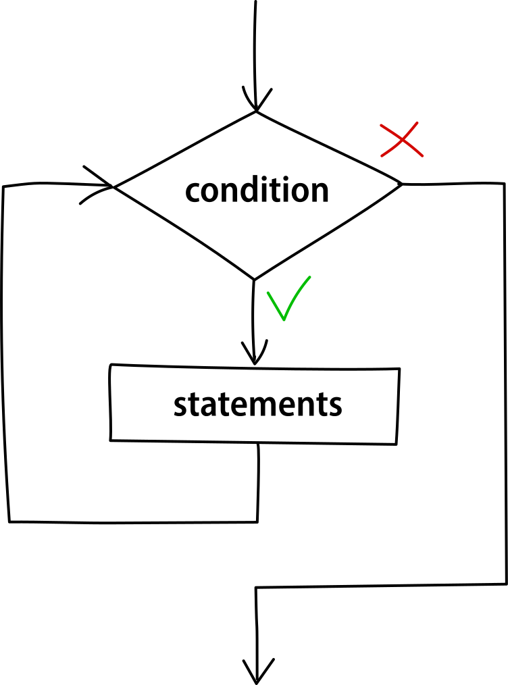
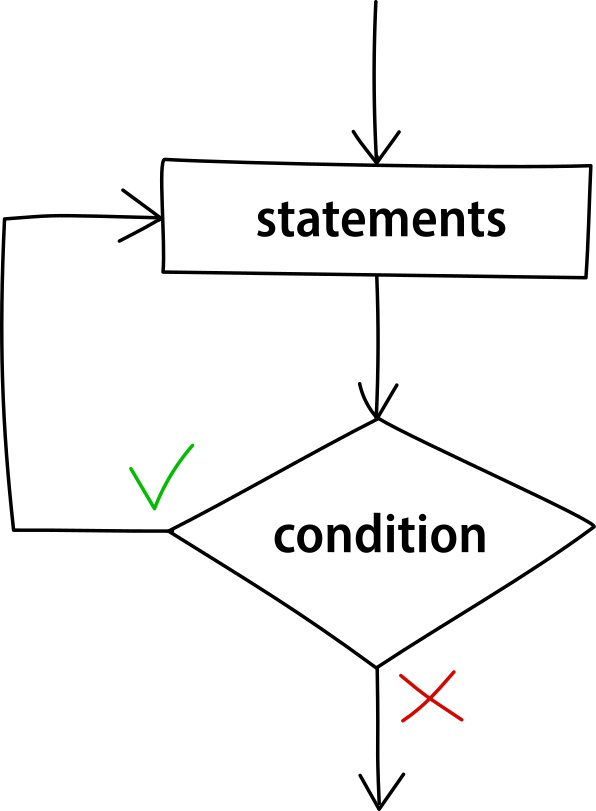
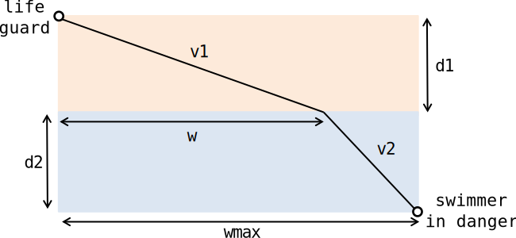

import CodeBlock from '@theme/CodeBlock';
import Tabs from '@theme/Tabs';
import TabItem from '@theme/TabItem';
import Spoiler from '@site/src/components/Spoiler';

This chapter covers flow control and structured programming in C, which are essential concepts for writing well-organized code.

## Introduction to Structured Programming

In C, there are two classes of instructions:

1. **Simple instructions** (the ones we've seen so far)
2. **Control instructions** (which aggregate simple instructions)

Structured programming avoids unconditional jumps (like `goto` statements) in favor of clear, predictable control flow. According to computer scientist Edsger W. Dijkstra (1969), any algorithm can be expressed using just three fundamental control structures:

1. **Sequence** - Instructions executed one after another in order
2. **Selection** - Choosing between different code blocks based on conditions (if-else, switch)
3. **Iteration** - Repeating blocks of instructions (loops like while, do-while, for)

These three structures form the foundation of structured programming and are sufficient to express any algorithm without resorting to arbitrary jumps.

Using these structures makes code more readable, maintainable, and less prone to bugs compared to "spaghetti code" that relies on uncontrolled jumps.

:::info What is "Spaghetti Code"?

"Spaghetti code" is a pejorative term for code that has complex and tangled control flow, often due to excessive use of unconditional jumps like `goto` statements. Just as with actual spaghetti where it's hard to trace a single strand, in spaghetti code it's difficult to follow the program execution path due to its poor or inconsistent structure.


The code might function correctly, but remains difficult to debug when problems arise, challenging to modify without introducing new bugs, nearly impossible for new developers to understand, and resistant to extension or improvement.

Structured programming was developed specifically to combat these issues by enforcing clear, predictable control flow.

:::

## Blocks in C

A block in C is a group of statements enclosed within curly braces `{}`. Blocks define a scope and can contain variable definitions, expressions, and other control structures.

Syntax:

```c
{
    statement1;
    statement2;
    // more statements...
}
```

Blocks are used in control structures to group multiple statements and treat them as a single unit.

### Blocks and Variable Scope

Variables defined within a block:
1. Are only accessible within that block (their scope)
2. Are destroyed when execution leaves the block (their lifetime)

For this reason, such variables are called **local** to the block.

```c {title="block_scope.c"}
#include <stdio.h>

int main() {
    int a = 3;
    {
        int b = 2;
        // Both a and b are accessible
        printf("Inside inner block: a = %d, b = %d\n", a, b);
    }
    // b is no longer accessible here
    printf("Outside inner block: a = %d\n", a);
    
    return 0;
}
```

<div class="output">
<code class="output">
Inside inner block: a = 3, b = 2<br />
Outside inner block: a = 3
</code>
</div>

### Variable Shadowing

Variable shadowing occurs when **a local variable in an inner scope has the same name as a variable in an outer scope**.

When this happens, the local variable in the inner scope temporarily obscures or "shadows" the variable from the outer scope. Within the inner scope, any reference to the variable name refers to the inner variable, not the outer one. The outer variable continues to exist unmodified and becomes accessible again once execution leaves the inner scope.

This concept directly relates to the declaration and definition principles covered in the [Variables and Types](/docs/c/variables-and-types#variable-declaration-and-definition) chapter. When shadowing occurs, both the outer and inner variables are distinct entities with separate memory allocations.

Each variable has its own definition and occupies its own memory space. Unlike when using `extern` declarations, these are completely independent variables that merely share a common identifier.

Let's take a look at this example to see what happens:

```c {title="variable_shadowing.c"}
#include <stdio.h>

int main() {
    int a = 3;  // Outer 'a' is defined here
    {
        int a = 2;  // Inner 'a' is a completely separate variable
        printf("Inner a = %d\n", a); // Refers to inner 'a' (2)
    }
    printf("Outer a = %d\n", a); // Refers to outer 'a' (3)
    
    return 0;
}
```

<div class="output">
<code class="output">
Inner a = 2<br />
Outer a = 3
</code>
</div>

## Conditional Statements

### If-Else Statement

The if-else statement executes different code blocks based on a condition.

Syntax:
```c
if (expression) {
    // Code executed when expression is true
} else {
    // Code executed when expression is false (optional)
}
```

The expression is interpreted as a logical value: 0 means false, any non-zero value means true.

Example:

```c {title="if_else_example.c"}
#include <stdio.h>

int main() {
    int a = 5, b = 3, max;
    
    if (a > b) {
        max = a;
    } else {
        max = b;
    }
    
    printf("The maximum value is %d\n", max);
    return 0;
}
```

<div class="output">
<code class="output">
The maximum value is 5
</code>
</div>

### Nested If Statements

If statements can be nested inside each other:

```c
if (y != 0) {
    if (x > y) {
        z = x / y;
    } else {
        z = y / x;
    }
}
```

:::caution
In nested if statements, each `else` is associated with the closest `if` that doesn't already have an `else`. Using proper indentation makes these relationships clearer.
:::

Example:

```c {title="nested_if_example.c"}
#include <stdio.h>

int main() {
    int score = 85;
    int attendance = 1;  // 1 for sufficient, 0 for insufficient
    
    if (score >= 60) {
        if (attendance) {
            printf("Result: Pass with score %d", score);
        } else {
            printf("Result: Incomplete - attendance requirement not met");
        }
    } else {
        if (attendance) {
            printf("Result: Fail - eligible for retest");
        } else {
            printf("Result: Fail - must repeat course");
        }
    }
    
    return 0;
}
```

<div class="output">
<code class="output">
Result: Pass with score 85
</code>
</div>

### Switch Statement

The switch statement executes different code blocks based on the value of an expression.

Syntax:
```c
switch (expression) {
    case constant1:
        // Code for constant1
        break;
    case constant2:
        // Code for constant2
        break;
    // More cases...
    default:
        // Code when no case matches
}
```

Example:

```c {title="switch_example.c"}
#include <stdio.h>

int main() {
    int day = 3;
    
    switch (day) {
        case 1:
            printf("Monday");
            break;
        case 2:
            printf("Tuesday");
            break;
        case 3:
            printf("Wednesday");
            break;
        case 4:
            printf("Thursday");
            break;
        case 5:
            printf("Friday");
            break;
        default:
            printf("Weekend");
    }
    
    return 0;
}
```

<div class="output">
<code class="output">
Wednesday
</code>
</div>

:::warning
Without the `break` statement, execution "falls through" to the next case. This means that after a matching case is found, all subsequent cases are executed until a `break` is encountered or the switch statement ends.
:::

Example of using fall-through behavior intentionally:

```c {title="month_days.c"}
switch (month) {
    case 2:
        if (isLeapYear) {
            days = 29;
        } else {
            days = 28;
        }
        break;
    case 4:
    case 6:
    case 9:
    case 11:
        days = 30;
        break;
    default:
        days = 31;
}
```

## Iteration Statements (Loops)


Loops enable repetitive execution of code blocks. C provides three types of loops:

1. `while` loops
2. `do-while` loops
3. `for` loops

### While Loop

The while loop executes a block of code repeatedly as long as a condition is true.

Syntax:
```c
while (condition) {
    // code to execute
}
```

The condition is evaluated before each iteration. If the condition is false initially, the loop body is never executed.


<figcaption>Fig.1. Flowchart of the while loop.</figcaption>

Example:

```c {title="multiplication_as_sum.c"}
#include <stdio.h>

int main() {
    int a = 4, b = 3;
    int result = 0;
    
    while (b > 0) {
        result += a;
        b--;
    }
    
    printf("%d\n", result); // Computes a * b as a sum
    return 0;
}
```

<div class="output">
<code class="output">
12
</code>
</div>

### Infinite Loops with While

An infinite loop is a loop that never terminates. With a while loop, this happens when the condition is always true:

```c {title="infinite_while.c"}
while (1) {
    // This code will run forever
    printf("This is an infinite loop\n");
}
```

:::caution
Make sure the loop condition eventually becomes false, or you'll create an infinite loop. For example:

```c
while (b > 0) {
    result += a;
    // ‼️ We forgot to update b
}
```

This would run forever since `b` never changes.
:::

### Do-While Loop

The do-while loop is similar to the while loop, but the condition is evaluated after each iteration. This ensures that the loop body is executed at least once.


<figcaption>Fig.2. Flowchart of the do-while loop.</figcaption>

Syntax:
```c
do {
    // code to execute
} while (condition);
```

Example:

```c {title="sum_until_negative.c"}
#include <stdio.h>

int main() {
    int num, sum = 0;
    
    do {
        printf("Enter a number (negative to stop): ");
        scanf("%d", &num);
        
        if (num >= 0) {
            sum += num;
        }
    } while (num >= 0);
    
    printf("Sum of all positive numbers: %d\n", sum);
    return 0;
}
```

For this example, if the user enters: 5, 10, 15, -1, the output would be:
<div class="output">
<code class="output">
Sum of all positive numbers: 30
</code>
</div>

### For Loop

The for loop provides a compact way to write loops when the number of iterations is known in advance or when there's a clear initialization, condition, and update pattern.

Syntax:
```c
for (initialization; condition; update) {
    // code to execute
}
```

- The initialization is executed once at the beginning
- The condition is checked before each iteration
- The update is executed after each iteration

#### Why For Loops Were Introduced

For loops were introduced to address common issues with while loops, and have many good features:

1. **Improved Readability:** all loop control elements (initialization, condition, update) are in one place
2. **Reduced Errors:** helps prevent forgetting to update counter variables
3. **Scope Control:** variables declared in the initialization part are local to the loop (C99 and later)
4. **Standardized Pattern:** provides a consistent structure for the common pattern of "initialize, check, execute, update"

Example:

```c {title="sum_numbers.c"}
#include <stdio.h>

int main() {
    int sum = 0;
    
    for (int i = 1; i <= 10; i++) {
        sum += i;
    }
    
    printf("Sum of numbers 1 to 10: %d\n", sum);
    return 0;
}
```

<div class="output">
<code class="output">
Sum of numbers 1 to 10: 55
</code>
</div>

### Infinite Loops with For and While

The for loop can create an infinite loop by omitting the index, condition and increment part (oftentimes the first part is omitted if the index already exists outside the loop):

```c {title="infinite_for.c"}
for (;;) {
    printf("This is an infinite loop\n");
    // This loop runs forever
}

int i = 0;
for (; i < n; i++) { // no initialization expression
    // ...
}
```

Infinite loops can also be done with while loops, and both of these forms achieve the same result:

```c
while (true) {
    // Loop body
}

for (;;) {
    // Loop body
}
```

#### Evolution of a For Loop

Let's see how a while loop can be transformed into a for loop step-by-step, using factorial calculation as an example:

1. Original while loop:
```c {title="factorial_while.c"}
int n = 6, i = 2;
int y = 1;
while (i <= n) {
    y *= i++;
}
```

2. Basic for loop equivalent:
```c {title="factorial_for1.c"}
int n = 6, i;
int y = 1;
for (i = 2; i <= n; i++) {
    y *= i;
}
```

3. With variable declaration in the for statement (C99 and later):
```c {title="factorial_for2.c"}
int n = 6;
int y = 1;
for (int i = 2; i <= n; i++) {
    y *= i;
}
```

:::note
Variables declared in the for loop initialization are local to the loop's scope and are not accessible after the loop ends.
:::

#### Special Cases of For Loops

A for loop can also have an empty body (just a semicolon): all the necessary operations are performed in the loop control expressions themselves:

```c {title="compact_factorial.c"}
int factorial = 1;
for (int n = 5; n > 0; factorial *= n--); // Computes 5!
```

However, this code can be harder to read and understand, so it should be used sparingly.

## Special Control Flow Statements

### Using Break and Continue

The `break` statement terminates the innermost loop or switch statement:

```c {title="break_example.c"}
for (int i = 0; i < 100; i++) {
    if (i * i > 500) {
        break; // Exit when i² exceeds 500
    }
    printf("%d ", i);
}
```

The `continue` statement skips the rest of the current iteration and proceeds to the next iteration:

```c {title="continue_example.c"}
for (int i = 0; i < 10; i++) {
    if (i % 3 == 0) {
        continue; // Skip multiples of 3
    }
    printf("%d ", i);
}
```

<div class="output">
<code class="output">
1 2 4 5 7 8
</code>
</div>

:::caution
While `break` and `continue` can be useful, overusing them can make code harder to follow. In structured programming, their use should be minimized in favor of clearer conditional logic.
:::

### The goto Statement

The `goto` statement provides an unconditional jump from one point in a program to another. It's generally advised to avoid `goto` as it can lead to spaghetti code:

```c {title="goto_example.c"}
#include <stdio.h>

int main() {
    int i = 0;
    
start:  // This is a label
    printf("%d ", i);
    i++;
    
    if (i < 10) {
        goto start; // Jump back to the label
    }
    
    printf("\nDone!\n");
    return 0;
}
```

<div class="output">
<code class="output">
0 1 2 3 4 5 6 7 8 9 <br />
Done!
</code>
</div>

:::caution
The `goto` statement is often considered "harmful" because:

1. It creates complex, non-linear flow that's hard to understand
2. It makes code difficult to debug and maintain
3. It can lead to spaghetti code with unpredictable behavior
4. All control flow needs can already be better handled with the structured programming constructs (if-else, loops)

There are very few legitimate uses for `goto` in modern C programming. One rare acceptable use is for error handling with multiple cleanup steps:

```c
#include <stdio.h>
#include <stdlib.h>

int main() {
    int *arr1 = NULL;
    int *arr2 = NULL;
    
    arr1 = malloc(100 * sizeof(int));
    if (arr1 == NULL) {
        goto cleanup;
    }
    
    arr2 = malloc(200 * sizeof(int));
    if (arr2 == NULL) {
        goto cleanup;
    }
    
    // Do something with arr1 and arr2
    
cleanup:
    if (arr1 != NULL) {
        free(arr1);
    }
    if (arr2 != NULL) {
        free(arr2);
    }
    return 0;
}
```

Even in this case, many programmers prefer to use other techniques that don't require `goto`.
:::

## Best Practices and Common Pitfalls

### Equality Operator vs. Assignment Operator

:::warning Warning
One of the most common bugs in C is using the assignment operator `=` when the equality operator `==` was intended:

```c
// This will error
if (x = 5) {  // ❌ This assigns 5 to x and then evaluates to true
    // ...
}

// This is correct
if (x == 5) { // ✅ This checks if x equals 5
    // ...
}
```

**A possible solution**: when comparing variables with constants, if you put the constant on the left side the program will not compile unless you use the right operator:

```c
if (5 == x)  // If you accidentally type = instead of == you'll get a compiler error
```

**Fun Fact**: this problem is so common that some modern languages like Python use `:=` (known as the "*walrus operator*") for assignment within expressions to avoid confusion with the equality operator `==`.
:::

### Overflow and Underflow in Loops

Be careful about the data type of your loop variables to avoid overflow/underflow:

```c {title="overflow_underflow.c"}
// Potential infinite loop due to overflow
char i;
for (i = 0; i < 200; i++) {
    // When i reaches 127, i++ overflows to -128
    // which is still less than 200, so the loop continues forever
}

// Potential infinite loop due to underflow
unsigned int j;
for (j = 10; j >= 0; j--) {
    // When j reaches 0, j-- underflows to a very large number
    // which is still >= 0, so the loop continues forever
}
```

---

## 📝 Exercise: Lifeguard Rescue Optimization

### Problem description

A lifeguard needs to rescue a swimmer in distress. The lifeguard starts at position (0, d1) on the beach and needs to reach the swimmer at position (wmax, d2) in the water. The lifeguard can run on sand at speed v1 and swim in water at speed v2, where v1 > v2 (running is faster than swimming).

The beach line runs along the x-axis. The lifeguard must determine the optimal point w along the beach (0 ≤ w ≤ wmax) where they should enter the water to minimize the total rescue time.



#### Mathematical formulation

The total time for the rescue is the sum of:

1. Time to run along the beach to point w
2. Time to swim from point w to the swimmer

Mathematically:

- The time for running on sand (first segment) is:
    $$
    t_1(w) = \frac{1}{v_1} \cdot \sqrt{d_1^2 + w^2}
    $$

- The time for swimming in water (second segment) is:
    $$
    t_2(w) = \frac{1}{v_2} \cdot \sqrt{d_2^2 + (w_{\text{max}} - w)^2}
    $$

- The total time is:
    $$
    t(w) = t_1(w) + t_2(w)
    $$

The goal is to find the value of w that minimizes the total time t(w).

<Spoiler>
Since this is a minimization problem, we could find the analytical solution by taking the derivative of the total time function with respect to w and setting it to zero. However, a numerical approach is often more practical, where we sample different values of w and find the one that gives the minimum time.
</Spoiler>

<details>
<summary>Show solution</summary>

<Tabs>
<TabItem value="solution1" label="Solution">

```c
#include <stdio.h>
#include <math.h>

// s = vt ➡️ t = s/v

int main() {
    double v1 = 4;         // Runner's speed on sand
    double v2 = 3;         // Swimmer's speed in water
    double w;              // Current running distance along the beach
    double wmax = 100;     // Total horizontal distance along the beach
    double d1 = 100;       // Vertical distance from starting point to coast
    double d2 = 100;       // Vertical distance from entry point to the swimmer

    int samples = 1000;    // Number of sample points to consider

    double min_total_time = INFINITY;
    
    // Find the value of w that minimizes the total rescue time
    for (int i = 0; i < samples; i++) {
        w = (wmax / samples) * i;

        double t1 = sqrt(pow(w, 2) + pow(d1, 2)) / v1;
        double t2 = sqrt(pow(wmax - w, 2) + pow(d2, 2)) / v2;
    
        double total_time = t1 + t2;

        if (total_time < min_total_time) {
            min_total_time = total_time;
        }

        printf("Total time: %f\n", total_time);
    }
    // Display the minimum total rescue time
    printf("Minimum total time: %f\n", min_total_time);
    
    return 0;
}
```

<div class="output">
<code class="output">
Total time: 72.140452<br />
Total time: 71.906592<br />
...<br />
Total time: 68.514006<br />
Minimum total time: 65.053152
</code>
</div>

</TabItem>
</Tabs>

</details>
