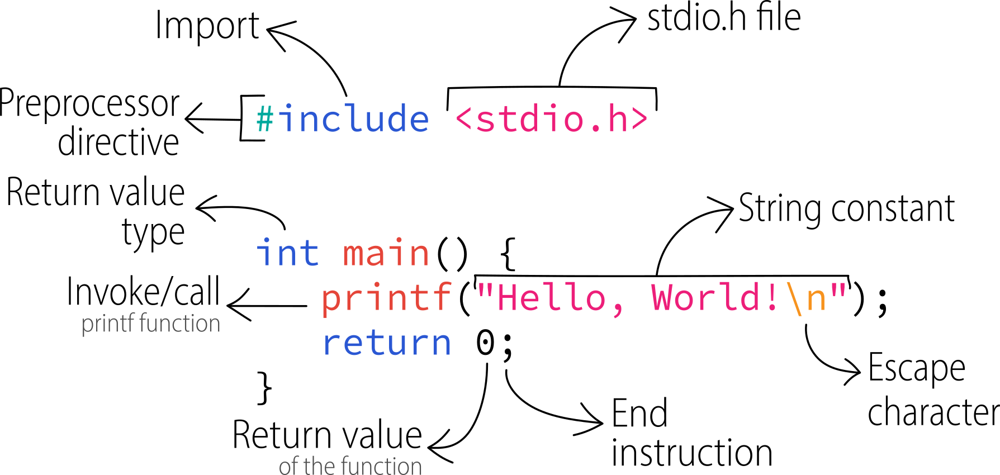

It's tradition to start a programming journey in a new language by writing a simple program that prints "Hello, World!" to the screen, so let's do that:

```c {title="helloworld.c"}
#include <stdio.h>

int main() {
    printf("Hello, World!\n");
    return 0;
}
```

Here's a graphical breakdown of the code:



The image above might seem confusing with all that text gathered together, but in reality this program is very simple. Let's analyze the code:

* **`#include <stdio.h>`** is a *preprocessor directive*. It tells the compiler to include the contents of the `stdio.h` file, which contains declarations of standard input/output functions (like `printf`).
* **`int main() { ... }`** is the definition of the `main` function. Every C program must have a `main` function, which is the starting point of execution.
  * `int` indicates that the `main` function returns an integer (the "exit code" of the program).
  * The curly braces `{}` delimit the *body* of the function, i.e., the instructions that make it up.
* **`printf("Hello, World!\n");`** is a call to the `printf` function, which prints text to the screen.
  * `"Hello, World!\n"` is a *string literal*, i.e., a sequence of characters enclosed in double quotes.
  * `\n` is an *escape sequence* that represents the newline character.
  * The semicolon `;` terminates the statement.
* **`return 0;`** is the statement that terminates the `main` function and returns the value 0 to the operating system. By convention, 0 indicates that the program terminated successfully.

## Compiling and executing

To compile and run this program (assuming you've saved it in a file named `helloworld.c`):

1. Open a terminal/command prompt and ensure you are located in the same folder as the C file (use `dir` and `cd` commands to navigate through CLI).
2. Type the command
  ```batch
  gcc -Wall -g -o helloworld helloworld.c
  ```
  and press <kbd>ENTER/RETURN ⏎</kbd>. What do those gcc arguments/flags mean?
    * `-Wall` enables all warnings (recommended).
    * `-g` generates debugging information, useful when using a debugger (like GDB).
    * `-o helloworld` specifies the name of the executable file (output).
3. If there are no errors, an executable file named `helloworld` will be created.
4. Type `./helloworld` (or `./helloworld.exe` on Windows) and press Enter to run the program. The `./` prefix is necessary to tell the shell to look in the current directory for the executable file.

You should finally see "Hello, World!" printed on the screen.

:::info Note

If you open the `.exe` file manually from File Explorer, it will probably close immediately. This is because `return 0;` terminates the program without leaving it open for us to read the message.

You can prevent the program from closing immediately by adding `getchar();` before the return:

```c {title="helloworld.c"}
#include <stdio.h>

int main() {
    printf("Hello, World!\n");
    getchar(); // prevent terminal from closing
    return 0;
}
```

:::