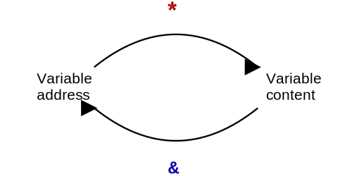

A pointer is a **variable that stores the memory address of another variable**.

This concept might seem strange at first, but it's fundamental to many operations in C.

Pointers allow you to:

- Reference variables indirectly
- Pass variables by reference to functions
- Work with arrays and strings efficiently
- Dynamically allocate memory
- Build complex data structures like linked lists and trees

Some of those things may sound confusing, yet, so we'll start from the beginning of how memory works (in a simplified way, for now).

But first, here's a useful analogy:

## The Hyperlink Analogy

To understand pointers intuitively, think of them like **hyperlinks** on websites (in the simplified context of files on a server):

- A hyperlink doesn't contain the actual webpage—it contains the address (URL) where the webpage is located
  - When you click a hyperlink, the browser navigates to that address to display the content
- Similarly, a pointer doesn't contain a value—it contains the memory address where the value is stored
  - When you ***dereference*** a pointer (`*p`), the program "navigates" to that memory address to access the value

| Hyperlinks | Pointers |
|------------|----------|
| Store a URL | Store a memory address |
| Multiple links can point to the same webpage | Multiple pointers can point to the same variable |
| If you edit the webpage, all links to it show the new content | If you modify a variable through one pointer, all pointers to it will see the new value |
| Broken links point to nothing valid | NULL or uninitialized pointers don't point to valid memory |

:::note Example

For example, if you have two hyperlinks pointing to the same blog post, and the author updates the post, you'll see the new content regardless of which link you click. Similarly:

```c
int value = 10;      // Original "webpage"
int *p1 = &value;    // First "hyperlink" to the value
int *p2 = &value;    // Second "hyperlink" to the same value

*p1 = 20;            // Update the content through the first hyperlink
printf("%d\n", *p2); // Displays 20 (new content is visible through both hyperlinks)
```

:::

Here's another (funny) [real-life analogy for pointers](https://www.reddit.com/r/C_Programming/comments/18ixoxr/comment/kdg92c7/).

## Memory addresses and Pointers

In C programs, every variable is stored somewhere in the computer's memory, and **each memory location has a unique address**.

When we declare a variable:

```c
int x = 10;
```

the system allocates memory for this `x` variable and stores the value 10 in that memory location.

To work with these memory addresses, C provides pointers. A pointer is simply a variable that holds a memory address, allowing us to **indirectly access or modify the data at that location**.

This powerful feature brings us to the important concepts of referencing and dereferencing.

## Referencing and Dereferencing

C provides two key operators for working with pointers:

### The Address Operator (&)

The `&` (address) operator returns the ***memory address where a variable is stored***:

```c
int x = 10;
printf("The address of x is %p\n", &x);  // Prints something like 0x7fff5fbff8ac
```

> The `&` operator means "give me the location of" - it's like asking for a house's address instead of the house itself.

### The Dereferencing Operator (*)

The `*` operator accesses the ***value at the address stored in a pointer***:

```c
int x = 10;   // A regular integer variable
int *px;      // A pointer to an integer
px = &x;      // px now holds the address of x
printf("Value of x: %d\n", *px);  // Prints 10 - the value stored at the address in px
```

> The `*` operator means "go to this address and get what's there" - it's like following an address to find what's inside that location.

From this illustration, it's clear that `&x` allows you to obtain `x`'s address, while `*px` provides the value at the address `px` holds:

<figcaption>Fig.1. Pointer operators: address and dereference.</figcaption>

In even simpler words, `&` finds a variable's address, while `*` takes an address and retrieves the value at that address. Therefore, we can think of them as opposites, in the sense that `&` moves from a value to its address, while `*` moves from an address to its value.

### Understanding `p` vs `*p`

It's easy to confuse the syntax and the meaning of pointers initially, so let's clarify the distinction between those forms even further:

- The pointer variable `p` stores a memory address
- The dereferenced value `*p` represents the value stored at that memory address

This relationship allows you to manipulate the original variable indirectly:

```c
double *p;      // Declare a pointer to double
double x = 1.1; // Declare and initialize a regular double
p = &x;         // p now holds the address of x

printf("*p = %f\n", *p);  // Prints "*p = 1.1" (the value at address p)
*p = 5.5;                 // Modifies the value at address p (which is x)
printf("x = %f; *p = %f\n", x, *p);  // Both print 5.5 because they refer
                                     // to the same memory location

x = (*p) * (*p) - (*p);   // Same as x = x * x - x
printf("x = %f\n", x);    // Prints "x = 24.75" (5.5 * 5.5 - 5.5 = 24.75)
```

<div class="output">
<code class="output">
*p = 1.1<br />
x = 5.5; *p = 5.5<br />
x = 24.75
</code>
</div>

Every time you see `*p`, mentally substitute it with "*the value stored at the address contained in `p`*", or shorter "*the value at address `p`*". With it you can:

1. Read the current value (`*p`)
2. Modify the value (`*p = new_value`)
3. Use the value in expressions (`(*p) + 5`)

The parentheses in expressions like `(*p) * (*p)` are necessary because the `*` operator has lower precedence than arithmetic operators.

:::note l-values and r-values for pointers
An important characteristic of dereferenced pointers is that `*p` is an l-value (like regular variables), not an r-value. This means:

- `*p` refers to an actual memory location (the one pointed to by `p`)
- `*p` can appear on the left side of an assignment (`*p = 10;`)
- You can modify the value it points to

For example:

```c
int x = 10;
int *p = &x;
*p = 20;  // Valid: *p is an l-value
```

:::

## Pointer declaration (and initialization)

To declare a pointer, use the `*` symbol along with the data type that the pointer will point to:

```c
int *p;      // Pointer to an integer
char *c;     // Pointer to a character
float *f;    // Pointer to a float
```

:::note Pointer declaration syntax
You may see pointers declared in different styles:

```c
int* p;     // Style 1: * next to the type
int * p;    // Style 2: * separated with spaces
int *p;     // Style 3: * next to the variable name
```

All three are syntactically equivalent. However, style 3 (`int *p`) is often preferred because it makes it clearer that the `*` is part of the variable declaration, not the type. Consider this example:

```c
int* a, b;   // Only a is a pointer, b is a regular int
int *a, *b;  // Both a and b are pointers
```

In the first declaration, the `*` applies only to `a`, which can be confusing. The second form makes it explicit that both variables are pointers.
:::

The `*` operator is used for indirection. Indirection means the value in `p` is interpreted as a memory address and the value at that address is loaded.

`p` is the value of `p`, while `*p` is the value stored in the memory location pointed by `p`. When you want to indirectly access the value of an integer `i`, you can have an integer pointer point to it (`int *p = &i`) and use that pointer to modify the value of `i` indirectly (`*p = 10`).

:::warning
Always initialize your pointers! Uninitialized pointers contain random addresses, and using them can cause unpredictable behavior or crashes.
:::

:::tip

It's good practice to initialize pointers to `NULL` when you declare them:

```c
int *p = NULL;  // p is explicitly initialized to point nowhere
:::

## Pointers and functions (Pass by Reference)

One of the most common uses for pointers is to achieve "pass by reference" behavior with functions, as explained in the [related C++ lesson](/docs/cpp/passage-of-values#pass-by-reference).

:::info Pass by reference vs Pass by pointer
While C++ has true pass-by-reference using the `&` symbol in parameter declarations, C has no built-in pass-by-reference mechanism. Instead, C programmers use pointers to simulate pass-by-reference behavior.

This approach is often called "pass by pointer" or "pass by address" to distinguish it from true pass-by-reference seen in languages like C++.
:::

### The problem with Pass by Value

Consider a function that tries to swap two integers:

```c
void swap(int a, int b) {
    int temp = a;
    a = b;
    b = temp;
}

int main() {
    int x = 10, y = 7;
    swap(x, y);
    printf("x: %d, y: %d\n", x, y); // Still not swapped
}
```

<div class="output">
<code class="output">
x: 10, y: 7
</code>
</div>

This doesn't work because C passes arguments strictly by value, meaning the function receives copies of the values (stored in completely different addresses), not the original variables.

### Solution with pointers (Pass by Pointer)

Using pointers, we can modify variables outside the function's scope:

```c
void swap(int *a, int *b) {
    int temp = *a;
    *a = *b;
    *b = temp;
}

int main() {
    int x = 10, y = 7;
    swap(&x, &y); // Pass the addresses
    printf("x: %d, y: %d\n", x, y);
}
```

<div class="output">
<code class="output">
x: 7, y: 10
</code>
</div>  

When `swap(&x, &y)` is called, the function receives the addresses of `x` and `y`, and using these addresses it can directly modify the original variables so that the changes persist after the function returns.

#### All parameters in C are passed by value, even pointers

It's important to understand that even when using pointers to achieve "pass by reference" behavior, C is still technically passing the pointer itself *by value*. What this means is:

```c
void function(char *str) {
    // The pointer 'str' is a copy of the address passed to this function
    // Modifying *str changes the original data
    // But modifying str itself only changes the local copy
}

int main() {
    char message[] = "Hello";
    function(message);  // Passing the address of message[0]
    return 0;
}
```

When we call `function(message)`, we're actually passing the value of a pointer (the address of `message[0]`). The function receives a *copy* of this address value, not the pointer variable itself.

This distinction becomes important when working with functions that need to modify the pointer itself, not just what it points to (like when building data structures).

### Performance benefits of Pass by Pointer

When dealing with large data structures, passing by pointer offers significant performance advantages:

```c
// 👎 Inefficient: copies the entire array
void process_data_by_value(int data[], int size) {
    for (int i = 0; i < size; i++) {
        data[i] += 1; // Process data here
    }
}

// 👍 Efficient: only copies the address of the array
void process_data_by_pointer(int *data, int size) {
    for (int i = 0; i < size; i++) {
        data[i] += 1; // Process data here
    }
}
```

Passing large structures by value requires:

- Copying all data members (could be megabytes of data)
- Allocating stack space for the copy
- Potentially degrading cache performance

With pointers, you're only copying a memory address (typically 4 or 8 bytes), regardless of how large the actual data is.

### Constant pointers

When you want to avoid copying data but also ensure that a function cannot modify the original value, use `const` pointers:

```c
// Function can't modify what ptr points to
void print_data(const int *ptr) {
    printf("Value: %d\n", *ptr);
    // *ptr = 10; // Error: can't modify through const pointer
}

int main() {
    int value = 42;
    print_data(&value); // Safe to call, value won't change
    return 0;
}
```

Using `const` pointers provides both performance (no copying) and safety (no modification).

## Pointers and Arrays

In C, there's a close relationship between pointers and arrays. When you declare an array:

```c
int numbers[5] = {1, 2, 3, 4, 5};
```

the variable `numbers` actually **behaves like a pointer to the first element of the array**.

These expressions are equivalent:

- `numbers[0]` and `*numbers`
- `numbers[1]` and `*(numbers + 1)`
- `numbers[i]` and `*(numbers + i)`

This is called "***pointer arithmetic***".

:::tip Why does it work?

Pointer arithmetic works because arrays are stored *continuously* in memory, with elements placed one after another. When an array is declared, the elements occupy **adjacent memory locations in sequence**.

For example, if you have an integer array where each integer takes 4 bytes of memory, the elements would be laid out like this:

```
numbers[0] at address 1000
numbers[1] at address 1004
numbers[2] at address 1008
...and so on
```

This continuous memory layout allows C to efficiently calculate the position of any array element using the formula:

$$
\text{addressOfNumbers[i]} = \text{baseAddress} + (i \times \text{sizeOfElement})
$$

This is why pointer arithmetic and array indexing are interchangeable in C. Under the hood, `numbers[i]` is actually computed as `*(numbers + i)`, making arrays and pointers intrinsically connected concepts.

:::

:::info On data dimensions
In pointer arithmetic, adding 1 to a pointer doesn't just add 1 to the memory address. Instead, it advances the address by the size of the data type the pointer points to.

For example, if `p` is an `int*` and an `int` is 4 bytes, then `p + 1` points to the address 4 bytes after `p`.
:::

:::danger Illegal array access
Be careful not to use indices that exceed the array's size! The compiler will always try to access the memory at the requested location, which can result in:

- Memory access violations (*segmentation fault/SigSegV*) that terminate the program
- Silently accessing memory that shouldn't be accessed, which can lead to:
  - Unpredictable program behavior
  - Security vulnerabilities, including buffer overflows that attackers can exploit
  
Unlike some other languages, C does not perform bounds checking on arrays at runtime.
:::

### Pointer arithmetic example

Pointer arithmetic allows you to navigate through arrays efficiently:

```c
int numbers[5] = {10, 20, 30, 40, 50};
int *p = numbers;  // p points to the first element

printf("%d\n", *p);        // Prints 10
printf("%d\n", *(p + 1));  // Prints 20
printf("%d\n", *(p + 2));  // Prints 30

// Moving the pointer itself
p++;                       // p now points to the second element
printf("%d\n", *p);        // Prints 20

// Array notation and pointer notation are equivalent
printf("%d %d\n", numbers[3], *(p + 2)); // Both print 40
```

In this example, when we add 1 to the pointer `p`, it advances to the next integer (not just the next byte). This is because pointer arithmetic automatically scales by the size of the data type.

## The NULL pointer

The `NULL` pointer is a special value that indicates "points to nothing." It's essential for:

- Initializing pointers that don't yet point to valid data
- Checking if a pointer has been assigned a valid address
- Indicating error conditions or the end of data structures

```c
int *p = NULL;

// Before using, check if the pointer is valid
if (p != NULL) {
    *p = 10;  // Safe only if p is not NULL
}
```

:::caution
Dereferencing a NULL pointer (using `*p` when `p` is NULL) causes a runtime error, typically resulting in a program crash (segmentation fault).
:::

## Key points

1. A pointer stores a memory address, not the value itself
2. Use the `&` operator to get a variable's address
3. Use the `*` operator to access the value a pointer points to
4. Always initialize pointers to prevent unpredictable behavior
5. Pointers enable pass-by-reference in C
6. Pointers and arrays are closely related
7. Check for NULL before dereferencing pointers

For further reading and to avoid common mistakes when working with pointers, check out this concise and useful [Programiz guide to pointers](https://www.programiz.com/c-programming/c-pointers#common-mistakes) (and in particular the section on **common mistakes**).
