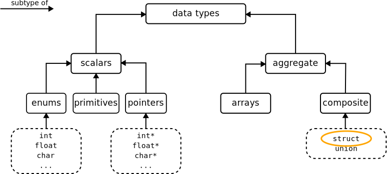

C provides fundamental data types like `int`, `float`, and `char`, but for complex data representation, we need more sophisticated data structures. This is where `struct` and `typedef` come into play.

## Structures

A structure is a **collection of variables of different data types** grouped together under a single name. While arrays allow you to store multiple items of the same type, structures enable you to store items of different types together.


<figcaption>Fig.1. Hierarchy of C data types, showing how structs and unions are classified as composite aggregate types.</figcaption>

Structures can be thought of as user-defined data types that represent a collection of related data items.

### Declaring structures

The general syntax for declaring a structure in C is:

```c
struct [tag_name] {
    data_type member1;
    data_type member2;
    ...
    data_type memberN;
} [variable_names];
```

Where:

- `tag_name` is an optional name for the structure type
- `member1`, `member2`, etc. are the structure members (fields)
- `variable_names` is an optional list of variables of this structure type

**Example: Person structure**

```c
struct person_s {
    char name[20];
    int age;
    double salary;
} person1;
```

In this example:

- `person_s` is the structure tag
- `name`, `age`, and `salary` are members of the structure
- `person1` is a variable of type `struct person_s`

#### Declaration vs Definition

You can separate the declaration of the structure type from the definition of variables:

```c
// Structure declaration (only describes the type)
struct date {
    int day, month, year;
};

// Variable definition (creates actual variables)
struct date yesterday, today;
```

This approach is particularly useful when you need to use the same structure type in multiple places.

### Initializing structures

There are mainly two ways to initialize structure variables:

**Method 1: Initialization during declaration with positional values**

```c {6}
struct Point {
    int x;
    int y;
};

struct Point p1 = {10, 20};  // x=10, y=20
```

**Method 2: Initialization with designated initializers (recommended)**

```c {6}
struct Point {
    int x;
    int y;
};

struct Point p2 = {.x = 30, .y = 40};  // More explicit and readable
```

*Designated initializers* make your code more readable and less prone to errors, especially when structures have many members or are updated in the future.

### Accessing structure members

To access the members of a structure, you use the **dot operator** (`.`):

```c
struct date {
    int day, month, year;
};

struct date today;

today.day = 27;
today.month = 4;
today.year = 2025;

// In main()
printf("Today's date is: %d/%d/%d\n", today.day, today.month, today.year);
```

#### Using pointers to structures

When working with pointers to structures, you can access members in two ways:

#### Arrow operator (`->`)

```c
struct date *date_ptr = &today;
date_ptr->day = 27;  // equivalent to (*date_ptr).day = 27
```

#### Dereference operator (`*`) and dot operator (`.`)

```c
(*date_ptr).month = 7;  // equivalent to date_ptr->month = 7
```

:::tip
The arrow operator (`->`) is a shorthand for dereferencing a pointer and then accessing a member, making your code more readable when working with structure pointers, so it's recommended.
:::

### Copying and assigning structures

Unlike arrays, structures in C can be **directly assigned and copied**:

```c
struct point p1 = {10, 20};
struct point p2;

p2 = p1;  // Entire structure is copied
```

When you assign one structure to another, all members are copied from the source to the destination structure.

### Arrays of structures

You can create arrays of structures just like arrays of any other data type:

```c
struct student {
    char id[10];
    char name[50];
    int grade;
};

struct student class[30];  // Array of 30 student structures

// Accessing elements
strcpy(class[0].id, "S001");
class[0].grade = 85;
```

- `strcpy` is used to copy a string into a character array.
- `class[0]` accesses the first element of the `class` array, which is an array of `student`  structs.
- `.id` and `.grade` are fields in the struct, accessed using the dot operator.

### Dynamic allocation of structures

Structures can be dynamically allocated with `malloc()`:

```c
struct student *students;
int num_students = 10;

students = (struct student *)malloc(num_students * sizeof(struct student));

// Access with array notation
strcpy(students[0].id, "S001");

// Or with pointer notation
strcpy((students + 0)->id, "S001");

// Don't forget to free when done
free(students);
```

### Structures and Functions

Structures can be passed to functions either by value or by reference:

#### Passing by Value

```c
void print_date(struct date d) {
    printf("%d/%d/%d\n", d.day, d.month, d.year);
}

int main() {
    struct date today = {27, 4, 2025};
    print_date(today);  // Entire structure is copied
    return 0;
}
```

When you pass a structure by value, a complete copy is made, which can be inefficient for large structures.

#### Passing by Reference

```c
void modify_date(struct date *d) {
    d->day = 26;  // Modifies the original structure
}

int main() {
    struct date today = {27, 4, 2025};
    modify_date(&today);
    printf("%d/%d/%d\n", today.day, today.month, today.year);  // Prints 27/4/2025
    return 0;
}
```

Passing by reference is more efficient and allows the function to modify the original structure.

#### Returning structures from functions

Functions can also return structures:

```c
struct point midpoint(struct point p1, struct point p2) {
    struct point mid;
    mid.x = (p1.x + p2.x) / 2;
    mid.y = (p1.y + p2.y) / 2;
    return mid;
}
```

### Nested structures

Structures can contain other structures as members:

```c
struct address {
    char street[50];
    char city[20];
    int zipcode;
};

struct employee {
    char name[50];
    int id;
    struct address office_address;  // Nested structure
};

struct employee emp1;
strcpy(emp1.office_address.city, "New York");
```

## The `typedef` keyword

The `typedef` keyword allows you to create aliases for existing data types, making your code more readable and maintainable.

#### Syntax

```c
typedef existing_type new_type_name;
```

For example:

```c
typedef unsigned long ulong;
ulong counter = 0;  // Same as: unsigned long counter = 0;
```

### Using `typedef` with structures

`typedef` is particularly useful with structures, as it allows you to avoid repeatedly typing `struct`:

```c
// Without typedef
struct point {
    int x, y;
};
struct point p1;

// With typedef
typedef struct {
    int x, y;
} Point;
Point p1;  // No 'struct' keyword needed
```

### Combined declaration and `typedef`

You can combine structure declaration with `typedef`:

```c
typedef struct point_s {
    int x, y;
} Point;
```

This creates:

1. A structure tag named `point_s`
2. A typedef name `Point` for `struct point_s`

Now you can use either `struct point_s` or simply `Point` to declare variables.

### When to use `typedef`

The `typedef` keyword is most useful when:

1. **Making complex declarations more readable**

   ```c
   // Without typedef
   void (*signal(int sig, void (*func)(int)))(int);

   // With typedef
   typedef void (*SignalHandler)(int);
   SignalHandler signal(int sig, SignalHandler func);
   ```

2. **Creating platform-independent code**

   ```c
   // Can be changed for different platforms
   typedef int size_type;
   size_type buffer_size = 1024;
   ```

3. **Working with structures and complex types**

   ```c
   typedef struct {
       int day, month, year;
   } Date;
   
   // Now you can use:
   Date today, tomorrow;
   ```

4. **Improving code maintainability**

   If you need to change a type later, you only need to change the typedef, not every occurrence in the code.

:::caution
While `typedef` can make code more readable, excessive use can obscure the actual types being used, making the code harder to understand. Use `typedef` when it genuinely improves readability or maintainability.
:::

## 📝 Complete example

Here's a complete example demonstrating structures and typedef:

```c
#include <stdio.h>
#include <string.h>

// Define a structure and create a typedef for it
typedef struct person_s {
    char name[64];
    char surname[64];
    int age;
} Person;

// Function that takes a Person by value
void print_person(Person p) {
    printf("Name: %s %s, Age: %d\n", p.name, p.surname, p.age);
}

// Function that takes a Person by reference
void age_person(Person *p, int years) {
    p->age += years;
}

int main() {
    // Declare and initialize a Person
    Person p1 = {.name = "John", .surname = "Doe", .age = 30};
    
    // Print the person
    print_person(p1);
    
    // Age the person by 5 years
    age_person(&p1, 5);
    
    // Print again to see the change
    print_person(p1);
    
    // Create an array of Persons
    Person team[3] = {
        {.name = "Alice", .surname = "Smith", .age = 25},
        {.name = "Bob", .surname = "Johnson", .age = 32},
        {.name = "Carol", .surname = "Williams", .age = 28}
    };
    
    // Print all team members
    printf("\nTeam Members:\n");
    for (int i = 0; i < 3; i++) {
        print_person(team[i]);
    }
    
    return 0;
}
```

<div class="output">
<code class="output">
Name: John Doe, Age: 30<br/>
Name: John Doe, Age: 35<br/>
<br/>
Team Members:<br/>
Name: Alice Smith, Age: 25<br/>
Name: Bob Johnson, Age: 32<br/>
Name: Carol Williams, Age: 28
</code>
</div>

## Key points

1. Structures group related variables of different types under a single name
2. Access structure members with the dot operator (`.`) for variables and the arrow operator (`->`) for pointers
3. Structures can be copied with simple assignment
4. Structures can be passed to and returned from functions (though passing large structures by value can be inefficient)
5. `typedef` creates aliases for existing types, making code more readable
6. `typedef` is particularly useful with structures to avoid repeatedly typing `struct`
7. Structures can contain arrays, pointers, and even other structures as members
