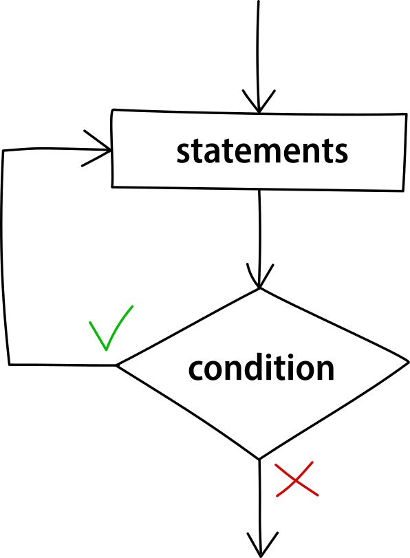

The do-while loop is very similar to the while loop but with one important difference: whilst the while latter evaluates first and then executes the statements, using a condition specified at the beginning of the loop, the do-while loop evaluates after the first execution and the condition isn't specified until after its body.

This means that the body of a do-while looop is always **executed at least once**, regardless of whether the condition is met.


<figcaption>Fig.1. Flowchart of the do-while loop.</figcaption>

Syntax:

```cpp
do {
    // code to be repeatedly executed
} while (condition);
```

### Example


Let's take the previous lesson's example and convert is to a program that uses a do-while loop:

```cpp
int count = 1; // initialize the counter

do {
    cout << count << ' '; // print the counter and add some space
    count++; // update the counter
} while (count <= 5);
```

<div class="output">
<code class="output">
	1&nbsp;2&nbsp;3&nbsp;4&nbsp;5
</code>
</div>

### Use

Do-while loops are usually used for checking that the input of the user is correct. In particular, the input is prompted to the user repeatedly until it inserts a valid input. For example:

```cpp title="positive-number-input.cpp" {7-10}
#include <iostream>
using namespace std;

int main() {
    int n;

    do {
        cout << "insert a positive number:" << endl;
        cin >> n;
    } while (n <= 0); // if negative or null, ask again

    cout << "you inserted a valid number" << endl;

    return 0;
}
```