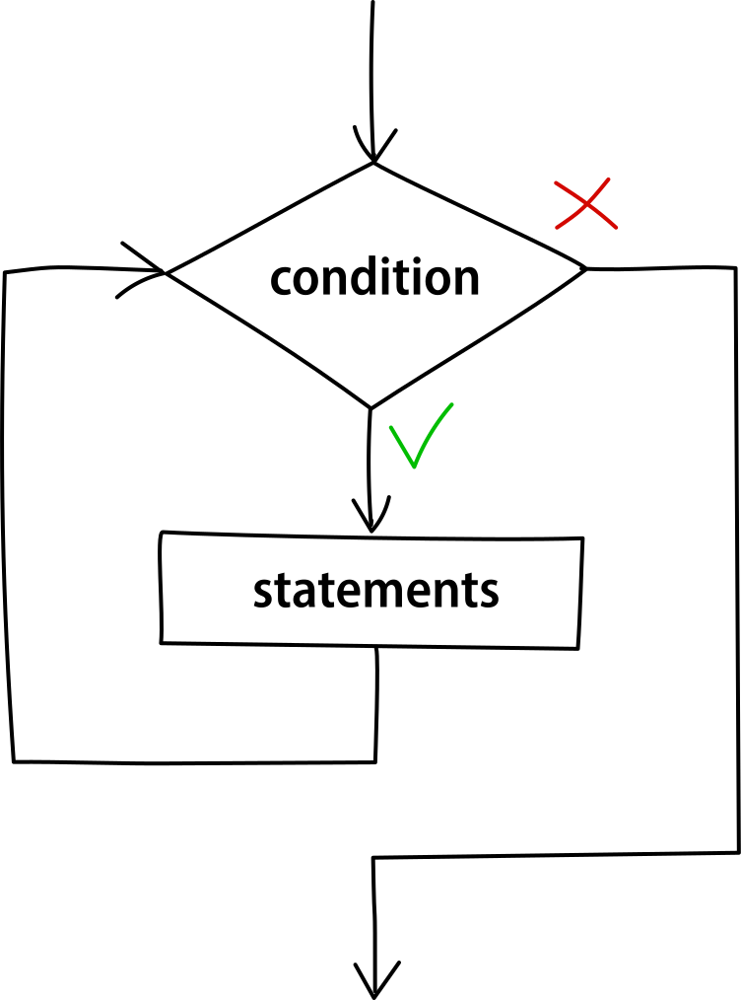

The while loop, or while statement, allows a piece of code to execute repeatedly until the condition inside the parentheses is met.

Its syntax is very simple and similar to that of an if statement:

```cpp
while (condition) {
    // code to be repeatedly executed
}
```

### Explanation

When a while loop is executed, the **first thing** that the compiler does is to **evaluate the condition**. Only if the condition is true the code inside the body of the while loop executes.

After the first execution, control returns to the top of the while loop and the process is repeated. The loop will not stop as long as the condition is true.


<figcaption>Fig.1. Flowchart of the while loop.</figcaption>

Since while loops don't include a counter to stop the execution, it is usually added by the programmer. 

For demonstration, let's see a program that prints the numbers from 1 to 5 using a while loop:

```cpp
int count = 1; // initialize the counter

while (count <= 5) {
    cout << count << ' '; // print the counter and add some space
    count++; // update the counter
}
```

<div class="output">
<code class="output">
	1&nbsp;2&nbsp;3&nbsp;4&nbsp;5
</code>
</div>

The loop is repeatedly executed until `count` is 6. When doing the evaluation of the condition 6 <= 5 the value becomes `false` and the loop stops.

If a while loop evaluates to `false` already in the first check, the statements inside won't be executed, **not even once**.

### Infinite loops

While loop is the most used type of loop when programmers want to make an infinite loop. This is generally considered a bug but sometimes it is intentional and useful.

It's made by putting a condition that will always evaluate to `true` no matter the number of iterations or the statements inside. Using the `true` keyword is the easiest and most common way:

```cpp
while (true) {
    // infinite iterations
}
```