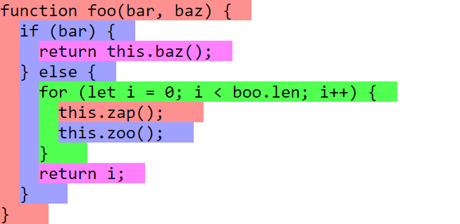

Instead of going straight to the coding part, it's better to make some context first.

## Brief history

C++ is a programming language created by Bjarne Stroustrup at Bell Labs, starting in 1979. It was not created from the ground up, but evolved from the C language, which was created by Dennis Ritchie, with the main goal of adding the new Object Oriented Programming (OOP) *programming paradigm* support, which was not present in C.

C++ was standardized in 1998, and since then, several updates have been made. C++11, in particular, added many new capabilities, and further upgrades to the language are expected every few years.

:::info Did you know?

Originally, the language was called "*C with classes*", but then C++ became the final name because `++` is an operator that increments the value of a variable, and using the "+" sign is a common naming convention among software developers to indicate an enhanced computer program.

:::

If you are curious, there's a much more in-depth explanation [here](https://www.geeksforgeeks.org/history-of-c/), from GeeksforGeeks.


<figcaption>Fig.1. The storyline of C and C++. Image courtesy of GeekforGeeks (CC BY-SA license).</figcaption>

## Characteristics of C++

C++ is a hybrid language, so it contains not only object-oriented features but also the functionality of the C programming language, so traditional [procedural programming](https://en.wikipedia.org/wiki/Procedural_programming). This means that you have all the features that are available in C, such as universally usable modular programs, efficient, close-to-the-machine programming, and portable programs which can run on various platforms.

Existing C source code can be used in C++ programs.

Various language elements were added to C++ beyond the OOP paradigm, such as references, templates, exception handling, and many more features important for efficient program implementation.

Don't worry, though! You don't have to know all these concepts to start coding.

## Why use it

Both C and C++ are very famous and largely used for a wide range of software types and platforms. The advantages and features of the C++ language are many, but one of its biggest strengths is that the compilation and execution time is **really fast**. That's one of the main reason why it's often chosen over other languages, but it's not the only one.

Another key aspect of C++ is its [**high-level nature**](https://en.wikipedia.org/wiki/High-level_programming_language), making it easier to learn, read, understand, and work with.

It also gives programmers precise control over memory and other computer resources, making it more powerful and capable of doing more things, with the compromise being that it can be a bit harder to learn.

There's a nice overview of the advantages of learning C++ on [this website](https://www.programiz.com/cpp-programming/guide) by Programiz.

## Where it's used

- Video games (especially for graphic engines and game development (e.g. in [Unreal Engine](https://www.unrealengine.com/))
- Operating systems (also in C language)
- Real-time systems (e.g. for transportation, manufacturing, etc…)
- High-performance financial applications (e.g. high-frequency trading)
- Graphical applications and simulations
- Embedded software (also in C language)
- Audio and video processing
- Artificial intelligence, machine learning and neural networks
- Scientific research (e.g. simulations, data analysis)
- Web browsers (like [Chrome](https://en.wikipedia.org/wiki/Google_Chrome#:~:text=C%2C-,C%2B%2B,-%2C%20Assembly%2C%20HTML%2C%20Java) and [Firefox](https://en.wikipedia.org/wiki/Firefox#:~:text=Written%20in-,C%2B%2B,-%2C%20C%2C%20Rust%2C%5B5]))
- GUI Based Applications (Qt)
- Databases
- Compilers of various high-level programming languages, like C# and Java (also in C language)
- Productivity software (MS Office, Photoshop, Maya/3ds Max, SolidWorks, Inventor, AutoCAD…)

## Basic information

### Structure of a program

The structure of a program in C++ can vary, but in its basic form it looks like this:

```cpp
#include <...>
using namespace ...;

int main()
{
	...
	
	return 0;
}
```

We'll see what those words mean and what to put instead of the generic three dots `...` in the next lesson, but for what matters in this section, it's just important to remember that each program that you write contains a `main()` function, which is the starting point for program execution and so what will be done by the machine when we'll run the code.

Every program must have that special `main()` function, and it has to be written exactly in that way (all lowercase letters). When the program is run, the instructions or statements inside of main are executed in sequential order.

We'll cover what a function is in a future chapter, but for now, just know that a *function* is a collection of instructions that can be reused. It has a name that identifies it, followed by parentheses like this: `function()`. Sometimes, there may be values inside the parentheses, called *parameters*.

### Comments

A comment in computer programming is a human-readable explanation or annotation in the source code of a computer program. This text is inserted in the source code by the programmer to make it easier to understand, and it's not processed by the compiler, meaning that it's **completely ignored in the execution phase**.

A comment in C++ can be added in two ways, like below:

```cpp
// this is a single-line comment
Not a comment

/* 
This is a 
multi-line
comment that
spans multiple 
lines
*/
Not a comment, too
```

**Single line comments** are considered comments only if the text is typed in the same line of the two slashes `//`. In other words, `//` indicates that everything following it until the end of the line is a comment. A **multi-line comment**, instead, is considered a comment if the text is typed *between* `/*` and `*/`.

:::warning

Do not use multi-line comments inside other multi-line comments.

:::

### Indentation

Indentation is a term that expresses the action of putting whitespace (tabs or spaces) for **formatting purposes**.

It means adding some empty space among the code in the right way so that it becomes more readable.

Some languages like Python use indentation as an important part of their syntax, and it influences how the code is interpreted by the interpreter.

This is **not** the case for C and C++, since the compiler ignores all kinds of indentation. For this reason, we say that those languages are **whitespace-independent**. Instead, we use **braces** to tell the compiler that a piece of code belongs (it's inside) a block of other code or not.

That means that indentation is technically optional. However, for programmers it's an important aspect when writing code because it's necessary to keep a good level of readability.

:::info Fun Fact

Some people took advantage of the whitespace-independency of C/C++ to make some very interesting programs, like this [Donut-shaped C code that generates a 3D spinning donut](https://www.a1k0n.net/2011/07/20/donut-math.html) (the code might be a bit complex for beginners to read, but it's beautiful anyway).


:::

Usually, if you use an IDE with a text editor, when you press <kbd>ENTER/RETURN ⏎</kbd> on the keyboard it automatically adds one *tab-sized whitespace*. In the other cases, you can add it by pressing the <kbd>TAB ⇆</kbd> key. It's also fine using four (or sometimes three or two) spaces instead, but I wouldn't recommend that.

Indentation is used like this:

```cpp
int main() {
	...
	...
> > codeBlock() {
		...
		...
> > > > nestedCodeblock() {
			...
			...
> > > > }
		...
		...
> > }
	...
	...
}
```

The `>` signs are only used here to indicate the added whitespace for indentation and are not part of actual code. Indentation creates a tree-like structure that enhances code readability. Note that the closing parentheses of each block is vertically aligned with the start of the respective function/code block.

The indentation style shown above is known as **K&R style** or "one true brace style." It is one of the most common styles, along with the *Allman style*. You can choose the style you prefer. For a comprehensive list of indentation styles, visit the [Wikipedia page](https://en.wikipedia.org/wiki/Indentation_style).


<figcaption>Fig.2. A colored representation of how to read nested blocks when using the K&R indentation style (from <a href="https://gist.github.com/jesseschalken/0f47a2b5a738ced9c845">Jesse Schalken's GitHub gist</a>).</figcaption>

## Development phases

A computer program is created through different phases. I already briefly discussed the phases of the creation of a program in the previous section, but here we are talking more specifically about the programming phase. Let's see how it works.


<figcaption>Fig.2. A scheme describing the process behind the creation of an executable file from C++ code.</figcaption>

### What's an IDE

To run the programs that we'll make, we need a place to execute the code. The IDEs out there will help us. IDE is an acronym that stands for **I**ntegrated **D**evelopment **E**nvironment, and it's an environment, place, or piece of software that helps the programmer in the development and debugging phases of a program. 

It provides the developer with some facilities and tools, like a source code editor, build automation tools, and a **debugger** (a tool that allows the programmer to run the code step-by-step, inspect variables, and monitor the execution flow to identify and fix errors).

There are many IDEs to choose from, both open source and paid. Personally, I use Dev-C++, which compiles also C language. You can download it **[here](https://sourceforge.net/projects/orwelldevcpp/)** (it's open source).

:::note

This IDE has long since been abandoned and it's not used in professional fields, but Orwell (an independent programmer) has taken it up and updated it. At the moment of writing, it supports the C++11 standard, and although the modern standard is C++17, we don't care about that for our learning purposes.

:::

If you prefer to use another IDE, that's perfectly fine, but be sure that it has a compiler integrated, or as an alternative, install it separately on your machine (it will require a bit more steps, but it's not too complicated). Also, you can use [online compilers](https://arnemertz.github.io/online-compilers/) too, but some libraries will not be present, so programs that will use them won't work.

### Compilation (translation)

After having saved the source code into a source file (or several source files that are edited and translated separately in larger projects when doing modular programming) with the **`.cpp` extension**, that source file is put through a compiler for translation.

The compiler checks the syntactic correctness of the code in accordance with the rules established by the programming language used. If errors are present, the compiler lists them.

If everything works as planned, an *object file* made up of machine code is created. The object file is also referred to as a *module* and can be directly executed by the processor (unlike source code).

### Linking

Finally, in case the construction of the final program requires the union of one or more modules and/or needs to integrate the code contained in the libraries (included at the top), the **linker** combines the object file with other modules to form an executable file `.exe`. These further modules contain functions from standard libraries or parts of the program that have been compiled previously.

### Debugging

Debugging is the process of finding and fixing errors in a program. It involves running the program, observing its behavior, and using tools to step through the code, check variables, and understand the execution flow. The programmer identifies the source of the problem and makes corrections to ensure the program works correctly.
