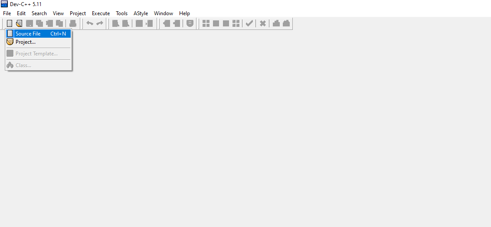
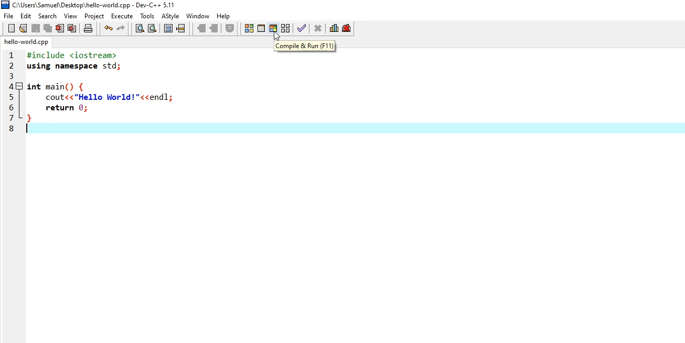
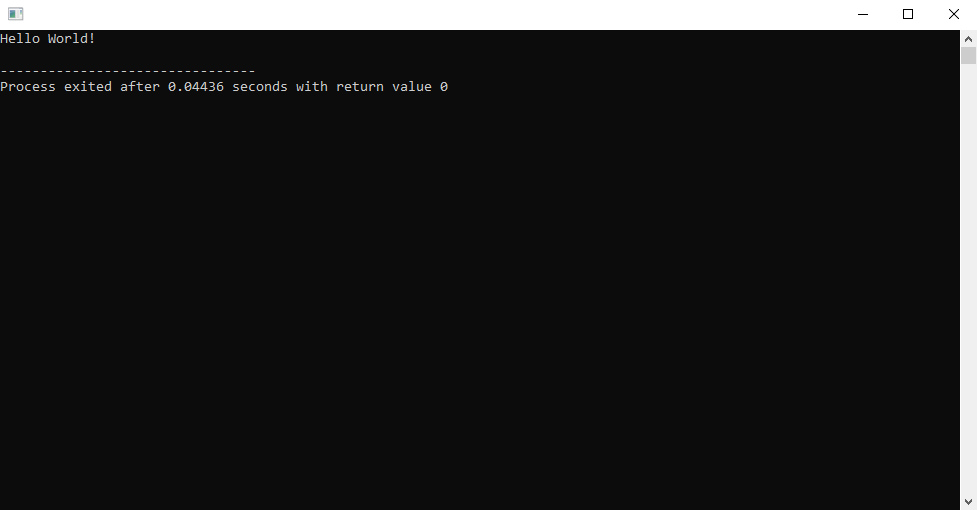

Now let's jump to the coding part!

To keep things simple, our first program will just print the message "Hello World!" to the console.

:::info Did you know?

Writing a program that prints out "Hello World!" is a common use of programmers when they are learning to code in a new language, or simply coding for the first time, considering it as a traditional starting point for the entry into the world of programming.

:::

What follows is the piece of code that allows us to see the "Hello World!" message in the terminal:

```cpp title="hello-world.cpp"
#include <iostream>
using namespace std;

int main() {
	cout << "Hello World!" << endl;
	return 0;
}
```

This code has to be written into a new file with the `.cpp` extension. To create it in Dev-C++, the IDE we are going to use for now, press <kbd>Ctrl</kbd>+<kbd>N</kbd> or click on the top left button and then on "Source File".



Then, paste the code above and compile it using the "Compile & Run" button, or by pressing <kbd>F11</kbd>.



Once compiled, if everything is OK a console window (Command Prompt) will open with the "Hello World!" text printed on it.



Congratulations, you have made your first C++ program!

But let's now go through the code in detail to actually understand what it does.

## Analysis

If we look back at the code of our first program, we notice that it can be divided into **two parts**.

### 1) Linking section & Namespace

```cpp {1,2}
#include <iostream>
using namespace std;

int main() {
	cout << "Hello World!" << endl;
	return 0;
}
```

The first one is called *linking section* and in this case it's made by two instructions:

1. **`#include <iostream>`** is a special command that the program needs in order to read and write text from/to the console respectively. It tells the compiler to add the content of the `iostream` header file, which includes some function declarations of the C++ standard library that allows us to access input and output stream classes and *manipulator functions* (see point 1 or Main section). We need this line in order to use `cout` on line 5. Every line preceded by the `#` symbol is called a *preprocessor directive*. These directives call the *preprocessor*, which *pre*processes the source code before compiling the rest of the code. The `iostream` library is a header-only library, meaning that it only contains header files (in this case the *iostream* header file). We will learn what a library is in a future chapter.
2. **`using namespace std;`** means that we tell the compiler to use the namespace called "std" (standard). A namespace is a declarative region (sort of a directory) that provides a scope to the identifiers (the names of types, functions, variables, and other C++ tokens) inside it under a single name. It's used to organize code into logical groups and to prevent name collisions that can occur especially when a program includes multiple libraries. Without this line, we would have to use the *scope resolution operator* `::` like `std::cout` each time we want to output something with `cout` (and this holds for all the other standard C++ library functions and objects).

:::caution

The statement `using namespace std;` is generally considered bad practice, but in our programs conflicts will never happen. We are not interested in taking that precaution, therefore we won't mostly for practical reasons. See this [video](https://youtu.be/4NYC-VU-svE) by The Cherno if you are interested.

:::

#### Semicolons

In C++ we use the semicolon `;` to indicate the termination of instruction. It lets the compiler know that it reached the end of a command.

Most lines of code in C and C++ end with a semicolon, but it's not always the case: for example preprocessor directives (e.g. `#include ABC`, `#define XYZ`, these statements end with a line break), function headers (e.g. `void myFunction() { ... }`), control structures (e.g. `if`, `for`, `while`), class and struct definitions (e.g. `class MyClass { ... };`), and namespace declarations (e.g. `namespace MyNamespace { ... }`) don't require a semicolon.

#### Blank lines

Before the second part of the code, we encounter line 3 which is a blank line. All blank lines are ignored by the compiler but they help humans to keep the code more readable and well separated into multiple little sections.

### 2) Main section

```cpp {4-7}
#include <iostream>
using namespace std;

int main() {
	cout << "Hello World!" << endl;
	return 0;
}
```

In line 4 we start with the `main()` function opening a curly bracket `{`. Brackets are very important, as the compiler uses them to create a ***code block***, which is a logically connected group of program statements that are treated as a unit. Everything inside the `main()` function, from `{` to `}` is called the *function body*.

Inside the body we have written two lines:

1. **`cout << "Hello World!" << endl;`** is the command that prints "Hello World" to the console. Every time we want to print a value we use the `cout` object (which stands for "character output"), followed by two angle brackets (or less-than sign) `<<` and then the value or the message we want to output. At the end of this line is also present `endl`. What is it? It's called *manipulator* and, as the name suggests, it modifies the output stream. In this case, it adds a line break (*endl* = end line). Of course, this instruction is optional.
2. **`return 0;`** is the return statement. Every function, including `main()` has to finish with a return statement as the last instruction. Why `return 0;`? When a program finishes running, it sends a value (*exit code*) back to the operating system in order to indicate whether it ran successfully or not. This particular return statement returns the value of 0 (integer) to the operating system, which means “everything went okay”. That's also why we write `int` before `main()`. If an error (or "*bug*") is present in the code, the return does not happen and we know that something went wrong.

If you look back to the [console output](./assets/console-output-hello-world.png), you can see the return value in the line "`Process exited after ... seconds with return value 0`" after the output.

:::note Pausing the console

In some cases, the console window will close immediately after the program execution is finished. This happens because the console is temporary, and this can be a problem if we want to continue seeing the last part of our program as long as we want. The solution is usually to put just before `return 0;` one of these three lines of code:
```cpp
system("pause"); // only works on Windows
// or
cin.get();
// or
getchar();
```

Remember that `system("pause");`, like all Windows-specific command lines and instructions coming from the `windows.h` header (containing the function declarations for the functions of the Windows API), only works on Windows OS.

:::

:::info Note

```cpp
int main() {
  return 0;
}
```
and
```cpp
int main() {
  return -57;
}
```
and
```cpp
void main() { // void type does not return anything
  return;
}
```
will behave in a slightly different way but work anyway, without giving errors. We can put any value in return, or not put it completely (the compiler will automatically add a `return 0;`), however, it's strongly recommended to follow the standard `return 0;`. In C language return is *not* optional.

:::

All of the programs we write will follow this general template or a variation of it.

:::tip

Don't worry if the program still seems overwhelming or confusing. It's not a problem if you don't completely understand all the theoretical concepts immediately; they will be more meaningful later.

:::
