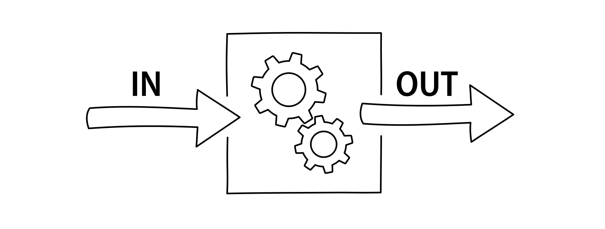

## Definition
A function is a reusable sequence of statements designed to do a particular job.

In more general terms, a function is a system which takes an input and returns it as an 
output after doing some calculations inside to preform a specific task.


<figcaption>Fig.1. Abstract raffiguration of a system.</figcaption>

We have already used functions: `main()` is a special function that every executable 
program must have, and it was present in every one of our programs done so far.
Also writing `<iostream>` means having to deal with functions (inside that library):
although it doesn’t look like it, every time you `<<` or `>>` operator to do 
input or output, you’re using a function provided by the standard library.

The [C++ standard library](https://en.cppreference.com/w/cpp/header) comes with plenty 
of already-written functions ready to use. But this doesn't mean that we can't write ours! 
Functions that you write yourself are called ***user-defined functions***.

You can pass data, known as parameters, into a function as inputs.

## Why use functions

There are two benefits that comes when using functions:

1. **Riusability**: once some code is written inside a function, it can then be executed 
as many times as you want. This avoids repetition, redundancy and duplicate code. 
The principle is similar to loops, but it works in a bit different way.
2. **Organization**: as programs start to get longer and longer, putting all the code 
inside the main function becomes increasingly hard to manage: with functions we can 
split our programs into small, modular chunks that are easier to organize, test, use and 
reuse.

## Parts of a function

A function is made up of a signature 

To understand how a function is created let's see the generic form:

```cpp
// Don't compile this!
returnType functionName(type parameter1, type parameter2, ...) {
	instructions;
	return ...;
}
```

For example a function that returns the sum of two variables can be writte like this:
```cpp
int sum(int a, int b) {
	int addition = a+b;
	return addition;
}
```

### Analysis

Now let's analyze every part that makes up a function:


<figcaption>Fig.2. The various components of a function.</figcaption>

## Create a functions

Before creating a function, we need to know about the two types that exists in C++:

1. Classic functions
2. Procedures

:::caution

🚧 This section is still under construction. 🚧

:::

### Classic functions

:::caution

🚧 This section is still under construction. 🚧

:::

### Procedures

Procedures are functions that perform a task but do not produce informations. In other words, 
they cannot return any numeric value, but they can, for example, print some text on screen.

:::caution

🚧 This section is still under construction. 🚧

:::