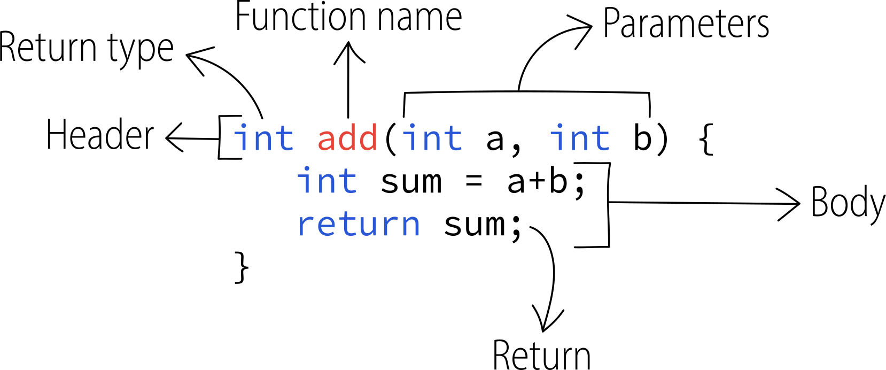

## Definition
A function is a reusable sequence of statements designed to do a particular job.

In more general terms, a function is a system which takes an input and returns it as an 
output after doing some calculations inside to preform a specific task.


<figcaption>Fig.1. Abstract raffiguration of a system.</figcaption>

We have already used functions: `main()` is a special function that every executable 
program must have, and it was present in every one of our programs done so far.
Also writing `<iostream>` means having to deal with functions (inside that library):
although it doesn’t look like it, every time you `<<` or `>>` operator to do 
input or output, you’re using a function provided by the standard library.

The [C++ standard library](https://en.cppreference.com/w/cpp/header) comes with plenty 
of already-written functions ready to use. But this doesn't mean that we can't write ours! 
Functions that you write yourself are called ***user-defined functions***.

You can pass data, known as parameters, into a function as inputs, but it is not always 
necessary.

## Why use functions

There are two benefits that comes when using functions:

1. **Reusability**: once some code is written inside a function, it can then be executed 
as many times as you want. This avoids repetition, redundancy and duplicate code. 
The principle is similar to loops, but it works in a bit different way.
2. **Organization**: as programs start to get longer and longer, putting all the code 
inside the main function becomes increasingly hard to manage: with functions we can 
split our programs into small, modular chunks that are easier to organize, test, use and 
reuse.

## Where to put them

Functions needs to be written ***before*** they are used with an invocation. Therefore, they 
usually stays at the top of the program, before `main()` and after all the *includes* and 
*namespaces*.

Remember that since `main()` is also a function, every other function has to be written 
**outside** of it, because unlike some other programming languages **C/C++ does not support 
nested functions** (functions inside functions).

## Parts of a function

A function is made up of a signature 

To understand how a function is created let's see the generic form:

```cpp
// do not compile this!
returnType functionName(type parameter1, type parameter2, ...) {
	instructions;
	return ...;
}
```

For example, a simple function that returns the sum of two variables can be writte like this:
```cpp
int add(int a, int b) {
	int sum = a+b;
	return sum;
}
```

:::note

Of course this is not a really useful function, but at least it's simple to understand and 
it will help you to grasp the concept of how function works in an easier way through the 
following explanations.

:::

### Analysis

Now let's analyze every part that makes up a function like the one above:


<figcaption>Fig.2. The various components of a function.</figcaption>

- **Return type**: this is the primitive type of the output value that the function will 
return.
- **Function name**: like for variables, also functions require a name in order to be 
declared. This name is an identifier and it's also called *header*. It will be used 
every time we'll need to call (refer to) that function, and it identifies it uniquely.
- **Parameters**: they are local variables that takes *arguments* (values of other 
variables from outside) in input when the function is called. You work with them inside 
the body of a function. Parameters can be one, more than one but also zero. In the latter 
case we can put the keyword `void` inside the parenthesis or simply open and close round 
parenthesis (most recommended) like in `main()`. It's important to remember that you always 
have to specify the type of *each* of the ***formal parameters*** (this is how they are called) 
inside a function, but not when you call it (see [function call](#function-call-invocation)).
- **Header**: it's the whole first line of a function and it encloses all the three components 
mentioned above: *return type*, *name* and *parameters*.
- **Body**: it's the block of statements required to perform a specific task for which 
that function is built for. The instructions are always enclosed in the function’s curly 
brackets `{...}`.
- **Return**: the `return` instruction always terminate the execuition of a function, so 
it must be typed at the end. It can be only 1 for each function, and it's used to *return* 
(provide/give back in output, but *<u>not</u>* as a text on the console like with `cout`!) 
the result of the computation performed in the function itself. What follows the *return* 
keyword (it can be a value like `0`, a variable like `sum` or an expression like `a+b`) is 
what the function gives in output when invocated and exectued, and this needs to be stored 
somewhere if the function is not of type `void` (see *procedures* for further explanation). 
We have already used `return` in the `main()` function.

:::info Difference (Parameter 🆚 Argument)

When a function is called, the *actual* values that are passed during the call are called as 
**arguments**. So the arguments are the data you externally pass into the function's 
parameters.

The values which are defined at the time of the function prototype or definition 
of the function are called as **parameters**. Parameters are local variables which are 
assigned value of the arguments when the function is called.

:::


## Function types

Before creating a function, we need to know about the two types that exists in C++:

**1.** Classic functions <br/>
**2.** Procedures

They can both (optionally) take inputs, but for the outputs the situation is different.

### Classic functions

Classic functions are just like the one we saw earlier:

```cpp
int add(int a, int b) {
	int sum = a+b;
	return sum;
}
```

They always start with the return type and when they are invoked they return a value that 
has to be stored somewhere, like a variable, in order to work with it.

### Procedures

Procedures are a particular type of function that perform a task but **do not produce 
informations** as outputs. In other words, they cannot return any numeric value, but 
they can, for example, print some text on screen or make calculations.
```cpp
void add(int a, int b) {
	int sum = a+b;
	cout<<"The sum is: "<<sum<<endl;
	return; // this line is optional
}
```

Notice the `void` type keyword. It means no return value. If you write `return 5` inside 
a procedure, the compiler will throw out an error.


## Function call (invocation)

Invoking a function means telling to the compiler to execute that function. The CPU do 
that and then, when the function ends, it returns to the place where it has been invoked to 
resume execution. You put the function call whenever you need it, but of course you can also 
never invoke it.

Before invoking a function, we need to know it's type.

If it's a **classic function**, the invocation is made by storing the return value of that 
function inside a variable:

:::caution

I inverted main function and user-defined functions for clarity reasons. If wou want to use 
the function correctly in a program you'll have to put it before the main function. There's 
actually another method called "*forward declaration*" to avoid this and put functions at the 
end of the program, but I don't cover that in this lesson.

:::

```cpp {3}
// inside main function
int x=5, y=2;
int result = add(x,y) // output: 7

// classic function (outside main)
int add(int a, int b) { // a and b becomes 5 and 2
	int sum = a+b;
	return sum;
}
```

If it's a **procedure**, instead, we don't need to store any value, so it's simply:

```cpp {3}
// inside main function
int x=5, y=2;
add(x,y) // output: 7

// procedure (outside main)
void add(int a, int b) { // a and b becomes 5 and 2
	cout<<a+b<<endl;
	return;
}
```

You can learn more about the differences by reading this [article](https://www.geeksforgeeks.org/difference-between-function-and-procedure/) 
by GeeksForGeeks.

:::note Which is better?

Which method is better between classic function and procedure? Well, there is no hard and 
strict rule on which method should be chosen. Technically they are both true.

You have to chose a particular method depending upon the situation and how you want to solve 
a problem.

:::

Note that in neither of these cases a type has been specified inside the function call 
(`add(x,y)`) for a parameter passed. You don't have to do that because **the type is already 
specified in the header of the function**.

### Passage of values

In both cases `x` and `y` values are passed and copied inside `a` and `b` respectively. They 
are different variables pairs, but with the function call `sum(x,y)` they have associated and 
matched with each other in that order. I could have called them both `a` and `b` with any `x` 
or `y` identifier, but I intentionally made that to briefly explain how passage of values 
works.

Since this is a tricky topic to explain and to understand, but also very important, I'll write 
a dedicated chapter in one of the following lessons.
