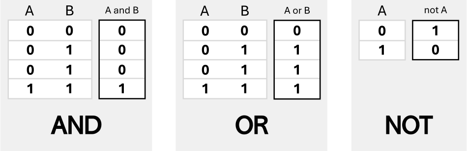

To make operations and calculations with numbers and variables in C++, we use (like in math) a 
bunch of different operators, each one with its own unique role. There exist operators that 
we can use for logic, too.

There are different types of operators. Let's see them.

:::warning

Bitwise operators are intentionally left out because in our programs we'll never need them.

:::


## Arithmetic operators
They compute the result of a specific arithmetic operation and return its result.

| Syntax | Operator name  | Example |
|--------|----------------|---------|
| `+`    | addition       | `a + b` |
| `-`    | subtraction    | `a - b` |
| `*`    | multiplication | `a * b` |
| `/`    | division       | `a / b` |
| `%`    | modulo         | `a % b` |

If you want to chain multiple operations together, they will follow the PEMDAS rule (Parentheses, 
Exponents, Multiplication/Division, Addition/Subtraction in this order of importance). You can 
also use parentheses to give precedence to some operations or group them together.

## Compound assignment operators
They assign a new value to a variable or object.

| Syntax | Operator name             | Example  | Equivalent to  |
|--------|---------------------------|----------|----------------|
| `=`    | simple assignment         | `a = b`  | `a = b`        |
| `+=`   | addition assignment       | `a += b` | `a = a + b`    |
| `-=`   | subtraction assignment    | `a -= b` | `a = a - b`    |
| `*=`   | multiplication assignment | `a *= b` | `a = a * b`    |
| `/=`   | division assignment       | `a /= b` | `a = a / b`    |
| `%=`   | modulo assignment         | `a %= b` | `a = a % b`    |

These operators are only shorthand or their corresponding, so they are optional. they combine 
an operation with the assignment of the resulting value.
Remember that the assignment of the value is always from the right to the variable of the left.

## Unary operators
They increment or decrement the value of the object.

| Syntax | Operator name  | Equivalent to  |
|--------|----------------|----------------|
| `++a`  | pre-increment  | `a = a + 1`    |
| `--a`  | pre-decrement  | `a = a - 1`    |
| `a++`  | post-increment | `a = a + 1`    |
| `a--`  | post-decrement | `a = a - 1`    |

### Difference

The difference between *pre* and *post*-increment expressions is a bit confusing, but the names 
help. 

**Pre-incrementation** means the variable is incremented before the expression is set or evaluated. 
If we write `y = ++x;` it's doing:
```cpp
x++;
// x is already incremented, now.
y = x;
// so x is incremented and also y gets the incremented value
```

**Post-incrementation** means the expression is set or evaluated, and then the variable is altered. 
If we write `y = x++;` it's doing:
```cpp
y = x;
// and only then, after the assignment...
x++;
// so x is incremented, but y doesn't get the incremented value
```

:::info Loops

In loops this difference is not relevant and does not influence the number of iterations or the 
starting/ending point of the incrementing variable (usually called `i`). We haven't explained 
loops, yet, so leave this info as is until we'll get to that topic in a later lesson.

:::

## Comparison/relational operators
They are used to compare two values and return a *boolean* value (**1** or **0**, true or false 
respectively).

| Syntax | Operator name            | Example  |
|--------|--------------------------|----------|
| `==`   | equal to                 | `a == b` |
| `!=`   | not equal                | `a != b` |
| `>`    | greater than             | `a > b`  |
| `<`    | less than                | `a < b`  |
| `>=`   | greater than or equal to | `a >= b` |
| `<=`   | less than or equal to    | `a <= b` |

:::caution

It is easy to confuse the assignment operator `=` with the relational operator `==`. Remember, 
though, that they are very different: the first assigns a value, whereas the second compares two 
values (operands), checks the relationship between them and returns *true* or *false*.

:::

## Logical operators
They return the result of a boolean operation. They are used to determine the logic between 
two or more relations logically joined.

<!--
| Syntax      | Operator name  | Example             |
|-------------|----------------|---------------------|
| `&&`, `and` | AND            | `a && b`, `a and b` |
| `||`, `or`  | OR (inclusive) | `a || b`, `a or b`  |
| `!`, `not`  | NOT/negation   | `!a`, `not a`       | 
-->


<table class="tg">
<thead>
  <tr>
    <th class="tg-0lax">Syntax</th>
    <th class="tg-0pky">Operator name</th>
    <th class="tg-0pky">Example</th>
  </tr>
</thead>
<tbody>
  <tr>
    <td class="tg-0lax"><code>&amp;&amp;</code>, <code>and</code></td>
    <td class="tg-0pky">AND</td>
    <td class="tg-0pky"><code>a &amp;&amp; b</code>, <code>a and b</code></td>
  </tr>
  <tr>
    <td class="tg-0lax"><code>||</code>, <code>or</code></td>
    <td class="tg-0pky">OR (inclusive)</td>
    <td class="tg-0pky"><code>a || b</code>, <code>a or b</code></td>
  </tr>
  <tr>
    <td class="tg-0lax"><code>!</code>, <code>not</code></td>
    <td class="tg-0pky">NOT/negation</td>
    <td class="tg-0pky"><code>!a</code>, <code>not a</code></td>
  </tr>
</tbody>
</table>

### Meaning
- **AND**: both relations must be true for the complex expression to be true.
- **OR**: if either relation is true, the complex expression is true.
- **NOT**: negates the statement. It changes true to false, and false to true.


<figcaption>Fig.1. The logic table of truth (1 is true, 0 is false).</figcaption>