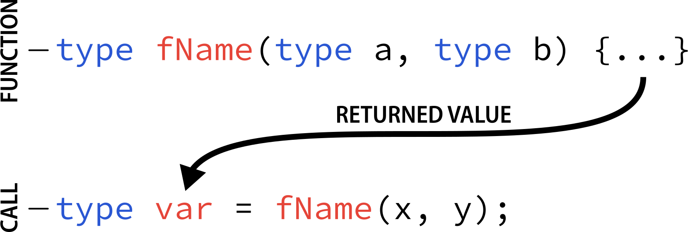
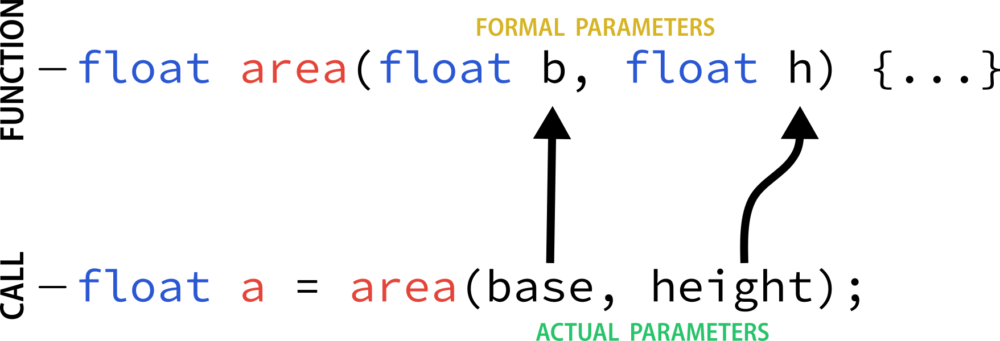
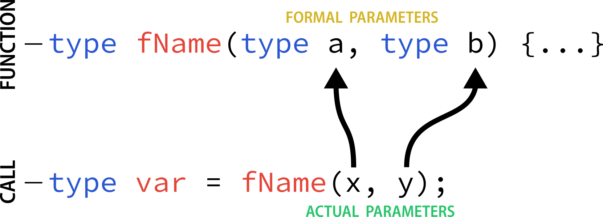
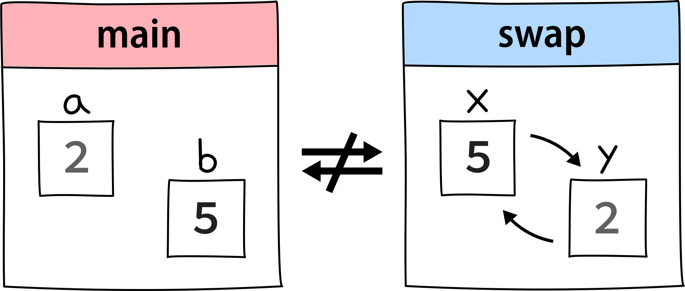
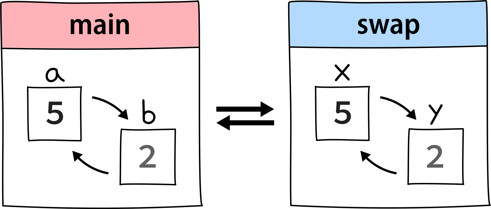

In C and C++ there are two ways to pass some data to a function: *by value* and *by 
reference*.

They are strictly related to *actual parameter* (or arguments) and *formal parameters*, though, 
so it's better to understand and distinguish them before going forward.


## Parameter types

In support of the following explanation I'm going to use an example of a program that prompts 
the user to enter the base and height of a rectangle and with a function calculates the area 
of the quadrilateral (according to the formula **a = b*h**), storing that value in the 
variable `a`:

```cpp {4-7,17} title="area-of-rectangle.cpp"
#include <iostream>
using namespace std;

float area(float b, float h) {
	float area = b*h;
	return area;
}

int main() {
	float base, height;
	
	cout<<"enter the base: "<<endl;
	cin>>base;
	cout<<"enter the height: "<<endl;
	cin>>height;
	
	float a = area(base, height);
	cout<<"the area is: "<<a<<endl;
	
	return 0;
}
```

:::note

This code works directly, so I highly encourage you to try it. As always, feel free to run 
this program yourself and experiment with it as much as you want.

:::

### Code explanation

#### Function

Before the main function, at line **4**, the function area is defined. Here we multiply the 
formal parameters `b` and `h` and store the result in a new variable called `area`. Then we 
return it. 

#### Main

In the main function we create two new variables, `base` and `height`, and we ask to the user 
to insert the values that we'll then assign to each variable.

At line **17** we create another variable, `a`, and here we call the function previously 
created passing as arguments `base` and `height` (not `b` and `h`!), without specifying any 
type. When the compiler compiles the function that has just been called, it calculates a value 
`area` and then returns it. We store that value in `a`.

The `float` type has being used with the variables and the function to cover also cases of 
inputs with decimal numbers, but also `int` and `double` are perfectly fine.

#### Return (in details)

Inside the function `area()`, the `return area;` instruction finalizes the function and 
returns the control back to the function that called it in the first place (so `main()` 
in our example).

At this moment the program follows it regular course from the same point at which it was 
interrupted by the call to `area()`. But additionally, because the return statement in our
function `area()` specified a value, this value becomes the value of the function call.

The variable `a` will be set to the value returned by the multiplication performed inside 
`area(float b, float h)`, that is `b*h`. 
To explain it another way, you can imagine that the function call `area()` 
is literally replaced by the value it returns, and then this value is stored in a variable.

Just as shown in this figure:


<figcaption>Fig.1. How the returned value of a function is stored.</figcaption>

In this general example, a `fName()` function is invoked, and when it's executed its result 
replaces the invocation `fName(x, y)` and gets stored in a variable `var`. **`val` = `returned 
value`**.
The intermediate step (where `fName(x, y)` becomes the returned value) is not shown for 
simplicity.

:::info Remember

All this process happens when we use classic functions. For procedures (functions with `void` 
type), instead, all this doesn't subsist (it's not true) because procedures *never* have a 
return value.

:::

### Actual parameter (argument)

The actual parameters, or arguments, are the actual values (or values of variables) that gets 
**passed** to a function. In our previous example, we invoke the function `area()` that has two 
parameters, `b` and `h`, and we pass those arguments as `base` and `height`. We could have 
passed also some values directly, like 3 and 4, as arguments. Try yourself with our example 
program.

This scheme will probably convey better how these two different type of parameters are used:


<figcaption>Fig.2. How arguments are passed to a function (example).</figcaption>

### Formal parameter

The formal parameters are the local variables of the function that **receive** the arguments.
In our example, they are `b` and `h` and they receive the value specified during the 
invocation, which are `base` and `height`.

### General scheme


<figcaption>Fig.3. How arguments are passed to a function (in general).</figcaption>


## Passing by value 🆚 by reference

Let's now take another program. Imagine you want to write a function of type `void` that 
swaps two variables (the algorithm for swapping is explained in a previous lesson) `a` and 
`b`:

```cpp {4-8,16} title="swapping.cpp"
#include <iostream>
using namespace std;

void swap(int x, int y) {
	int temp = x;
	x = y;
	y = temp;
}

int main() {
	int a=2, b=5;
	
	cout<<a<<endl;
	cout<<b<<endl;
	
	swap(a, b);
	
	cout<<a<<endl;
	cout<<b<<endl;
	
	return 0;
}
```

Inside main we call the function `swap()` passing `a` and `b` as arguments (actual parameters).
In the function at line **4** we receive those arguments and inside the body we swap them.
Remember that it's of type `void`, so it's a special function that does not have a return value.
Swapping is made by creating a new variable `temp` (following the algorithm already explained 
in a previous tutorial), and after all the instructions we don't need to return anything.

#### Troubleshooting

Now try run this program. What will be the output?

<details>
  <summary>Answer</summary>
	<code class="output">
		2<br/>
		5<br/>
		2<br/>
		5<br/>
	</code>
</details>

It turns out that **the values 2 and 5 haven't swapped**!

But why?

### Pass by value (or copy)

#### Local scope

If you remember, in the previous chapter I mentioned that functions have formal parameters, 
which are basically variables that have **local scope**. Actually the whole body of a function 
and the variables inside it are also local scope of the function itself. This means that they 
all have a visibility and a lifetime *limited* to that function and you can't access the 
outside of the function body (it's the same principle applied to code blocks, were variables 
inside of it are not global). 

For instance, in our program you can't use the `temp` variable (created inside the function) 
in the main scope, because the scope of local variables is limited to the same block level 
in which they are declared.

When we invoke a function (as we have done so far), the arguments that we pass to the function 
are passed *by value*, or *by copy*. This terms comes from the fact that **the values of the 
actual parameters written in the function call are** ***copied*** **inside the formal 
parameters**, and then the function works on those copies ***locally***.

In our code example we pass `a` and `b`, 2 and 5 respectively, so `x` and `y` in the 
function assume those two values, but they are different variables with **different locations 
in memory**.

For each variable, we are just passing copies of it's value and not the variable itself. 
Therefore, when passing by value, changes that we apply to formal parameters, like swapping 
them, will work inside the funtion but nothing will happen outside of the it (like in 
main). If we change the parameters, we lose all the modications outside of the function.


<figcaption>Fig.4. Pass by value (or copy). The swapping doesn't happen in main.</figcaption>

That's why with our actual program we get this output:
<code class="output">
	2<br/>
	5<br/>
	2<br/>
	5<br/>
</code>

### Pass by reference

To solve this problem we can pass arguments by reference. When we call and pass by reference, 
actual and formal parameters refers to the **same memory location**, so when changes are made 
to the formal parameters, also actual parameters will change. In this way we associate these 
two types of parameters.

In practice, the *invoked* function and the *invoking* function the same variables and the 
eventual changes get  reflected on both parameters.

There are two ways to do this.

To pass by reference is by prefixing each formal parameter with an ampersand 
symbol **`&`** in the signature of the function.

In our case the solution will be:
```cpp {1}
void swap(int &x, int &y) {
	int temp = x;
	x = y;
	y = temp;
}
```


<figcaption>Fig.5. Pass by reference. The swapping is successful!</figcaption>

### Pass by pointer

There's actually another method, which implies again the ampersand symbol, but in another way. 
It's used in conjunction with *pointers*, that are special variables that are capable of 
containing memory addresses of some other variables. To declare a pointer we use the asterisk 
symbol **`*`** followed by the identifier.

When we write:

 ```cpp {1,7}
void swap(int *x, int *y) {
	int temp = *x;
	*x = *y;
	*y = temp;
}
// inside main
swap(&a, &b);
```

`*x` and `*y` will store not the values but the addresses of `a` and `b`. When you call 
the function you have to put the `&` symbol before the names of the arguments. 

Then, inside the function, `*x = *y` and `*y = temp` lines mean that the compiler has 
to change the original values (the content stored) of the addresses of `x` and `y` 
variables, so the changes will remain effective even outside of the function.

:::note Which to use?

I honestly prefer passing by reference simply because it's easier, but it's not 
necessarily the best. You can find more details on how these lasst two methods work in 
[this article](https://www.geeksforgeeks.org/passing-by-pointer-vs-passing-by-reference-in-c/) 
by GeeksforGeeks.

:::

#### Performances

Pass-by-references is more efficient than pass-by-value, because it does not copy the 
arguments. The formal parameter is an alias for the argument. When the called function 
read or write the formal parameter, it is actually read or write the argument itself[^1].


[^1]: [ibm.com - Pass by reference (C++ only)](https://www.ibm.com/docs/en/zos/2.4.0?topic=calls-pass-by-reference-c-only#:~:text=Pass%2Dby%2Dreferences%20is%20more%20efficient%20than%20pass%2Dby%2Dvalue%2C%20because%20it%20does%20not%20copy%20the%20arguments.%20The%20formal%20parameter%20is%20an%20alias%20for%20the%20argument.%20When%20the%20called%20function%20read%20or%20write%20the%20formal%20parameter%2C%20it%20is%20actually%20read%20or%20write%20the%20argument%20itself.)