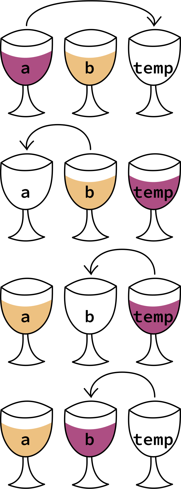
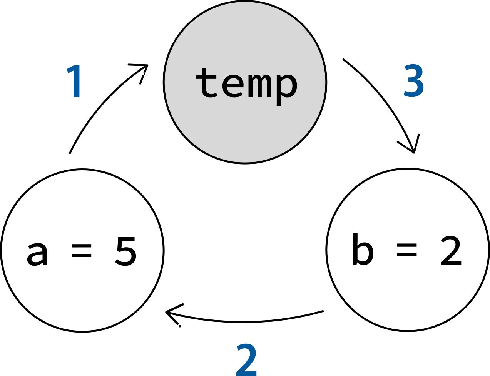

## The problem

Sometimes we could encounter a situation where we have two variables, for example `a` and `b` 
(each with its own value), and we want to mutually exchange their numbers so that `a` takes 
the value of `b` and `b` gets the value of `a`. The problem is that we cannot simply invert 
the numbers using just two variables because when a value is passed from one variable to the 
other you replace the old number with a new one and you lose it forever. Read this example 
line by line:

```cpp {5,6}
a = 5;
b = 2;

// doesn't work
a = b; // now a = 2
b = a; // ❌ no!
```

:::info Remember

The assignment happens always **from right to left**!

:::

In line 6 you've lost the value of a (5) by replacing it with b (2), so you can't assign 5 
anymore.

If we printed `a` and `b` with this code we would get that `a` = 2 and also `b` = 2.

## The solution

We have many ways to solve this issue, but one of the easiest and more intuitive is to use the 
swapping algorithm, which permits swapping the two variables without losing their content.

The idea is to make a new **temporary variable**, usually called `temp`, where you store one of 
the two values of the variables you want to swap in order to prevent a value from being lost. 
You then take back the value stored in it and put in the correct variable where you 
swapped its value, obtaining the desired result.

To explain this better, let me make an analogy with a real example. You have **three glasses**: 
1. One filled with wine, `a`
2. One filled with beer, `b`
3. One empty, `temp`

To swap wine and the beer inside `a` and `b` you have to follow the procedure below.


<figcaption>Fig.1. The steps you have to follow to swap the contents of the two glasses a and b.</figcaption>

In code, this concept translates into the following program:

```cpp title="swapping.cpp" {12-14}
#include <iostream>
using namespace std;

int main() {
    int a = 5, 
		b = 2, 
		temp;

    cout << "before swapping:" << endl;
    cout << "a = " << a << ", b = " << b << endl;

    temp = a;
    a = b;
    b = temp;

    cout << "\nafter swapping:" << endl;
    cout << "a = " << a << ", b = " << b << endl;

    return 0;
}
```

#### Output
<div class="output">
    <code class="output">
    	before swapping:<br/>
    	a = 5, b = 2<br/>
    <br/>
    	after swapping:<br/>
    	a = 2, b = 5<br/>
    </code>
</div>

The process can also be illustrated more abstractly like in this diagram:


<figcaption>Fig.2. An alternative diagram representing the swapping algorithm.</figcaption>

In step **1** the value of `a` goes into `temp`, then in step **2** the value of `b` goes into 
`a` and finally in step **3** the value of `temp` goes into `b`. Obviously, the order of these 
actions must be respected.

### Alternatives

An alternative approach is to use addition and subtraction between the two values of the 
variables involved. The advantage is that we don't have to rely on a third variable for 
support.

```cpp
a = a + b;
b = a - b;
a = a - b;
```


<figcaption>Fig.3. How swapping without a third variable is done. Image courtesy of w3resource.com (CC BY 4.0 license).
</figcaption>

:::info Curiosity

Some languages, like Ruby, Python and JavaScript (which since version ES6 supports 
destructuring operators) can perform parallel assignments, which simplifies the notation 
for swapping two variables[^1]:

```
[a, b] = [b, a];
```

:::

[^1]: [Wikipedia - Swap (computer programming)](https://en.wikipedia.org/wiki/Swap_(computer_programming))